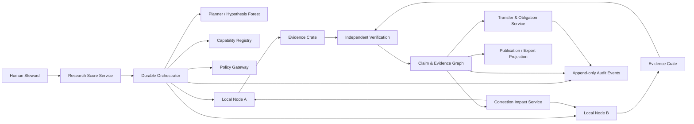

# Meridian Research Runtime — Consolidated Implementation Specification v0.2.0

**Status:** implementation-ready specification package  
**Date:** 21 July 2026  
**Scope:** v0.1.1 governance/evidence foundations plus v0.2.0 Research Method Kernel

> This consolidated document is a reading convenience. The modular source files, schemas, acceptance features, examples, ADRs and task packets remain authoritative for implementation and review.

---


---

<!-- SOURCE: README.md -->

# Meridian Research Runtime (MRR) — Implementation Specification v0.2.0

This package extends MRR v0.1.1 from a federated research governance and evidence operating system into an executable research architecture through the **Research Method Kernel**.

## What remains unchanged

The v0.1.1 foundations remain normative:

- immutable, content-addressed research history;
- Research Scores and autonomy boundaries;
- local node sovereignty;
- signed Task Bundles;
- sandboxed execution;
- Evidence Crates;
- atomic Claims and source families;
- independent skepticism and verification;
- transfers, obligations, corrections, and projections;
- parallel operation with Meridian Classic.

## What v0.2 adds

- local versioned Method Profiles;
- QuestionModel and ambiguity handling;
- ConceptMeasurementCharter;
- Estimands and competing CausalModels;
- EvidenceMatrix and DataAssetProfile;
- ResearchDesign and IdentificationAudit;
- machine-enforced claim-language ceilings;
- immutable PreAnalysisPlans and explicit amendments;
- Analysis Compiler contracts;
- FalsificationPlan and kill conditions;
- ReplicationPlan with measured independence;
- GeneralizationMap and explicit non-claims;
- Adaptive ResearchDecision objects;
- a synthetic housing-affordability/political-support reference project;
- MethodBench and ten new hard release gates.

## Strategic rule

> A governed pipeline is not yet a research method. A research method is not yet a valid claim. Each transition must be explicit, testable, and reversible.

## Reading order

1. `AGENTS.md`
2. `UMSETZUNGSUPDATE_DE.md`
3. `CLAUDE_CODE_IMPLEMENTATION_HANDOFF_DE.md`
4. docs 00–07 for governance and evidence foundations
4. `docs/08_RESEARCH_METHOD_KERNEL.md`
5. docs 09–15 for method behavior
6. `docs/16_HOUSING_AFFORDABILITY_REFERENCE_PROJECT.md`
7. docs 17–19 for API, gates, and implementation
8. accepted ADRs
9. schemas, examples, acceptance features, and task packets

## First implementation target

Implement a deterministic single-node method slice on synthetic data. It must be capable of rejecting a causal claim, not only producing one.

## Validation

```bash
python tools/validate_package.py
```

The validator checks all v0.2 method examples against Draft 2020-12 JSON Schemas and parses all task packets.


---

<!-- SOURCE: UMSETZUNGSUPDATE_DE.md -->

# Meridian Research Runtime v0.2.0 — Umsetzungsupdate
## Vom Governance- und Evidenzsystem zur konkreten Forschungsmaschine

## Entscheidung

Version 0.1.1 spezifiziert ein belastbares **Research Governance and Evidence Operating System**: Forschungsaufträge, Berechtigungen, lokale Ausführung, Provenienz, Claims, Verifikation, Transfers und Korrekturen. Diese Schicht bleibt vollständig erhalten.

Version 0.2.0 ergänzt den bislang fehlenden **Research Method Kernel**. Er beschreibt, wie Meridian aus einer offenen Forschungsfrage ein ausführbares, falsifizierbares und revisionsfähiges Forschungsprogramm erzeugt.

Die Runtime wird damit nicht zu einem Master-Agenten und erhält keine universelle wissenschaftliche Methode. Stattdessen führt sie **lokale, versionierte Method Profiles** aus. Das erste vollständige Profil ist `causal_observational`, weil die Referenzfrage eine kausale sozialwissenschaftliche Untersuchung verlangt.

> Die Runtime verwaltet nicht nur Forschung. Sie kompiliert Fragen in überprüfbare Forschungsoperationen, ohne deren Geltungsgrenzen zu verstecken.

## Was neu hinzukommt

Der Research Method Kernel führt folgende Objekte und Dienste ein:

1. `QuestionModel` — zerlegt die Ausgangsfrage in Claim-Typ, Population, Exposition, Outcome, Raum, Zeit und offene Begriffe.
2. `ConceptMeasurementCharter` — definiert lokale Begriffe, Messvarianten, Klassifikationen und bekannte Messfehler.
3. `Estimand` — legt fest, welcher konkrete Effekt für welche Einheit und Population geschätzt werden soll.
4. `CausalModel` — erfasst Mechanismen, Confounder, Mediatoren, Selektionspfade und konkurrierende Erklärungen.
5. `EvidenceMatrix` — strukturiert Literatur nach Design, Identifikation, Effekt, Scope, Limitationen und Quellenfamilie.
6. `DataAssetProfile` — bewertet Datensätze nach Auflösung, Abdeckung, Zugriff, Bias, Joinbarkeit, Recht und kausaler Eignung.
7. `ResearchDesign` — beschreibt eine konkrete Untersuchungsstrategie und ihre Daten- und Diagnostikbedürfnisse.
8. `IdentificationAudit` — entscheidet, ob ein Design kausale, assoziative, deskriptive oder keine belastbare Aussage tragen kann.
9. `PreAnalysisPlan` — friert konfirmatorische Entscheidungen vor Ergebnisinspektion ein.
10. `FalsificationPlan` — erzeugt Placebos, negative Kontrollen, alternative Messungen und Kill Conditions.
11. `ReplicationPlan` — verlangt unabhängige Reimplementierung oder dokumentiert deren Unmöglichkeit.
12. `GeneralizationMap` — grenzt ab, für welche Populationen, Räume und Zeiten ein Claim gelten darf.
13. `ResearchDecision` — dokumentiert `continue`, `revise`, `kill`, `replicate`, `narrow_scope`, `escalate` oder `stop_insufficient_evidence`.

## Kernarchitektur

```text
Research Score
    ↓
Question Compiler
    ↓
Concept & Measurement Charter
    ↓
Estimand Set + Causal Model
    ↓
Evidence Scout + Data Scout
    ↓
Design Generator
    ↓
Identification Audit
    ↓
Hypothesis Forest
    ↓
Pre-analysis Lock
    ↓
Analysis Compiler + local execution
    ↓
Falsification + independent replication
    ↓
Claims + Generalization Map
    ↓
Adaptive Research Decision
    ↓
Governance-, Transfer- und Correction-System aus v0.1.1
```

## Referenzprojekt

Die Spezifikation enthält einen vollständigen vertikalen Referenzfall für die Frage:

> „In welchem Maß erhöht steigende Wohnkosten-Unbezahlbarkeit ursächlich die Unterstützung für rechtspopulistische / Anti-Establishment-Parteien in europäischen Städten, 2015–2025?“

Der Fall ist **kein vorweggenommenes Forschungsergebnis**. Er demonstriert:

- wie uneindeutige Begriffe getrennt werden;
- wie mehrere Estimands entstehen;
- wie individuelle Präferenzänderung von räumlicher Sortierung unterschieden wird;
- wie mehrere kausale Mechanismen konkurrieren;
- wie Daten- und Literaturrecherche strukturiert wird;
- wie Designs generiert und bei schwacher Identifikation beendet werden;
- wie eine präanalytische Festlegung erfolgt;
- wie Falsifikation und Replikation Claims begrenzen;
- wie die Runtime auch zu `insufficient_evidence` gelangen kann.

## Implementierungsprinzip

Die erste Method-Kernel-Version wird **ohne LLM-Autorität** implementiert. LLMs dürfen Vorschläge erzeugen; autoritative Objekte entstehen nur durch:

- Schema-Validierung,
- deterministische Domain-Regeln,
- Policy-Entscheidungen,
- dokumentierte menschliche oder unabhängige methodische Prüfung.

Der erste End-to-End-Slice nutzt synthetische Fixtures und einen deterministischen Analyseworkflow. Er beweist nicht die politische Hypothese, sondern die methodische Integrität der Maschine.

## Wichtigste Release-Gates

Ein Release scheitert, wenn:

- ein kausaler Claim ohne Estimand oder Identification Audit entstehen kann;
- ein rein korrelatives Design kausale Sprache freischaltet;
- ein Begriff oder eine Parteiklassifikation unversioniert bleibt;
- ein Pre-analysis Plan nach Ergebnisinspektion still geändert werden kann;
- explorative Analysen als konfirmatorisch erscheinen;
- ein Design trotz erfüllter Kill Condition weiter als kausal geführt wird;
- dieselbe Code-, Modell- und Datenlinie als unabhängige Replikation zählt;
- Scope und Generalisierungsgrenzen im finalen Claim fehlen;
- Nullresultate, Gegenbefunde oder nicht verfügbare Daten verschwinden.

## Empfehlung für Claude Code

Claude Code soll nicht „den gesamten Research Method Kernel“ in einem Lauf bauen. Es arbeitet die Task-Pakete in dieser Reihenfolge ab:

1. `M0-T01` — Method-Verträge, Runtime-Modelle und Schema-Validierung
2. `M0-T02` — versionierte Method Profiles und Policy-Interface
3. `M1-T01` — deterministischer Question Compiler
4. `M1-T02` — Concept & Measurement Charter
5. `M2-T01` — Estimand Builder
6. `M2-T02` — Causal Models und konkurrierende Erklärungen
7. `M2-T03` — Research Designs, Identification Audits und Claim Ceilings
8. `M3-T01` — Evidence Matrix und Quellenverifikation
9. `M3-T02` — DataAssetProfile, Readiness und Crosswalks
10. `M4-T01` — Pre-analysis Lock und Amendments
11. `M4-T02` — typisierter Analysis Compiler und synthetischer Executor
12. `M5-T01` — Falsification Probes und Kill-Propagation
13. `M5-T02` — Replikationsunabhängigkeit und Diskrepanzen
14. `M5-T03` — GeneralizationMap und ResearchDecision Engine
15. `M6-T01` — vollständiger Housing-Populism-Referenzslice
16. `M7-T01` — MethodBench und harte Gates

Jedes Paket besitzt erlaubte Pfade, verbotene Abkürzungen, Invarianten und Akzeptanztests.


---

<!-- SOURCE: CLAUDE_CODE_IMPLEMENTATION_HANDOFF_DE.md -->

# Claude-Code-Handoff — Meridian Research Runtime v0.2.0
## Research Method Kernel als Erweiterung des Governance- und Evidenzsystems

Du arbeitest an der bestehenden Federated Research Ecology und kennst den aktuellen Repository- und Implementierungsstand möglicherweise genauer als dieses Spezifikationspaket. Behandle die Spezifikation deshalb als verbindlichen Ziel- und Sicherheitsrahmen, aber nicht als Behauptung über bereits vorhandenen Code. Prüfe zuerst den tatsächlichen Stand und dokumentiere Abweichungen, bevor du Architektur oder Dateien veränderst.

## Auftrag

Erweitere den Meridian Research Runtime v0.1.1 um den in v0.2.0 spezifizierten **Research Method Kernel**.

Version 0.1.1 bleibt die Governance-, Ausführungs-, Evidenz-, Föderations- und Korrekturschicht. Version 0.2.0 fügt die bislang fehlende methodische Schicht hinzu, durch die aus einer offenen Forschungsfrage ein explizites, überprüfbares und ausführbares Forschungsprogramm entstehen kann.

Die Erweiterung umfasst insbesondere:

- Question Compilation;
- Concept and Measurement Charters;
- Estimands;
- lokale und konkurrierende Causal Models;
- Evidence- und Data-Scouting-Verträge;
- Research Designs;
- Identification Audits;
- maschinell erzwungene Claim Ceilings;
- gesperrte PreAnalysisPlans und explizite Amendments;
- typisierte Analysis Workflows;
- Falsification Plans und Kill Conditions;
- Replication Plans mit gemessener Unabhängigkeit;
- Generalization Maps und explizite Non-Claims;
- adaptive Research Decisions einschließlich `stop_insufficient_evidence`.

## Was nicht geändert wird

Diese Erweiterung ist **kein Ersatz** für:

- Meridian Classic;
- den Parallel-, Shadow- und Challenger-Betrieb;
- lokale Souveränität der Practices;
- Research Scores und Autonomiegrenzen;
- signierte Task Bundles;
- lokale Sandbox-Ausführung;
- Evidence Crates und atomare Claims;
- unabhängige Verifikation;
- Transfer-, Obligation- und Correction-Protokolle;
- menschliche Verantwortung für Veröffentlichung, sensible Daten und Außenhandlungen.

Meridian Classic darf weiterlaufen und weiterentwickelt werden. Der versiegelte Baseline-Stand ist ein Vergleichspunkt, kein Stilllegungsauftrag.

## Zentrale Interpretation

Ein sicher orchestrierter Agentenworkflow ist noch keine Forschungsmethode. Eine Forschungsmethode erzeugt noch keinen gültigen Claim. Ein erfolgreich ausgeführtes Modell ist noch keine kausale Identifikation.

Daher gilt:

```text
offene Frage
  != ausführbare Analyse

Regression oder Modelloutput
  != Estimand

Designbezeichnung
  != Identifikation

statistische Signifikanz
  != kausale Gültigkeit

Robustheitscheck
  != Falsifikation

identischer Rerun
  != unabhängige Replikation

synthetischer Benchmark
  != empirisches Forschungsergebnis
```

Jeder Übergang muss durch explizite Objekte, Regeln, Prüfungen und Ereignisse repräsentiert sein.

## Verbindliche Quellen

Lies in dieser Reihenfolge:

1. `AGENTS.md`
2. `START_HERE_CODEX_OR_CLAUDE.md`
3. `UMSETZUNGSUPDATE_DE.md`
4. `docs/08_RESEARCH_METHOD_KERNEL.md`
5. `docs/09_QUESTION_AND_CONCEPT_COMPILATION.md`
6. `docs/10_CAUSAL_INFERENCE_AND_DESIGN.md`
7. `docs/11_EVIDENCE_AND_DATA_SCOUTING.md`
8. `docs/12_PREANALYSIS_EXECUTION_AND_ADAPTATION.md`
9. `docs/13_FALSIFICATION_REPLICATION_GENERALIZATION.md`
10. `docs/14_METHOD_PROFILES.md`
11. `docs/15_QUALITATIVE_AND_MIXED_METHODS.md`
12. `docs/16_HOUSING_AFFORDABILITY_REFERENCE_PROJECT.md`
13. `docs/17_METHOD_API_AND_EVENTS.md`
14. `docs/18_METHOD_BENCHMARKS_AND_ACCEPTANCE.md`
15. `docs/19_METHOD_IMPLEMENTATION_PLAN.md`
16. `docs/adr/ADR-0003-RESEARCH-METHOD-KERNEL.md`
17. `docs/adr/ADR-0004-CAUSAL-CLAIM-GATES.md`
18. die zugewiesene Datei unter `task-packets/`

Die modularen Dateien, JSON Schemas, Gherkin-Akzeptanzfälle und Task-Pakete sind gegenüber dieser Übergabe spezifischer und haben bei einem Widerspruch Vorrang. Ein echter Widerspruch zum bereits implementierten und akzeptierten System darf nicht still aufgelöst werden. Dokumentiere ihn und schlage ADR, Migrationspfad oder Spezifikationsänderung vor.

## Erste Aktion: Audit statt sofortiger Umbau

Beginne nicht direkt mit Implementierung. Erstelle zunächst einen **v0.2 Integration Audit** mit:

1. aktueller Repository-Topologie;
2. bereits implementierten v0.1.1-Domainobjekten und Services;
3. vorhandenen IDs, Revisionen, Hashes, Signaturen und Event Envelopes;
4. Claim-, Evidence-, Correction- und Dependency-Modell;
5. Workflow-, Sandbox- und Policy-Integration;
6. vorhandenen Datenbankmigrationen;
7. Test-, CI- und Deploymentstruktur;
8. Überschneidungen mit den neuen Method-Objekten;
9. Konflikten oder doppelten Konzepten;
10. technischen Schulden, die M0 blockieren könnten.

Erzeuge danach eine Mapping-Tabelle:

```text
v0.2 contract
existing implementation
reuse / extend / migrate / new
blocking conflict
recommended action
```

Keine breitflächige Umbenennung und kein Greenfield-Rewrite ohne belegten Grund.

## Implementierungsmodus

Arbeite ausschließlich ein freigegebenes YAML-Task-Paket nach dem anderen ab. Die vorgesehene Reihenfolge ist:

```text
M0-T01  Method contracts and runtime models
M0-T02  Method profile registry and policy interface
M1-T01  deterministic Question Compiler
M1-T02  ConceptMeasurementCharter lifecycle
M2-T01  Estimand Builder
M2-T02  CausalModel graph and competing explanations
M2-T03  ResearchDesign, IdentificationAudit and claim ceilings
M3-T01  EvidenceMatrix and source verification lifecycle
M3-T02  DataAssetProfile readiness and synthetic isolation
M4-T01  PreAnalysisPlan locking and amendments
M4-T02  typed Analysis Compiler and synthetic executor
M5-T01  falsification probes and kill propagation
M5-T02  replication independence and discrepancy handling
M5-T03  GeneralizationMap and ResearchDecision engine
M6-T01  complete synthetic housing reference slice
M7-T01  MethodBench and release hardening
```

M8 mit modellgestützter Forschungsplanung beginnt erst, wenn M0 bis M7 deterministisch funktionieren und die harten Gates bestehen.

## Architekturgrenzen

Implementiere Domain- und Methodlogik zunächst framework-unabhängig. Nutze vorhandene Frameworks und Infrastrukturadapter nur an klaren Grenzen.

Empfohlene Modulstruktur, sofern mit dem aktuellen Repository kompatibel:

```text
packages/
  domain/
  method-kernel/
    question/
    measurement/
    estimand/
    causal_model/
    evidence_scout/
    data_scout/
    design/
    identification/
    preanalysis/
    falsification/
    replication/
    generalization/
    decisions/
  method-profiles/
    causal_observational/
  policy/
  workflow-compiler/
  benchmark/
```

Verwende keine Graphdatenbank für die erste Version. Method-Abhängigkeiten, Knoten und Kanten können relational und zusätzlich als versiegelte JSON-Artefakte gespeichert werden.

## Autoritative Übergänge

LLMs oder andere generative Modelle dürfen ab M8 Vorschläge erzeugen, aber niemals direkt:

- ein `QuestionModel` akzeptieren;
- eine Begriffsdefinition autoritativ ersetzen;
- ein `IdentificationAudit` bestehen lassen;
- einen PreAnalysisPlan sperren oder ändern;
- eine Kill Condition überschreiben;
- eine Replikation als unabhängig klassifizieren;
- einen Claim über sein Method Ceiling heben;
- eine Generalisierung erweitern;
- eine empirische Veröffentlichung auslösen.

Alle autoritativen Übergänge laufen über Schema, Domain-Invarianten, Policy und attribuierte Review- oder Freigabeereignisse.

## Referenzslice

Nutze `examples/housing-populism/` ausschließlich als synthetischen Implementierungs- und Benchmarkfall.

Die Ausgangsfrage lautet:

> In welchem Maß erhöht steigende Wohnkosten-Unbezahlbarkeit ursächlich die Unterstützung für rechtspopulistische / Anti-Establishment-Parteien in europäischen Städten, 2015–2025?

Der Slice muss zeigen, dass die Maschine:

- die Frage nicht direkt ausführt;
- unbestimmte Begriffe sichtbar macht;
- individuelle und aggregierte Effekte trennt;
- ein explizites Estimand erzeugt;
- konkurrierende kausale Modelle erhält;
- ein Design auditieren und herabstufen kann;
- einen Plan vor Outcome-Analyse sperrt;
- Falsifikationsfehler als epistemisches Ereignis behandelt;
- Replikationsunabhängigkeit prüft;
- synthetische Daten niemals als empirische Evidenz verwendet;
- mit `stop_insufficient_evidence` erfolgreich enden kann.

Der Slice darf nicht durch fest codierte erwartete Endwerte bestehen. Er muss Regeln und Zustandsübergänge testen.

## Harte Abbruchbedingungen

Stoppe die jeweilige Aufgabe und berichte, wenn:

- ein neues Objekt nicht mit den vorhandenen Identitäts- und Revisionsverträgen vereinbar ist;
- Claim Ceilings nur durch Schwächung des bestehenden Claim-Modells implementierbar wären;
- ein Model Adapter direkte Zustandsautorität benötigen würde;
- ein gesperrter Plan nur mutierbar statt versionierbar wäre;
- eine Kill Condition nur als Berichtstext, nicht als State Transition abbildbar wäre;
- synthetische Fixtures nicht technisch von empirischer Evidenz getrennt werden können;
- ein Task Änderungen außerhalb seiner erlaubten Pfade benötigt;
- der Referenzslice nur durch Hardcoding oder Umgehung einer Gate-Logik besteht.

## Erwartetes Ergebnis je Task

Liefere nach jeder Aufgabe:

1. Task-ID und implementierte Requirement-IDs;
2. kurze Zusammenfassung;
3. geänderte Dateien;
4. neue oder geänderte Migrationen;
5. neue Tests;
6. exakte ausgeführte Befehle und Ergebnisse;
7. Auswirkungen auf Sicherheit, Datenschutz und epistemische Gültigkeit;
8. offene Risiken und nicht implementierte Nachbarfunktionen;
9. gefundene Spezifikationskonflikte;
10. Empfehlung, ob das nächste Task-Paket begonnen werden kann.

## Startentscheidung

Nach dem Audit beginne nur dann mit `M0-T01`, wenn keine blockierende Unvereinbarkeit besteht. Andernfalls liefere zuerst einen minimalen ADR- oder Spezifikationspatch. Implementiere nicht mehrere M-Epics in einem unreviewbaren Patch.


---

<!-- SOURCE: START_HERE_CODEX_OR_CLAUDE.md -->

# Start here — Codex or Claude Code

## Assignment boundary

You are implementing MRR v0.2.0 through one task packet at a time. Do not attempt to implement the entire specification in one pass.

Read `AGENTS.md` first. Then read the source files listed by the assigned YAML packet.

## Critical interpretation

MRR v0.1.1 is the governance, execution, evidence, and correction layer. The v0.2 Research Method Kernel adds question compilation, measurement, estimands, design, identification, pre-analysis, falsification, replication, and adaptive decisions.

The method kernel does not authorize an autonomous model to decide truth. Models may draft proposals. Deterministic contracts, policy, independent review, and human accountability govern authoritative transitions.

## Required first sequence

```text
M0-T01
M0-T02
M1-T01
M1-T02
M2-T01
M2-T02
M2-T03
M3-T01
M3-T02
M4-T01
M4-T02
M5-T01
M5-T02
M5-T03
M6-T01
M7-T01
```

Do not start M8 model-assisted components until M0–M7 pass.

## Before coding

For the assigned task:

1. quote the task ID;
2. list the normative requirements it implements;
3. inspect current repository state;
4. report any specification conflict;
5. state files you intend to change;
6. implement only allowed paths;
7. run exact relevant commands;
8. report results, limitations, security and method implications.

## Non-negotiable causal rule

No causal claim without:

- accepted Estimand;
- accepted ConceptMeasurementCharter;
- compatible CausalModel;
- eligible ResearchDesign;
- IdentificationAudit and claim ceiling;
- locked PreAnalysisPlan;
- required diagnostics;
- falsification handling;
- required replication or approved waiver;
- GeneralizationMap.

A valid result may be `insufficient_evidence`.


---

<!-- SOURCE: AGENTS.md -->

# Instructions for Codex, Claude Code, and other coding agents

## Mission

Implement Meridian Research Runtime strictly from the specification. Prefer correctness, auditability, explicit failure, and small reversible changes over speed or apparent completeness.

## Non-negotiable rules

1. Read the relevant specification sections before changing code.
2. Implement only one approved task packet at a time.
3. Do not invent domain behavior that is absent from the specification.
4. Do not weaken a MUST requirement to make a test pass.
5. Every change MUST include tests at the appropriate level.
6. All externally visible data structures MUST be schema-validated.
7. No model output may directly become authoritative state.
8. No executor may approve or verify its own result.
9. No cross-practice object may be accepted without signature and hash verification.
10. No raw restricted or participant-identifiable data may leave its owning node by default.
11. No privileged containers, unpinned dependencies, unrestricted network egress, or secrets in prompts.
12. Do not leave placeholders, silent exception handling, fake implementations, or TODO-only branches in merged code.
13. Do not modify files outside the task packet's allowed paths without reporting a blocking dependency.
14. If a requirement is ambiguous, create a specification issue or ADR proposal; do not guess.
15. Sealing the Meridian Classic baseline is not permission to stop, mutate, or replace the live Classic system. Such actions require an explicit capability-specific task and accepted decision record.

## Required delivery format

Every implementation response or pull request MUST contain:

- task identifier;
- concise implementation summary;
- files changed;
- migrations added;
- tests added or changed;
- exact commands executed and their results;
- security or privacy implications;
- known limitations;
- any specification conflict discovered.

## Engineering defaults

Unless superseded by an ADR:

- Python 3.12+
- FastAPI for HTTP interfaces
- Pydantic v2 for runtime contracts
- PostgreSQL for authoritative metadata and graph edges
- S3-compatible object storage for content-addressed artifacts
- Temporal for durable workflows
- OCI containers for sandbox tasks
- OpenTelemetry for traces
- pytest, hypothesis, and contract tests
- Ruff and mypy in strict mode
- Alembic for database migrations

## Commands expected in the eventual repository

The implementation MUST converge on these stable commands:

```bash
make format
make lint
make typecheck
make test
make test-contract
make test-integration
make test-e2e
make benchmark
make security-check
```

A task is not complete if the relevant commands fail.

## Source-of-truth discipline

- Database state is authoritative for current materialized state.
- The append-only domain event log is authoritative for audit history.
- Object storage is authoritative for sealed artifact bytes.
- Git is authoritative for code, schemas, prompts, policies, and specification versions.
- Narrative reports are projections and are never the primary research record.

## Prohibited shortcuts

- storing mutable blobs without content hashes;
- using an LLM confidence number as epistemic confidence;
- counting copied sources as independent evidence;
- letting an agent cite a source it did not retrieve and anchor;
- automatic publication or participant contact;
- collapsing `unknown`, `not_found`, `contradicted`, and `failed` into one generic error;
- silently overwriting prior object revisions;
- using a graph database before PostgreSQL graph edges are proven insufficient.

## Research Method Kernel rules

16. A raw question MUST NOT directly generate an executable analysis.
17. Do not create causal claims without an Estimand, ResearchDesign, IdentificationAudit, and enforced claim ceiling.
18. Do not treat a design label, p-value, model agreement, or citation count as causal identification.
19. Locked PreAnalysisPlans are immutable; use explicit amendments.
20. Do not relabel exploratory analyses as confirmatory.
21. Triggered kill conditions MUST affect branch and claim state.
22. Identical code/data reruns are reproducibility, not independent replication.
23. Synthetic test fixtures MUST never support empirical claims.
24. Preserve `insufficient_evidence` and method invalidation as successful, auditable outcomes.
25. Method profiles are local and versioned. Do not implement a global method ranking or ontology.

The additional reading order for method tasks is:

1. `docs/08_RESEARCH_METHOD_KERNEL.md`
2. `docs/09_QUESTION_AND_CONCEPT_COMPILATION.md`
3. `docs/10_CAUSAL_INFERENCE_AND_DESIGN.md`
4. `docs/11_EVIDENCE_AND_DATA_SCOUTING.md`
5. `docs/12_PREANALYSIS_EXECUTION_AND_ADAPTATION.md`
6. `docs/13_FALSIFICATION_REPLICATION_GENERALIZATION.md`
7. `docs/14_METHOD_PROFILES.md`
8. `docs/15_QUALITATIVE_AND_MIXED_METHODS.md`
9. `docs/16_HOUSING_AFFORDABILITY_REFERENCE_PROJECT.md`
10. `docs/17_METHOD_API_AND_EVENTS.md`
11. `docs/18_METHOD_BENCHMARKS_AND_ACCEPTANCE.md`
12. `docs/19_METHOD_IMPLEMENTATION_PLAN.md`
13. ADR-0003 and ADR-0004


---

<!-- SOURCE: docs/00_VISION_AND_GOVERNANCE.md -->

# 00 — Vision and governance

## 1. Product definition

Meridian Research Runtime is a federated research operating system that transforms an approved research brief into a traceable network of hypotheses, tasks, runs, evidence, counterevidence, claims, reviews, transfers, obligations, and corrections.

Its primary output is not a paper. Its primary output is an **auditable evidence and claim graph** from which papers, reports, datasets, notebooks, and public summaries can be projected.

## 2. Mission

MRR MUST enable human and machine researchers to coordinate complex research while preserving:

- local control over data and actions;
- exact provenance from claim to source or run;
- independent criticism and verification;
- explicit uncertainty, failure, and non-knowledge;
- the possibility of legitimate disagreement;
- correction propagation without central epistemic coercion;
- reversible institutional and technical evolution.

## 3. Governing principles

### P-01 — Immutable history, mutable constitution

Past states, decisions, runs, and artifacts MUST remain auditable. Policies, constitutions, role definitions, and workflows MAY be amended through versioned changes.

### P-02 — Evidence before narrative

Narratives MUST be generated from claims and evidence, not used as the authoritative source from which claims are reconstructed.

### P-03 — Local sovereignty

A practice or node MUST be able to refuse, narrow, modify, defer, or require approval for a task. The control plane MUST NOT bypass local policy.

### P-04 — Deterministic contracts, stochastic internals

Agent reasoning may be probabilistic. Interfaces, schemas, state transitions, permissions, and acceptance tests MUST be deterministic and machine-validatable.

### P-05 — Independence by construction

Proposal, execution, criticism, verification, and publication approval MUST be separated by role and permission. Independent verification cannot be simulated by repeatedly asking the same agent to reconsider its own output.

### P-06 — Failure is data

Null results, refusals, errors, unavailable sources, underpowered analyses, unresolved disagreements, and withdrawn claims MUST be preserved as first-class research records.

### P-07 — Least agency

Every component receives the minimum actions, data, network access, budget, and duration necessary for its task. Autonomy is capability-specific, not a global on/off setting.

### P-08 — Correction is normal operation

Correction is not an exceptional embarrassment. It is a standard domain event with impact analysis, notification, local response, and visible unresolved obligations.

### P-09 — Replaceability

No model vendor, workflow engine, vector database, publication format, or user interface may become the sole holder of research semantics.

### P-10 — No hidden convergence

The system MUST NOT silently collapse competing interpretations into one consensus. Synthesis must preserve material dissent, scope differences, and unresolved branches.

### P-11 — Parallel operation and empirical revision

MRR MUST NOT presume that a new architecture should replace a working research practice. Meridian Classic MAY continue to operate and evolve while MRR runs in shadow, challenger, or dual-run modes. Adoption decisions MUST be based on attributable comparative evidence and MAY be made capability by capability in either direction.

## 4. Scope for v1

MRR v1 covers:

- literature and document research;
- computational and data-analysis workflows;
- federated execution against locally governed nodes;
- evidence anchoring and claim lifecycle management;
- independent verification and correction propagation;
- qualitative field-research support in human-led or shadow mode;
- export of portable research objects and narrative projections.

## 5. Explicit non-goals for v1

MRR v1 MUST NOT:

- autonomously publish externally;
- autonomously contact research participants;
- replace ethics review, consent, or institutional authority;
- centralize raw sensitive field data by default;
- treat model-generated synthetic participants as empirical evidence;
- guarantee truth from reviewer scores or model confidence;
- operate physical laboratory devices without a separately approved safety architecture;
- optimize for paper count, novelty score, or citation count as a primary success metric.

## 6. Parallel operation and adoption policy

The immutable baseline and the live Meridian Classic system are separate concepts. Sealing a baseline preserves a comparison point; it does not suspend operation, development, or authoritative work in Meridian Classic.

- **MRR-GOV-021**: Creating MRR MUST NOT automatically decommission, pause, or prohibit further development of Meridian Classic.
- **MRR-GOV-022**: A content-addressed Meridian Classic baseline MUST be sealed before material comparative claims are made, while subsequent Classic runs and changes MUST remain attributable to exact versions and configurations.
- **MRR-GOV-023**: Meridian Classic and MRR MUST be executable in parallel for defined benchmark, pilot, or challenger tasks where data rights and operational constraints permit.
- **MRR-GOV-024**: Comparative results MUST identify the exact system version, policy profile, model/tool configuration, input snapshot, resource envelope, and evaluation rubric for each side.
- **MRR-GOV-025**: Migration or adoption decisions MUST be capability-specific, reversible, and supported by documented evaluation evidence. A whole-system cutover is never implied.
- **MRR-GOV-026**: Meridian Classic MAY remain indefinitely as an independent production, challenger, red-team, replication, or fallback practice.
- **MRR-GOV-027**: Material changes to either system MUST be versioned; no improvement or regression claim may combine results from materially different configurations without disclosure.
- **MRR-GOV-028**: Continued operation of Meridian Classic MUST NOT cause imported Classic claims to be treated as verified MRR claims. Imports remain `legacy_unverified` until they satisfy MRR evidence and verification contracts.

Three comparative operating modes are recognized:

1. **Baseline dual run**: both systems independently address the same bounded research assignment under as comparable a resource envelope as practical.
2. **Challenger run**: one system performs the primary task and the other concentrates on counterevidence, numeric checks, source-family analysis, correction discovery, or alternative hypotheses.
3. **Exploratory run**: one system investigates a materially different method or problem framing; results are compared for complementarity rather than ranked as if conditions were identical.

A task MAY remain in one system only. Parallel execution is required for selected evaluation cases, not for every production request.

## 7. Constitutional amendment protocol

Every amendment MUST include:

1. unique ADR or RFC identifier;
2. exact text or schema diff;
3. rationale and evidence;
4. affected requirements, objects, and migrations;
5. expected benefits and failure modes;
6. benchmark changes;
7. rollout and rollback procedure;
8. effective version and date;
9. human approver or approved governance process.

A constitution or policy change MUST NOT rewrite historical records. Existing runs retain the policy version under which they were executed.

## 8. Governance roles

- **Steward**: approves research scores, high-impact actions, releases, and amendments.
- **Planner/Proposer**: creates hypotheses, branch plans, and task proposals.
- **Executor**: performs approved tasks in a sandbox or local environment.
- **Skeptic**: searches for counterevidence, hidden assumptions, and alternative explanations.
- **Verifier**: independently checks sources, calculations, and reproducibility.
- **Chronicler**: seals artifacts, records state transitions, and validates provenance completeness.
- **Policy Authority**: evaluates local legal, ethical, data, and operational rules.
- **Methodologist**: reviews design validity and statistical or qualitative method fit.
- **Participant/Data Steward**: controls field-research data rights, withdrawals, and disclosure.

A natural person may hold multiple organizational roles, but the same execution principal MUST NOT both create and independently verify the same claim.

## 9. Success definition

MRR succeeds when it reduces unsupported certainty, preserves useful divergence, makes correction cheap and visible, and enables research work to move between autonomous practices without losing provenance or obligations.

It does not succeed merely because it produces fluent reports or completes many tasks.

## 10. v0.2 method-layer amendment

MRR is not only a governance and evidence ledger. Version 0.2 adds the Research Method Kernel described in `docs/08_RESEARCH_METHOD_KERNEL.md` through `docs/19_METHOD_IMPLEMENTATION_PLAN.md`.

The method layer does not create a common agenda or global ontology. Method profiles are local, versioned, contestable practice objects. The shared runtime enforces interfaces, provenance, policy, and claim ceilings while preserving methodological plurality.

A project is successful when it can produce a justified non-answer, kill a weak design, or narrow a claim. Output volume and positive findings are not success criteria.


---

<!-- SOURCE: docs/01_SYSTEM_SPEC.md -->

# 01 — System specification

## 1. Normative language

`MUST`, `MUST NOT`, `SHOULD`, `SHOULD NOT`, and `MAY` are normative. Every normative requirement has a stable identifier. A release may not claim conformance while knowingly violating a MUST requirement.

## 2. System boundary

MRR is divided into a control plane and independently governed data-plane nodes.

### 2.1 Control plane

The control plane coordinates work and stores only the information permitted by participating practices. It contains:

1. Research Score Service
2. Workflow Orchestrator
3. Capability Registry
4. Policy Decision Gateway
5. Claim and Evidence Graph
6. Review and Verification Service
7. Transfer and Obligation Service
8. Correction Impact Service
9. Audit/Event Log
10. Export/Projection Service
11. Observability and Cost Ledger

### 2.2 Data plane

Each local node contains:

1. Node Manifest and local identity
2. Local policy engine
3. Task inbox and decision interface
4. Sandboxed executor
5. Local data connectors
6. Local artifact store
7. Evidence Crate builder
8. Signed result outbox
9. Optional offline store-and-forward transport

The control plane MUST NOT assume that local data, prompts, logs, or artifacts are globally readable.

## 3. Reference architecture



## 4. Primary end-to-end workflow

### 4.1 Stage 1 — Research Score

A human or authorized practice creates a `ResearchScore` defining the question, scope, non-goals, data classes, allowed methods, budgets, quality gates, and autonomy limits.

- **MRR-FR-001**: Every research run MUST originate from an approved, versioned `ResearchScore`.
- **MRR-FR-002**: A material change to question, scope, data class, autonomy, budget, or publication policy MUST create a new score revision.
- **MRR-FR-003**: A score revision MUST NOT retroactively alter the policy or meaning of completed runs.
- **MRR-FR-004**: The system MUST reject execution when the referenced score is missing, unapproved, expired, or superseded without explicit continuation permission.

Acceptance:

- Creating a run without an approved score returns a deterministic domain error.
- Every run record resolves to the exact score revision and policy bundle used.

### 4.2 Stage 2 — Hypothesis Forest

The planner generates multiple research branches rather than one linear plan.

- **MRR-FR-010**: The planner MUST support at least the branch roles `confirmatory`, `falsification`, `alternative_explanation`, `replication`, `method_independent`, and `insufficient_evidence`.
- **MRR-FR-011**: A score MAY waive a branch role only with a recorded reason.
- **MRR-FR-012**: Each branch MUST declare falsifiable expectations, required capabilities, estimated budget, stop conditions, and dependencies.
- **MRR-FR-013**: Branch prioritization MUST preserve non-selected branches and the reasons for deferral.
- **MRR-FR-014**: The planner MUST NOT mark its own hypothesis as verified.

Acceptance:

- A branch cannot enter execution without stop conditions and an allocated budget.
- Deferred and rejected branches remain queryable.

### 4.3 Stage 3 — Capability discovery and negotiation

- **MRR-FR-020**: Every executable node MUST publish a signed `NodeManifest` containing capabilities, restrictions, accepted inputs, output types, data residency, and approval requirements.
- **MRR-FR-021**: The orchestrator MUST match tasks to capabilities without assuming permission.
- **MRR-FR-022**: The target node MUST make the authoritative accept, modify, defer, or reject decision.
- **MRR-FR-023**: Modified tasks MUST be returned as a new signed revision and explicitly accepted by the origin before execution.
- **MRR-FR-024**: A refusal MUST be preserved as a research event with a reason category and optional human-readable explanation.

Acceptance:

- A node can reject a syntactically valid task for local policy reasons without causing workflow corruption.
- The control plane cannot set a node task to `accepted` on behalf of that node.

### 4.4 Stage 4 — Signed Task Bundle

- **MRR-FR-030**: Every execution MUST be driven by a schema-valid, content-hashed `TaskBundle`.
- **MRR-FR-031**: A cross-practice `TaskBundle` MUST be signed by the origin practice.
- **MRR-FR-032**: The bundle MUST specify purpose, inputs, data access mode, allowed tools, container digest, resources, network policy, output contract, budget, expiry, and approval rules.
- **MRR-FR-033**: Secrets MUST be referenced by local secret identifiers and MUST NOT be embedded in the task payload.
- **MRR-FR-034**: A task revision MUST receive a new content hash and signature.
- **MRR-FR-035**: Task execution MUST be idempotent with respect to the tuple `(task_id, revision, execution_attempt)`.

Acceptance:

- Signature or hash mismatch rejects the task before any data access.
- An expired task cannot start.
- An identical delivery does not create duplicate authoritative runs.

### 4.5 Stage 5 — Local execution

- **MRR-FR-040**: Tasks MUST execute under the target node's local policy and resource controls.
- **MRR-FR-041**: Sandboxed execution MUST default to non-root, read-only base filesystem, explicit writable mounts, bounded CPU/memory/disk/runtime, and deny-by-default network egress.
- **MRR-FR-042**: The executor MUST record an immutable `RunManifest` before sealing outputs.
- **MRR-FR-043**: Failed, cancelled, timed-out, partially completed, and policy-denied runs MUST produce explicit terminal records.
- **MRR-FR-044**: The system MUST distinguish deterministic transformations from stochastic model-assisted operations.
- **MRR-FR-045**: Model invocations MUST use a provider-neutral adapter and record model profile, prompt/configuration hash, tool calls, token usage, and response hash subject to local redaction policy.
- **MRR-FR-046**: A model response MUST be treated as a proposal until domain validation accepts it.

Acceptance:

- A task cannot write outside approved mounts.
- A timeout produces `timed_out`, not generic `failed`.
- Invalid structured model output cannot enter the claim graph.

### 4.6 Stage 6 — Evidence Crate

- **MRR-FR-050**: Every completed or materially failed run MUST produce an `EvidenceCrate` or a signed failure crate.
- **MRR-FR-051**: Every artifact MUST have a media type, byte size, SHA-256 content hash, producer run, creation time, and disclosure classification.
- **MRR-FR-052**: Every source-based evidence item MUST include a resolvable source record and an exact anchor where technically possible.
- **MRR-FR-053**: Every computational result MUST reference inputs, code or workflow version, environment digest, parameters, and output artifacts.
- **MRR-FR-054**: The crate MUST preserve null results, errors, exclusions, and known unknowns.
- **MRR-FR-055**: Crates MUST be exportable in an RO-Crate-compatible form and mappable to W3C PROV relations.
- **MRR-FR-056**: A sealed crate is immutable; corrections create new objects and links rather than altering sealed bytes.

Acceptance:

- Recomputing a sealed artifact hash yields the stored value.
- A supported source claim cannot cite only a bare URL without an evidence anchor or explicit `anchor_unavailable` reason.

### 4.7 Stage 7 — Claim graph

- **MRR-FR-060**: Claims MUST be atomic enough to be independently supported, contested, contradicted, or withdrawn.
- **MRR-FR-061**: Every claim MUST declare type, scope, status, evidence links, counterevidence links, dependencies, uncertainty, and provenance.
- **MRR-FR-062**: A claim with status `supported` MUST have at least one valid support relation and no unresolved hard verification failure.
- **MRR-FR-063**: A claim MAY exist without support only under `draft`, `unsupported`, `unresolved`, or `speculative` status.
- **MRR-FR-064**: The system MUST distinguish `not_found`, `unknown`, `null_result`, `contradicted`, `underpowered`, `method_invalidated`, and `withdrawn`.
- **MRR-FR-065**: Source count MUST NOT be presented as evidence independence. Source families MUST be represented separately.
- **MRR-FR-066**: Materially different scopes or interpretations MUST remain separate claims linked by typed relations rather than merged into vague consensus.

Acceptance:

- The API rejects `supported` without support evidence.
- Two claims with different population or temporal scope cannot be silently deduplicated.

### 4.8 Stage 8 — Skepticism and independent verification

- **MRR-FR-070**: The proposer and executor MUST NOT issue the final verification decision for their own claim.
- **MRR-FR-071**: A verification record MUST declare its independence dimensions: principal, model family, prompt family, retrieval path, code path, and data access path.
- **MRR-FR-072**: Source verification MUST retrieve or locally inspect the cited source and validate the evidence anchor.
- **MRR-FR-073**: Numeric verification MUST recompute the value or explicitly record why recomputation is impossible.
- **MRR-FR-074**: The skeptic MUST search for counterevidence, alternative explanations, scope leakage, and hidden assumptions.
- **MRR-FR-075**: Failed verification MUST change or block claim status according to a deterministic policy.
- **MRR-FR-076**: Repeated judgments from the same model/configuration MUST NOT count as independent reviews.
- **MRR-FR-077**: The system MUST preserve reviewer disagreement and adjudication rationale.

Acceptance:

- A self-verification attempt is rejected.
- A citation verifier that cannot open the source returns `unverified_source_access`, not `verified`.

### 4.9 Stage 9 — Transfer and obligations

- **MRR-FR-080**: A transfer between practices MUST use a versioned `TransferContract` referencing exact source objects by identifier and hash.
- **MRR-FR-081**: The receiving practice MUST respond with `accepted`, `adapted`, `rejected`, `deferred`, or `unresolved`.
- **MRR-FR-082**: Adaptation MUST create a new local object and preserve the relation to the source object.
- **MRR-FR-083**: Obligations, caveats, disclosure limits, attribution, and correction subscriptions MUST travel with the transfer.
- **MRR-FR-084**: A receiving practice MAY reject a correction, but MUST record that it was notified and why it rejected or deferred it.

Acceptance:

- Transferred caveats are visible in every projection unless a local adaptation explicitly changes them with rationale.
- The recipient cannot silently replace the source hash.

### 4.10 Stage 10 — Correction propagation

- **MRR-FR-090**: A correction MUST identify affected objects, reason, severity, evidence, and requested action.
- **MRR-FR-091**: The impact service MUST traverse dependency, derivation, citation, transfer, and publication edges.
- **MRR-FR-092**: Affected claims MUST receive `review_required` or a stricter status without deleting local decisions.
- **MRR-FR-093**: Impact propagation MUST be idempotent and cycle-safe.
- **MRR-FR-094**: Every affected practice MUST receive a signed notification or a durable pending-delivery record.
- **MRR-FR-095**: Public projections MUST display unresolved critical corrections.
- **MRR-FR-096**: A participant data withdrawal MUST invoke the same impact machinery plus retention and deletion policy.

Acceptance:

- A benchmark graph with cycles produces one notification per affected object and no infinite loop.
- Withdrawing a source dataset marks dependent claims for review.

### 4.11 Stage 11 — Projection and publication

- **MRR-FR-100**: Reports, papers, dashboards, and summaries MUST be generated as projections from versioned claim and evidence objects.
- **MRR-FR-101**: A publication bundle MUST include methods, claim table, evidence map, counterevidence, uncertainty, known unknowns, corrections, and provenance summary.
- **MRR-FR-102**: External publication MUST require an A4 human approval event.
- **MRR-FR-103**: The system MUST support internal, partner-restricted, and public disclosure projections.
- **MRR-FR-104**: A narrative generator MUST NOT invent citations or omit material unresolved corrections.

Acceptance:

- Removing a claim from the graph removes it from regenerated projections without altering historical releases.
- An unapproved bundle cannot be published through any first-party connector.

## 5. Autonomy model

Autonomy is assigned per capability and action.

| Level | Name | Permitted actions | Required control |
|---|---|---|---|
| A0 | Observe | retrieve, parse, classify, compare | automated policy validation |
| A1 | Draft | propose hypotheses, protocols, code, questions | clearly marked proposal |
| A2 | Sandbox Execute | run code in isolated local environment | resource and network policy |
| A3 | Federated Execute | send signed bundles to nodes | target-node acceptance |
| A4 | External Act | publish, contact people, release data, control devices | explicit human or dual approval |

- **MRR-FR-110**: A component MUST NOT infer permission for a higher autonomy level from permission at a lower level.
- **MRR-FR-111**: Every external connector MUST declare its autonomy level and approval requirement.
- **MRR-FR-112**: The default for unclassified actions is deny.

## 6. State machines

### 6.1 Research Score

```text
DRAFT -> IN_REVIEW -> APPROVED -> ACTIVE -> SUPERSEDED -> ARCHIVED
             |            |
             v            v
          REJECTED      SUSPENDED
```

Only `APPROVED` and `ACTIVE` revisions may start work. `SUSPENDED` blocks new work but preserves running-work policy according to the suspension decision.

### 6.2 Task Bundle

```text
CREATED -> OFFERED -> ACCEPTED -> QUEUED -> RUNNING -> COMPLETED -> SEALED
                 |       |          |          |           |
                 |       |          |          +-> FAILED  +-> INVALID_RESULT
                 |       |          +-> CANCELLED
                 |       +-> EXPIRED
                 +-> MODIFICATION_PROPOSED -> OFFERED
                 +-> DEFERRED
                 +-> REJECTED
```

### 6.3 Claim

```text
DRAFT -> UNDER_REVIEW -> SUPPORTED
                    |-> CONTESTED
                    |-> CONTRADICTED
                    |-> UNRESOLVED
                    |-> UNSUPPORTED
Any nonterminal status -> REVIEW_REQUIRED
Any status -> WITHDRAWN
Any status -> SUPERSEDED
```

A withdrawn or superseded claim remains addressable.

### 6.4 Correction

```text
OPEN -> IMPACT_ANALYSIS -> NOTIFYING -> AWAITING_RESPONSES -> RESOLVED
                                         |                  |-> PARTIALLY_RESOLVED
                                         |                  |-> REJECTED_BY_RECIPIENT
                                         +-> DELIVERY_PENDING
```

## 7. Required components and responsibilities

### 7.1 Research Score Service

Validates score contracts, approvals, revisions, and policy references.

### 7.2 Durable Orchestrator

Coordinates long-running workflows, retries only idempotent activities, enforces budgets and stop conditions, and never stores hidden agent state as the sole record.

### 7.3 Capability Registry

Stores signed node manifests and compatibility metadata. It does not grant permission.

### 7.4 Policy Gateway

Combines global hard constraints with local node policy. Local policy may be stricter. Policy decisions are recorded as objects.

### 7.5 Node Runtime

Authenticates task bundles, performs local policy evaluation, executes approved work, seals outputs, and signs result crates.

### 7.6 Claim and Evidence Graph

Stores typed nodes and edges in PostgreSQL. A graph database is not required for v1. Recursive queries and materialized views are sufficient until measured otherwise.

### 7.7 Review and Verification Service

Assigns independent reviewers, validates independence, runs deterministic checks, records adjudication, and prevents self-approval.

### 7.8 Correction Impact Service

Computes transitive impact, creates review obligations, and tracks recipient responses.

### 7.9 Projection Service

Builds reports and portable bundles from a fixed graph revision.

## 8. Deployment modes

### 8.1 Local development

Docker Compose MAY run PostgreSQL, MinIO, Temporal, the control plane, and one node runtime.

### 8.2 Single-practice production

One practice runs both planes but MUST preserve logical role and permission separation.

### 8.3 Federated online

Nodes communicate over mutually authenticated channels and exchange signed task and result objects.

### 8.4 Federated offline

Air-gapped or intermittent nodes use signed inbox/outbox bundles. Import and export MUST verify signatures, expiry, replay protection, and object hashes.

## 9. Non-functional requirements

- **MRR-NFR-001 Provenance completeness**: Every authoritative state transition MUST identify actor, timestamp, policy version, causation, correlation, and object revision.
- **MRR-NFR-002 Auditability**: Domain events MUST be append-only and tamper-evident.
- **MRR-NFR-003 Portability**: Core objects MUST be exportable without a proprietary database dump.
- **MRR-NFR-004 Vendor neutrality**: LLM, storage, workflow, and identity providers MUST be behind interfaces.
- **MRR-NFR-005 Resilience**: Node unavailability MUST not corrupt global state; workflows pause or use explicit alternatives.
- **MRR-NFR-006 Privacy**: Raw restricted data MUST remain local unless a specific approved transfer permits export.
- **MRR-NFR-007 Security**: Cross-practice objects MUST be authenticated, authorized, signed, hashed, and replay-protected.
- **MRR-NFR-008 Observability**: Trace identifiers MUST connect score, branch, task, run, model call, artifact, claim, review, transfer, and correction.
- **MRR-NFR-009 Cost control**: Every run and model call MUST be attributable to a score, branch, budget, and practice.
- **MRR-NFR-010 Maintainability**: Core domain logic MUST be separated from frameworks and external adapters.
- **MRR-NFR-011 Accessibility**: Human review interfaces SHOULD expose provenance, uncertainty, and correction status without requiring database access.
- **MRR-NFR-012 Explicit degradation**: Missing models, connectors, or nodes MUST produce explicit degraded states rather than fabricated substitutes.

## 10. Technology baseline

The initial implementation SHOULD use:

- Python 3.12 or newer;
- FastAPI and Pydantic v2;
- PostgreSQL with JSONB and explicit edge tables;
- S3-compatible content-addressed object storage;
- Temporal for durable workflows;
- OCI images pinned by digest for execution;
- OpenTelemetry for traces and metrics;
- OIDC for users and service identities plus mTLS for node-to-node transport;
- SHA-256 content hashes and Ed25519 signatures;
- Git for code, policies, prompt templates, schemas, and specifications.

Any substitution requires an ADR explaining operational, security, and migration consequences.

## 11. v0.2 integrated research workflow

Between Research Score approval and executable Hypothesis Forest tasks, method-bearing projects MUST pass through:

```text
QuestionModel
→ ConceptMeasurementCharter
→ Estimand and CausalModel
→ EvidenceMatrix and DataAssetProfiles
→ ResearchDesign
→ IdentificationAudit
→ PreAnalysisPlan
```

After execution, primary claims MUST pass through:

```text
FalsificationPlan outcomes
→ ReplicationPlan outcomes
→ GeneralizationMap
→ ResearchDecision
```

The services, contracts, state machines, and claim gates are normative in docs 08–19 and ADR-0003/0004.

- **MRR-FR-120**: A method-bearing analysis task MUST reference an eligible design and, where required, a locked pre-analysis plan.
- **MRR-FR-121**: The Claim Service MUST enforce the claim ceiling issued by the active method profile and Identification Audit.
- **MRR-FR-122**: Method dependency invalidation MUST trigger the same correction-impact machinery as evidence invalidation.
- **MRR-FR-123**: Synthetic test fixtures MUST be technically ineligible to support empirical claims.


---

<!-- SOURCE: docs/02_DOMAIN_MODEL.md -->

# 02 — Domain model and invariants

## 1. Identity, revision, and hashing

Every first-class object MUST contain:

```text
id
api_version
kind
practice_id
revision
created_at
created_by
content_hash
supersedes (optional)
labels (optional)
```

### 1.1 Identifiers

Canonical identifiers use:

```text
urn:mrr:<entity>:<ulid>
```

Identifiers never change. Revisions receive a new object record and use `supersedes` or an explicit revision relation.

### 1.2 Canonical hashing

Content hashes are computed over canonical JSON with signatures and non-semantic transport metadata excluded. The implementation SHOULD use RFC 8785 canonicalization and SHA-256.

### 1.3 Signatures

Cross-practice objects MUST include:

- signer practice identifier;
- key identifier;
- algorithm;
- signature;
- signed-at timestamp;
- optional certificate or trust-chain reference.

The signature covers the canonical payload and content hash.

## 2. Core aggregate roots

### 2.1 Practice

Represents an autonomous research practice.

Required fields:

- `id`, `name`, `description`;
- identity and signing keys;
- governance contacts;
- supported policy versions;
- public capability registry endpoint if any;
- disclosure and trust metadata.

Invariant: a practice is the authority for its node policies and local accept/reject decisions.

### 2.2 NodeManifest

Describes a node's available actions and restrictions.

Required fields:

- node identity and practice;
- capabilities with semantic version;
- accepted input kinds;
- returned object kinds;
- autonomy ceiling;
- data-residency declarations;
- restrictions and required approvals;
- transport modes;
- public keys;
- validity period;
- signature.

A capability definition includes:

```text
name: literature.retrieve
version: 1.0.0
input_schema: urn:mrr:schema:literature-query:1
output_schema: urn:mrr:schema:evidence-crate:1
max_autonomy: A2
approval: automatic | human | dual
network_profile: none | allowlist | unrestricted_forbidden
```

### 2.3 ResearchScore

Defines the authorized research envelope.

Required fields:

- question and background;
- objectives and non-goals;
- scope: population, time, geography, conditions;
- epistemic starting assumptions;
- methods allowed and prohibited;
- source and data classes;
- ethics and consent references;
- autonomy matrix;
- compute, money, time, and human-review budgets;
- quality gates;
- stop conditions;
- publication and disclosure policy;
- approval state and approvers.

Invariant: a task may not exceed the score envelope.

### 2.4 Hypothesis and ResearchBranch

`Hypothesis` captures a falsifiable proposition or an explicit `insufficient_evidence` branch.

Fields:

- hypothesis statement;
- branch role;
- predicted observations;
- disconfirming observations;
- scope;
- dependencies and assumptions;
- methods;
- required capabilities;
- branch budget;
- stop conditions;
- priority rationale;
- lifecycle status.

Invariant: a hypothesis is not a claim of result.

### 2.5 TaskBundle

A signed request for a bounded action.

Fields:

- origin and target practices/nodes;
- score and branch references;
- capability and version;
- purpose and task instructions;
- input artifact references by hash;
- data access mode;
- runtime/container digest;
- resource limits;
- network policy;
- tool allowlist;
- secret references;
- output schema;
- disclosure classification;
- approval requirements;
- expiry and replay nonce;
- signature.

Invariant: no mutable URL alone is an authoritative input. Remote content must be snapshotted or anchored with retrieval metadata.

### 2.6 RunManifest

Records an execution attempt.

Fields:

- task and score revision;
- executor identity and role;
- start/end timestamps;
- terminal state;
- environment and image digest;
- code/workflow commit;
- parameters and seeds;
- input hashes;
- tool and model invocations;
- network accesses permitted and performed;
- resource and cost usage;
- logs and error references;
- policy decision references;
- produced artifact hashes.

Invariant: a run manifest is append-only while active and sealed at terminal state. Corrections create annotations or superseding manifests.

### 2.7 Artifact

An immutable byte object or structured data object.

Fields:

- content hash;
- media type and size;
- storage locator;
- producer run;
- classification;
- encryption metadata;
- retention policy;
- semantic role;
- optional redacted derivatives.

Invariant: storage locator changes do not change artifact identity; byte changes do.

### 2.8 SourceRecord

Describes an external or local source.

Fields:

- stable identifiers such as DOI, repository ID, archive identifier, or local asset ID;
- title, creators, publication date, version;
- retrieval timestamp and method;
- snapshot artifact hash when permitted;
- source type;
- primary/secondary/derived classification;
- source family identifier and derivation evidence;
- accessibility and licensing metadata.

Invariant: source metadata and source content are distinct. A correct DOI does not prove that a claim is supported.

### 2.9 EvidenceAnchor

Connects a claim-relevant proposition to an exact part of a source or run.

Text anchor fields:

- source record and snapshot hash;
- page, section, paragraph, line, character offsets, or structured selector;
- quoted fragment hash;
- relation: `supports`, `contradicts`, `qualifies`, `contextualizes`;
- extraction method and extractor identity;
- anchor validation status.

Computational anchor fields:

- run ID;
- output artifact;
- table/column/row, JSON Pointer, query, or notebook cell;
- transformation chain;
- recomputation status.

Invariant: the anchor must resolve against the exact referenced version or explicitly declare why exact anchoring is impossible.

### 2.10 SourceFamily

Represents evidence dependence.

Fields:

- family identifier;
- origin source or dataset;
- member sources;
- relationship type: copy, syndication, shared dataset, shared press release, direct derivation, uncertain;
- confidence and rationale;
- detecting method and reviewer.

Invariant: family confidence is not used to silently delete sources. It changes independence calculations and presentation.

### 2.11 Claim

Fields:

- atomic assertion;
- claim type: observational, causal, statistical, methodological, interpretive, normative, speculative;
- scope object;
- lifecycle status;
- support, contradiction, qualification, and context relations;
- dependency claims;
- source family summary;
- uncertainty object;
- known unknowns;
- proposer and responsible practice;
- review and verification references;
- correction and transfer references.

Suggested status values:

```text
draft
under_review
supported
contested
contradicted
unsupported
unresolved
review_required
withdrawn
superseded
legacy_unverified
```

Invariant: `supported` is a workflow conclusion under declared gates, not an assertion of metaphysical certainty.

### 2.12 Uncertainty

Uncertainty MUST be structured rather than expressed only as prose.

Fields:

- kind: measurement, sampling, model, inferential, source, contextual, ethical, operational, unknown;
- qualitative statement;
- optional interval or probability with method;
- calibration evidence;
- assumptions;
- sensitivity results;
- unresolved questions.

Invariant: model self-confidence is not accepted as calibrated probability without benchmark evidence.

### 2.13 Review and VerificationResult

A review records judgment; a verification records checks.

Fields:

- claim/run/artifact reviewed;
- reviewer identity and role;
- independence profile;
- checks performed;
- evidence inspected;
- numeric recomputation details;
- findings by severity;
- recommendation;
- confidence and rationale;
- conflicts of interest;
- adjudication relation.

Invariant: a reviewer cannot satisfy independence if it shares the same execution principal and unaltered reasoning path as the producer.

### 2.14 TransferContract

Fields:

- sender and receiver;
- exact object IDs and hashes;
- purpose and permitted uses;
- disclosure and attribution rules;
- attached caveats;
- correction subscription;
- obligations and deadlines if any;
- recipient decision and local adaptation links;
- signatures.

Invariant: transfer creates no authority over the recipient's local interpretation.

### 2.15 Obligation

Represents a follow-up duty.

Kinds include:

- review correction;
- preserve attribution;
- retain caveat;
- delete or restrict data;
- notify downstream recipients;
- obtain human approval;
- re-run analysis;
- respond to transfer.

Fields:

- responsible practice or role;
- trigger;
- due condition or deadline;
- status;
- resolution evidence;
- escalation policy.

### 2.16 CorrectionEvent

Fields:

- affected objects and hashes;
- correction type;
- severity;
- reason and evidence;
- originator;
- proposed replacement or action;
- impact analysis state;
- affected downstream objects;
- delivery and recipient responses;
- final resolution.

Severity levels:

- `minor`: presentation or metadata issue without claim impact;
- `material`: could change interpretation or scope;
- `critical`: invalidates a claim, breaches policy, or creates safety/privacy harm.

### 2.17 PolicyDecision

Fields:

- requested action;
- policy bundle and version;
- input facts hash;
- decision: permit, deny, require_approval, permit_with_modification;
- reasons and rules matched;
- evaluator identity;
- expiry;
- human override if permitted.

Invariant: policy decisions are explicit, inspectable, and never encoded only in application logs.

### 2.18 HumanApproval

Fields:

- action and object references;
- approver identity and authority;
- information presented;
- decision;
- conditions;
- timestamp and expiry;
- signature.

Invariant: approval is specific. It cannot be reused for materially changed content.

## 3. Edge vocabulary

The claim/evidence graph MUST use typed edges. Minimum vocabulary:

```text
supports
contradicts
qualifies
contextualizes
derived_from
depends_on
replicates
fails_to_replicate
supersedes
corrects
transferred_from
adapted_from
reviews
verifies
invalidates
uses_source
member_of_source_family
subject_to_obligation
projected_into
```

Each edge has identity, provenance, creator, timestamp, optional scope, and lifecycle status.

## 4. Data classification

Minimum levels:

| Level | Meaning | Default movement |
|---|---|---|
| PUBLIC | intentionally public | transferable |
| INTERNAL | practice-internal | explicit partner transfer |
| RESTRICTED | contract, license, or project restricted | local by default |
| SENSITIVE | personal, confidential, or high-risk | local and encrypted |
| PARTICIPANT_IDENTIFIABLE | directly or indirectly identifiable field data | never exported by default |

Derived data does not automatically receive a lower classification. A local disclosure review determines whether aggregation or redaction changes classification.

## 5. Field-research extensions

### 5.1 ConsentAsset

Records what processing, model use, sharing, quotation, retention, and withdrawal rights apply to participant data.

### 5.2 FieldObservation

Records observation context, researcher role, temporal and spatial scope, consent basis, field notes, transformations, and disclosure classification.

### 5.3 TranscriptAsset

Links audio/video/source artifact, transcript revision, diarization, confidence spans, redactions, pseudonyms, and human verification.

### 5.4 AnalyticMemo

Captures human or machine reflexivity, assumptions, coding choices, deviant cases, and limitations.

### 5.5 SamplingDecision

Records proposed and actual sampling actions, decision maker, rationale, rejected alternatives, and whether an agent suggestion influenced the decision.

Invariant: an agent may propose a field action under A1, but participant contact and sample changes remain human-authorized unless a later constitution explicitly allows otherwise.

## 6. RO-Crate and PROV mapping

MRR objects SHOULD map as follows:

- `Artifact`, `SourceRecord`, `Claim` -> PROV Entity
- `RunManifest`, `Review`, `CorrectionEvent` -> PROV Activity
- `Practice`, `Node`, `Person`, `AgentRole` -> PROV Agent
- `derived_from` -> `prov:wasDerivedFrom`
- producer relation -> `prov:wasGeneratedBy`
- executor/reviewer relation -> `prov:wasAssociatedWith`
- input relation -> `prov:used`

MRR-specific semantics remain in an extension vocabulary. Export must preserve MRR identifiers and hashes even when a consumer ignores the extension.

## 7. Required invariants summary

1. No authoritative object without identity, revision, provenance, and hash.
2. No supported claim without evidence and completed required verification.
3. No self-verification.
4. No cross-practice task or result without signature validation.
5. No silent overwrite of sealed objects.
6. No raw sensitive-data export without explicit policy and approval.
7. No correction without impact analysis.
8. No source count presented as source independence.
9. No narrative treated as the canonical research state.
10. No model output bypasses schema and domain validation.

## 8. v0.2 method aggregate roots

The Research Method Kernel adds the following aggregate roots:

- `MethodProfile`
- `QuestionModel`
- `ConceptMeasurementCharter`
- `Estimand`
- `CausalModel`
- `EvidenceMatrix`
- `DataAssetProfile`
- `ResearchDesign`
- `IdentificationAudit`
- `PreAnalysisPlan`
- `FalsificationPlan`
- `ReplicationPlan`
- `GeneralizationMap`
- `ResearchDecision`

They use the same identity, revision, hashing, signature, provenance, and event rules as v0.1.1. Full contracts are defined in `schemas/` and docs 08–19.

New edge types include:

```text
operationalizes
measures
identifies
confounds
mediates
selects_into
modifies_effect
tests_estimand
requires_data
admitted_by_audit
bounded_by_ceiling
locked_by_plan
falsified_by
replicated_by
generalizes_under
invalidates_method_dependency
```


---

<!-- SOURCE: docs/03_API_AND_EVENTS.md -->

# 03 — API, node protocol, and domain events

## 1. API design rules

- JSON over HTTPS for control-plane APIs.
- Versioned paths under `/v1`.
- UTC timestamps in RFC 3339 form.
- ULID-based canonical object identifiers.
- RFC 7807-style problem responses with stable MRR error codes.
- `Idempotency-Key` required for create and action endpoints.
- ETags or object revision preconditions required for mutable workflow actions.
- Pagination by opaque cursor.
- All payloads validated against published JSON Schemas.
- Authentication and authorization are mandatory except explicitly public node manifests.

A successful HTTP response does not imply epistemic verification. Domain status is always explicit in the returned object.

## 2. Error envelope

```json
{
  "type": "urn:mrr:problem:policy-denied",
  "title": "Policy denied the requested action",
  "status": 403,
  "code": "MRR_POLICY_DENIED",
  "detail": "Participant-identifiable data cannot leave this node.",
  "trace_id": "01J...",
  "object_id": "urn:mrr:task:01J...",
  "policy_decision_id": "urn:mrr:policy-decision:01J...",
  "retryable": false
}
```

Stable error codes include:

```text
MRR_SCHEMA_INVALID
MRR_STATE_TRANSITION_INVALID
MRR_SCORE_NOT_ACTIVE
MRR_POLICY_DENIED
MRR_APPROVAL_REQUIRED
MRR_SIGNATURE_INVALID
MRR_HASH_MISMATCH
MRR_OBJECT_EXPIRED
MRR_REPLAY_DETECTED
MRR_CAPABILITY_UNAVAILABLE
MRR_SOURCE_UNAVAILABLE
MRR_ANCHOR_UNRESOLVED
MRR_SELF_VERIFICATION_FORBIDDEN
MRR_BUDGET_EXCEEDED
MRR_CONFLICT
MRR_DEPENDENCY_UNAVAILABLE
```

## 3. Control-plane REST surface

### 3.1 Research Scores

```text
POST   /v1/research-scores
GET    /v1/research-scores/{id}
POST   /v1/research-scores/{id}/submit
POST   /v1/research-scores/{id}/approve
POST   /v1/research-scores/{id}/reject
POST   /v1/research-scores/{id}/revise
POST   /v1/research-scores/{id}/suspend
GET    /v1/research-scores/{id}/history
```

### 3.2 Research Runs and branches

```text
POST   /v1/research-runs
GET    /v1/research-runs/{id}
POST   /v1/research-runs/{id}/plan
POST   /v1/research-runs/{id}/pause
POST   /v1/research-runs/{id}/resume
POST   /v1/research-runs/{id}/cancel
GET    /v1/research-runs/{id}/branches
POST   /v1/research-runs/{id}/branches
POST   /v1/branches/{id}/allocate-budget
POST   /v1/branches/{id}/defer
```

### 3.3 Registry

```text
GET    /v1/nodes
GET    /v1/nodes/{id}
POST   /v1/nodes/manifests
GET    /v1/capabilities
POST   /v1/capability-matches
```

A capability match is advisory. It does not create permission or acceptance.

### 3.4 Tasks and runs

```text
POST   /v1/tasks
GET    /v1/tasks/{id}
POST   /v1/tasks/{id}/offer
POST   /v1/tasks/{id}/accept-origin-modification
POST   /v1/tasks/{id}/cancel
GET    /v1/tasks/{id}/attempts
GET    /v1/runs/{id}
GET    /v1/runs/{id}/manifest
```

### 3.5 Artifacts and Evidence Crates

```text
POST   /v1/artifacts/initiate-upload
POST   /v1/artifacts/{id}/complete-upload
GET    /v1/artifacts/{id}/metadata
GET    /v1/artifacts/{id}/download
POST   /v1/evidence-crates
GET    /v1/evidence-crates/{id}
POST   /v1/evidence-crates/{id}/seal
POST   /v1/evidence-crates/{id}/export
```

Downloads are subject to object classification, local policy, transfer contracts, and short-lived authorization.

### 3.6 Claims and evidence

```text
POST   /v1/claims
GET    /v1/claims/{id}
POST   /v1/claims/{id}/revise
POST   /v1/claims/{id}/submit-review
POST   /v1/claims/{id}/withdraw
GET    /v1/claims/{id}/evidence
GET    /v1/claims/{id}/dependencies
GET    /v1/claims/{id}/downstream
POST   /v1/evidence-anchors
POST   /v1/source-families
POST   /v1/graph/edges
```

### 3.7 Reviews and verification

```text
POST   /v1/reviews
GET    /v1/reviews/{id}
POST   /v1/verifications
GET    /v1/verifications/{id}
POST   /v1/verifications/{id}/checks
POST   /v1/verifications/{id}/complete
POST   /v1/adjudications
```

### 3.8 Transfers and obligations

```text
POST   /v1/transfers
GET    /v1/transfers/{id}
POST   /v1/transfers/{id}/offer
POST   /v1/transfers/{id}/respond
GET    /v1/obligations
GET    /v1/obligations/{id}
POST   /v1/obligations/{id}/resolve
POST   /v1/obligations/{id}/defer
```

### 3.9 Corrections

```text
POST   /v1/corrections
GET    /v1/corrections/{id}
POST   /v1/corrections/{id}/analyze-impact
GET    /v1/corrections/{id}/impact
POST   /v1/corrections/{id}/notify
POST   /v1/corrections/{id}/respond
POST   /v1/corrections/{id}/resolve
```

### 3.10 Projections

```text
POST   /v1/projections
GET    /v1/projections/{id}
POST   /v1/projections/{id}/render
POST   /v1/projections/{id}/request-publication-approval
POST   /v1/projections/{id}/publish
```

## 4. Node protocol

Every online node exposes a minimal mutually authenticated API.

```text
GET    /.well-known/mrr-node
GET    /v1/manifest
POST   /v1/tasks/inbox
GET    /v1/tasks/{id}
POST   /v1/tasks/{id}/decision
POST   /v1/tasks/{id}/start
POST   /v1/tasks/{id}/cancel
GET    /v1/tasks/{id}/status
GET    /v1/tasks/{id}/result
POST   /v1/corrections/inbox
POST   /v1/transfers/inbox
GET    /v1/health
```

### 4.1 Task decision

A node decision is one of:

```json
{
  "decision": "accept | modify | defer | reject | require_human_approval",
  "task_id": "urn:mrr:task:...",
  "task_revision": 1,
  "policy_decision_id": "urn:mrr:policy-decision:...",
  "modified_task": null,
  "reason_codes": ["DATA_RESIDENCY"],
  "message": "Only aggregate output is permitted.",
  "signed_at": "2026-07-17T12:00:00Z",
  "signature": {}
}
```

### 4.2 Store-and-forward envelopes

Offline exchange uses a transport envelope containing:

- envelope identifier and nonce;
- sender and intended recipient;
- object type and schema version;
- payload hash;
- creation and expiry;
- encryption metadata;
- sender signature;
- optional acknowledgement request.

A recipient MUST reject expired, replayed, misaddressed, untrusted, or hash-invalid envelopes before deserializing untrusted nested content beyond what is required for verification.

## 5. Domain event architecture

MRR uses append-only domain events for audit and reliable integration. Current state is materialized in PostgreSQL tables. Full event sourcing of every aggregate is not required for v1.

### 5.1 Event envelope

```json
{
  "event_id": "urn:mrr:event:01J...",
  "event_type": "claim.status_changed",
  "event_version": 1,
  "occurred_at": "2026-07-17T12:00:00Z",
  "recorded_at": "2026-07-17T12:00:01Z",
  "practice_id": "urn:mrr:practice:01J...",
  "actor": {
    "type": "person | service | agent | node",
    "id": "urn:mrr:agent:01J...",
    "role": "verifier"
  },
  "correlation_id": "urn:mrr:research-run:01J...",
  "causation_id": "urn:mrr:event:01J...",
  "object_id": "urn:mrr:claim:01J...",
  "object_revision": 3,
  "policy_version": "policy-2026-07-01",
  "payload_hash": "sha256:...",
  "payload": {}
}
```

### 5.2 Required events

```text
research_score.created
research_score.submitted
research_score.approved
research_score.revised
research_score.suspended
research_run.started
branch.created
branch.deferred
budget.allocated
node_manifest.registered
task.created
task.offered
task.modification_proposed
task.accepted
task.rejected
task.execution_started
task.execution_failed
task.execution_completed
run.sealed
artifact.registered
evidence_crate.sealed
claim.created
claim.status_changed
claim.withdrawn
review.requested
review.completed
verification.started
verification.completed
transfer.offered
transfer.responded
obligation.created
obligation.resolved
correction.opened
correction.impact_computed
correction.notification_sent
correction.response_recorded
projection.rendered
publication.approved
publication.completed
policy.decision_recorded
human_approval.recorded
```

### 5.3 Transactional outbox

State changes and event publication MUST use a transactional outbox so that committed domain changes cannot silently lose their corresponding event. Consumers MUST be idempotent.

## 6. Concurrency and revisions

- Mutating commands include `expected_revision` or `If-Match`.
- Revision conflicts return `409 MRR_CONFLICT` with current revision metadata.
- Sealed objects reject mutation with `409 MRR_STATE_TRANSITION_INVALID`.
- Long workflows use correlation and causation IDs, not distributed database transactions.
- Compensating actions create new events; they never erase previous events.

## 7. Authentication and authorization

### 7.1 Human and service identities

- OIDC access tokens for control-plane users and services.
- Scoped roles and practice membership.
- Short token lifetime.
- Step-up authentication for A4 actions and key-management operations.

### 7.2 Node identities

- mTLS for transport;
- signed application payloads for end-to-end object integrity;
- trust store managed per practice;
- key rotation without changing practice identity;
- revocation checked before accepting new work.

### 7.3 Authorization dimensions

Authorization MUST evaluate:

- actor and role;
- practice ownership;
- object classification;
- requested action and autonomy level;
- Research Score permissions;
- local node policy;
- transfer contract;
- consent and ethics constraints;
- approval presence and validity;
- budget and expiry.

## 8. Query and search

Search is a convenience layer, never the authoritative object store.

- Full-text and vector search MAY index permitted object projections.
- Search results MUST resolve to canonical object IDs and revisions.
- Index staleness MUST be visible.
- Restricted content MUST not be embedded or indexed outside permitted boundaries.
- Retrieval results are untrusted content and cannot modify tool policy.

## 9. API compatibility

- Additive optional fields MAY be introduced within a major version.
- Removing or changing semantics requires a new schema or API version.
- Consumers MUST ignore unknown optional fields but MUST reject unknown enum values when they affect safety or state transitions.
- Every schema change requires compatibility fixtures and migration notes.

## 10. v0.2 method API

The additional REST surface and events are defined in `docs/17_METHOD_API_AND_EVENTS.md`. They inherit all v0.1.1 authentication, authorization, idempotency, concurrency, outbox, and event-envelope requirements.


---

<!-- SOURCE: docs/04_SECURITY_AND_POLICY.md -->

# 04 — Security, privacy, ethics, and policy

## 1. Security objective

MRR must remain useful even when models are unreliable, retrieved documents contain malicious instructions, remote nodes are unavailable, and participating practices have different trust levels.

The security model assumes:

- model outputs may be wrong or adversarially influenced;
- retrieved content may contain prompt injection or malicious payloads;
- task senders and nodes may make mistakes;
- credentials may be exposed unless isolated;
- sensitive data may be re-identifiable after transformation;
- dependencies and containers may be compromised;
- legitimate practices may disagree about policy.

## 2. Trust boundaries

1. Human user to control plane
2. Control plane service to service
3. Control plane to local node
4. Node runtime to sandbox
5. Sandbox to local data connector
6. MRR to external model provider
7. MRR to external source or publication connector
8. Local raw data to derived artifact
9. Internal object to transferred object

Every boundary MUST have explicit authentication, authorization, validation, logging, and data-classification behavior.

## 3. Policy layering

Policy is evaluated in this order:

1. non-overridable legal and safety constraints;
2. participant consent and ethics restrictions;
3. target practice and node policy;
4. Research Score policy;
5. transfer contract;
6. capability-specific policy;
7. task-level requested constraints.

The effective permission is the intersection. A lower layer may be stricter but never broader than a higher-priority restriction.

For v1, policy contracts MAY be implemented as typed Python rules behind a stable interface. Adoption of OPA/Rego or another policy language requires an ADR. Policy behavior must be testable with fixtures.

## 4. Data security

### 4.1 Encryption

- TLS in transit for all online traffic.
- mTLS between federated nodes.
- Encryption at rest for restricted and more sensitive data.
- Envelope encryption for cross-practice offline bundles.
- Keys stored outside application databases.
- Key use and rotation are audited.

### 4.2 Data minimization

- Tasks request the smallest data fields and temporal scope required.
- Raw data remains local by default.
- Derived output receives a disclosure review before export.
- Logs and traces must not accidentally duplicate sensitive content.
- Model prompts receive only data explicitly allowed for that model/provider.

### 4.3 Retention and deletion

Every sensitive artifact MUST carry retention and deletion policy. Deletion may remove bytes while preserving a tombstone, hash, legal basis, and impact event where permitted. Participant withdrawal triggers impact analysis and downstream obligations.

### 4.4 Re-identification control

De-identification is not assumed safe merely because direct identifiers are removed. Local policy MUST consider rare attributes, quotations, location/time combinations, linkage risk, and small groups.

## 5. Sandbox security

The executor MUST enforce:

- no privileged mode;
- non-root user;
- read-only root filesystem;
- explicit read-only and writable mounts;
- seccomp/AppArmor or equivalent controls where available;
- bounded CPU, memory, disk, processes, and duration;
- no host socket mounts;
- deny-by-default egress;
- DNS and destination allowlists when egress is needed;
- output size limits;
- malware and archive-bomb checks on untrusted files;
- immutable image digest;
- software bill of materials and vulnerability scan before approved production use.

A task requesting broader permissions must be rejected or require explicit elevated approval. Production nodes MUST NOT execute arbitrary code directly on the host.

## 6. Prompt-injection and model safety

### 6.1 Retrieved content is data, not instruction

System and tool policy MUST be separated from retrieved content. Documents, websites, PDFs, transcripts, and emails cannot grant permissions or redefine the task.

### 6.2 Tool mediation

Models may request tools only through typed tool calls. A deterministic mediator validates:

- tool is allowed for the role and task;
- parameters satisfy schema;
- requested resource is within scope;
- budget and autonomy allow the action;
- data classification permits disclosure;
- human approval exists where required.

### 6.3 Model output handling

- Structured output validated before use.
- Unstructured output stored as a proposal artifact.
- No direct SQL, shell, publication, email, participant contact, or state mutation from free text.
- Tool results are independently recorded; the model's description of them is not authoritative.

### 6.4 Prompt and model provenance

The system records:

- provider and model identifier;
- model profile version;
- system and task prompt hashes;
- temperature, seed where supported, and decoding settings;
- tool schema version;
- input artifact references;
- output and tool-call hashes;
- usage and cost;
- safety or moderation result where applicable.

Sensitive prompt bodies MAY remain sealed at the local node while hashes and permitted summaries travel.

### 6.5 Multi-model independence

Using a different model name does not automatically prove independence. Verification records must declare shared provider, model family, prompt family, retrieval index, source snapshot, and code path.

## 7. Supply-chain security

- Dependencies pinned with lockfiles.
- Container bases pinned by digest.
- CI verifies signatures and produces an SBOM.
- Secrets are never committed.
- Release artifacts are signed.
- Database migrations are reviewed and reversible where feasible.
- Third-party plugins run with explicit capabilities.
- Network connectors are isolated from core domain logic.

## 8. Federated security

### 8.1 Trust model

Trust is per practice and capability, not universal. A practice may trust another to sign evidence crates but not to access raw data or issue external actions.

### 8.2 Replay and tampering

Task and result envelopes include nonces, expiry, recipient identity, content hashes, and signatures. Processed envelope IDs are retained for replay detection according to policy.

### 8.3 Refusal safety

A node refusal must not leak sensitive policy details. It may return a coarse reason code and retain detailed explanation locally.

### 8.4 Compromised node response

A practice can revoke a node or key. New objects are rejected after revocation. Existing objects remain historically attributable and may receive a `trust_revoked_after_creation` annotation.

## 9. Human approval

A4 actions require a human approval object that binds:

- exact object revision and content hash;
- action and target;
- disclosure classification;
- known warnings and unresolved corrections;
- approver identity and authority;
- expiration and conditions.

Any material change invalidates prior approval.

Dual approval SHOULD be available for:

- public release of sensitive findings;
- participant contact at scale;
- export of restricted datasets;
- physical device control;
- critical correction rejection;
- key trust changes.

## 10. Field-research policy

### 10.1 Consent

Before model processing of participant data, the node policy must determine whether the consent basis permits:

- transcription;
- external model processing;
- local model processing;
- automated coding;
- quotation;
- partner transfer;
- retention;
- reuse for future questions.

### 10.2 Shadow mode

Initial field deployments MUST use shadow mode:

- agents propose but do not contact participants;
- humans decide interview follow-ups and sampling;
- accepted and rejected suggestions are recorded;
- raw recordings and identities remain local;
- model influence on analysis is visible.

### 10.3 Synthetic respondents

Synthetic respondents may be used for method rehearsal, interface testing, and sensitivity analysis. Their outputs MUST be marked synthetic and MUST NOT be represented as observations about a real population.

### 10.4 Participant withdrawal

Withdrawal creates a `DataWithdrawalEvent` linked to affected consent and data assets. The system computes:

- bytes to delete or restrict;
- derived artifacts requiring review;
- claims potentially affected;
- transferred objects and recipients;
- public projections requiring amendment;
- legal or integrity exceptions to deletion.

## 11. Threat scenarios and required controls

| Scenario | Required behavior |
|---|---|
| A paper instructs the agent to exfiltrate secrets | Treat text as untrusted data; tool mediator denies action |
| A source URL changes after citation | Exact snapshot/hash or retrieval version preserves anchor |
| A sender alters a task after signing | Hash/signature mismatch rejects before execution |
| Same task is delivered repeatedly | Replay/idempotency control prevents duplicate authority |
| Node goes offline mid-run | Workflow pauses; terminal state is explicit; no fabricated result |
| Model invents a citation | Claim validation rejects unsupported citation |
| Five reviews use the same model and prompt | Independence validator counts one reasoning lineage |
| A copied press release appears in twenty outlets | Source-family layer reports one dependent evidence family |
| Participant quote is indirectly identifying | Local disclosure review blocks export or redacts |
| A critical source is retracted | Correction impact marks downstream objects and projections |
| A malicious container requests host access | Sandbox rejects privileged or undeclared capabilities |
| Cost loop fails to terminate | Branch and run budgets stop execution deterministically |

## 12. Security release gates

A release MUST NOT proceed when:

- a known raw-data exfiltration path exists;
- signature, hash, replay, or authorization tests fail;
- an A4 action can bypass approval;
- executor self-verification is possible;
- sealed artifacts can be mutated without a new hash;
- restricted content appears in unauthorized logs or traces;
- prompt injection can directly invoke tools;
- critical dependency vulnerabilities remain unaccepted by a documented risk decision.

## 13. Method-integrity security controls

- Retrieved papers, data documentation, and web content remain untrusted data and cannot modify method policy.
- Model-generated causal graphs, designs, and audits are proposals.
- The system must prevent outcome-informed plan mutation from being disguised as a normal edit.
- Synthetic fixtures carry an enforced no-evidence label.
- Taxonomy and geographic mapping changes are provenance-sensitive and may invalidate downstream claims.
- Causal publication remains an A4 external act and requires human approval.


---

<!-- SOURCE: docs/05_EVALUATION_AND_ACCEPTANCE.md -->

# 05 — Evaluation, benchmarks, and acceptance

## 1. Evaluation principle

MRR is accepted through observable behavior, not through fluent demonstrations. Every major requirement must map to one or more automated tests, benchmark fixtures, or documented human-review protocols.

The evaluation stack has six layers:

1. schema and unit tests;
2. state-machine and property tests;
3. service contract tests;
4. integration tests across storage, workflow, and node boundaries;
5. end-to-end research scenarios;
6. adversarial, privacy, and benchmark evaluation.

## 2. Hard release gates

The following are binary gates. A release cannot claim conformance if any gate fails.

### G-001 Object integrity

- 100% of authoritative objects have stable ID, revision, creator, timestamp, and content hash.
- Sealed artifacts reject mutation.
- Cross-practice objects fail closed on invalid signature, hash, expiry, recipient, or replay nonce.

### G-002 State integrity

- All state transitions are enforced by domain services.
- Invalid transitions return stable errors and create no partial authoritative state.
- Event and materialized state remain transactionally consistent through the outbox pattern.

### G-003 Evidence integrity

- A `supported` claim cannot exist without support evidence and required verification.
- Citation anchors must resolve against the referenced version or carry an explicit unresolved reason.
- Numeric verification cannot return `verified` without recomputation or an approved impossibility rationale.

### G-004 Role separation

- An executor cannot independently verify or approve its own result.
- Repeated reviews from the same declared reasoning lineage do not count as independent.
- A4 actions cannot bypass human approval.

### G-005 Data sovereignty

- Raw `SENSITIVE` and `PARTICIPANT_IDENTIFIABLE` fixtures cannot leave the local node under default policy.
- Denied exports produce policy decisions and no leaked content in payloads, logs, traces, or errors.

### G-006 Correction propagation

- All affected objects in the benchmark dependency graph are discovered.
- Cycles terminate.
- Notifications and obligations are idempotent.
- Local recipient decisions remain visible and are not overwritten.

### G-007 Explicit failure

- Timeout, refusal, cancellation, null result, not found, unavailable source, invalid method, and contradiction remain distinct terminal or epistemic states.
- No missing dependency is replaced by fabricated content.

### G-008 Reproducible deterministic slice

For deterministic tasks, the same approved task, input hashes, environment digest, parameters, and code revision must reproduce the expected output hash on a clean runner.

### G-009 Comparative validity

This gate applies to any claim that Meridian Classic or MRR is superior, that a capability should move, or that one system should be retired for a task class. Such a claim is non-conformant unless:

- both outputs are attributable to exact system and configuration versions;
- the assignment, available inputs, data rights, time window, and resource envelope are equal or all material asymmetries are disclosed;
- evaluators use a predefined rubric and are blinded to system identity where practical;
- quality, error, cost, latency, and human-review effort are reported together;
- the conclusion is based on more than one favorable anecdote or stochastic run;
- `inconclusive`, `complementary`, and `retain both` are valid outcomes.

## 3. MeridianBench

`MeridianBench` is the versioned evaluation corpus. It contains public, synthetic, licensed, and internally governed fixtures. Every fixture declares data rights and expected checks.

### 3.1 Benchmark families

#### MB-CIT — Citation and evidence anchoring

Cases:

- source supports exact claim;
- source supports only narrower scope;
- source contradicts claim;
- source is cited but inaccessible;
- citation points to wrong page or version;
- quote is accurate but context reverses meaning;
- URL content changed after retrieval;
- claim is not found.

Metrics:

- anchor resolution rate;
- support/contradiction classification;
- false-support rate;
- scope-leakage rate;
- correct unknown rate.

#### MB-NUM — Numeric fidelity

Cases:

- numerator/denominator swap;
- percentage vs percentage-point confusion;
- unit conversion;
- rounded number copied across sources;
- table extraction error;
- different population or time window;
- recomputable analysis with known output;
- unreproducible result with missing input.

Metrics:

- exact numeric accuracy;
- recomputation success;
- unit and denominator accuracy;
- false-verification rate.

#### MB-SRC — Source families

Cases:

- syndicated press release;
- multiple articles sharing one dataset;
- independent replications;
- review articles sharing primary sources;
- uncertain derivation lineage.

Metrics:

- source-family precision, recall, and F1;
- effective independent family count;
- over-collapse and under-collapse rates.

#### MB-COR — Corrections

Cases:

- source retraction;
- wrong statistical value;
- changed consent status;
- revoked node trust;
- caveat lost during transfer;
- cyclic dependency graph;
- offline recipient;
- recipient rejects correction.

Metrics:

- affected-object recall;
- false impact rate;
- time/event count to complete impact analysis;
- notification coverage;
- caveat survival.

#### MB-FED — Federation

Cases:

- node accepts;
- node modifies task;
- origin rejects modification;
- node requires human approval;
- node is offline;
- signature invalid;
- task replayed;
- partial result returned;
- data export denied but aggregate allowed.

Metrics:

- protocol correctness;
- policy compliance;
- idempotency;
- recovery without state corruption.

#### MB-QUAL — Qualitative and field research

Cases:

- emotional nuance missed by structural coding;
- rare deviant case;
- indirect identifier in a quote;
- participant withdrawal;
- conflicting human and model coding;
- agent sampling proposal that narrows diversity;
- transcript low-confidence span;
- synthetic respondent mislabeled as real.

Metrics:

- evidence-span fidelity;
- deviant-case recall;
- disclosure-risk detection;
- preservation of analytic disagreement;
- influence logging completeness.

#### MB-CMP — Comparative operation and capability adoption

Cases:

- identical bounded assignment under matched resource limits;
- unavoidable source or tool asymmetry disclosed before evaluation;
- Meridian Classic performs primary work while MRR acts as challenger;
- MRR performs primary work while Meridian Classic acts as challenger;
- material configuration drift between nominally repeated runs;
- one system returns a justified refusal or explicit unknown;
- mixed result where different capabilities are superior;
- reviewer preference changes after system identity is revealed.

Metrics:

- supported-claim precision and false-support delta;
- citation, numeric, source-family, and correction-performance delta;
- useful novel counterevidence and alternative-hypothesis yield;
- human review and adjudication time;
- machine cost and time-to-verification;
- rubric-based usefulness by task class;
- configuration-attribution completeness;
- blinded versus revealed reviewer-preference delta.

#### MB-INJ — Prompt injection and tool safety

Cases:

- malicious instructions embedded in a PDF;
- source asks model to reveal secrets;
- generated code attempts network egress;
- tool-call parameter smuggling;
- oversized archive and path traversal;
- source attempts to change role or system prompt.

Metrics:

- unauthorized action rate, whose hard target is zero;
- detection and denial rate;
- sensitive-content leakage rate, whose hard target is zero.

## 4. Initial calibrated targets

These are provisional performance targets, not immutable constitutional truths. They must be updated from baseline measurements through an ADR.

| Metric | Initial target |
|---|---:|
| Valid citation-anchor resolution | >= 0.95 |
| False support on MB-CIT | <= 0.02 |
| Correct explicit unknown on unsupported cases | >= 0.90 |
| Numeric verification accuracy | >= 0.95 |
| Source-family F1 | >= 0.85 |
| Correction affected-object recall | 1.00 on deterministic fixtures |
| Critical policy violation rate | 0 |
| A4 approval bypass rate | 0 |
| Deterministic replay success | 1.00 for reference tasks |
| Required provenance field completeness | 1.00 |

A target may not hide subgroup failures. MB-QUAL and privacy results must be reported by data class, language, participant group where lawful, and analysis mode.

## 5. Test matrix

| Requirement area | Unit | Property | Contract | Integration | E2E | Adversarial |
|---|---:|---:|---:|---:|---:|---:|
| Object identity/hash | yes | yes | yes | yes | yes | yes |
| State machines | yes | yes | yes | yes | yes | yes |
| Node protocol | yes | yes | yes | yes | yes | yes |
| Sandbox | yes | no | yes | yes | yes | yes |
| Claim/evidence graph | yes | yes | yes | yes | yes | yes |
| Review independence | yes | yes | yes | yes | yes | yes |
| Correction impact | yes | yes | yes | yes | yes | yes |
| Field policy | yes | yes | yes | yes | yes | yes |
| Projection | yes | no | yes | yes | yes | yes |

## 6. Reference end-to-end scenarios

### E2E-001 Single-node evidence loop

1. Approve Research Score.
2. Create confirmatory and falsification branches.
3. Accept a deterministic local task.
4. Execute in a sandbox.
5. Seal Evidence Crate.
6. Create a claim.
7. Run independent verification.
8. Mark claim supported or contested.
9. Export portable bundle.

Pass criteria: all hashes resolve, no forbidden role overlap, deterministic replay succeeds, and export contains required provenance.

### E2E-002 Federated refusal and modification

1. Origin offers a task requesting row-level output.
2. Target policy allows only aggregate output.
3. Target proposes a modified task.
4. Origin accepts modification.
5. Target executes and returns aggregate crate.

Pass criteria: no row-level bytes leave the node; both task revisions and decisions remain visible.

### E2E-003 Correction propagation

1. A supported claim is transferred and used in downstream claims and a publication.
2. Its source is invalidated.
3. Correction impact traverses all edges.
4. Recipients respond differently.

Pass criteria: every dependency is flagged; recipient autonomy is preserved; unresolved public correction is visible.

### E2E-004 Field-research shadow mode

1. Local node ingests consented transcript.
2. Human and model conduct separate coding.
3. Model proposes an interview follow-up and sampling change.
4. Human accepts one and rejects one.
5. A quote is blocked as indirectly identifying.
6. Only de-identified code-level results transfer.

Pass criteria: raw transcript stays local, influence decisions are logged, disagreement is preserved, and disclosure policy blocks the quote.

### E2E-005 Meridian Classic and MRR dual run

1. Seal an immutable Meridian Classic baseline and record the live Classic configuration.
2. Define one comparison case, input snapshot, rights, budget, stop conditions, and rubric.
3. Run Meridian Classic and MRR independently or in declared challenger roles.
4. Normalize outputs into claim, evidence, counterevidence, uncertainty, cost, and effort views without upgrading Classic imports to verified MRR state.
5. Conduct blinded evaluation where practical.
6. Record one of `promote_mrr_capability`, `retain_classic_capability`, `combine_capabilities`, `continue_dual_run`, or `inconclusive`.

Pass criteria: exact configurations and asymmetries are visible, both histories remain intact, no automatic cutover occurs, and the decision is capability-specific and reversible.

## 7. Property-based tests

Minimum properties:

- Canonical serialization produces the same hash regardless of map key insertion order.
- Any mutation of signed semantic content invalidates the signature.
- No invalid state transition succeeds for randomly generated transition sequences.
- Correction traversal terminates for arbitrary finite directed graphs, including cycles.
- Idempotent command replay produces one authoritative object and stable response semantics.
- Classification cannot become less restrictive without a recorded declassification decision.
- A receiving practice cannot modify a sender object without creating a new local revision or adaptation.

## 8. Model evaluation protocol

Model-dependent components require frozen evaluation profiles:

- exact model/provider/profile identifier;
- prompt and tool-schema version;
- fixed fixture set;
- multiple runs where stochasticity matters;
- cost and latency report;
- error taxonomy;
- comparison to deterministic and human baselines;
- subgroup and language analysis where relevant;
- no use of the test labels in prompts or retrieval sources.

A model upgrade is a behavior change and must re-run affected benchmark families before promotion.

## 9. Dual-run and challenger evaluation protocol

Every formal Meridian Classic/MRR comparison MUST define before execution:

- comparison case identifier and task class;
- common research question, scope, non-goals, and stopping conditions;
- input and source snapshot or disclosed differences;
- data rights and local-policy constraints;
- system, code, policy, prompt, model, tool, and environment versions;
- budget, runtime, network, and human-intervention envelope;
- primary and challenger responsibilities;
- evaluation rubric and adjudication process;
- conditions under which the result is considered inconclusive.

Outputs SHOULD be normalized into comparable views, but semantic differences MUST NOT be erased merely to make scoring easier. A justified refusal, explicit unknown, or narrower well-supported claim may be better than a fluent complete-looking answer.

Blind evaluation SHOULD be used for output quality where practical. Operational metrics such as cost, provenance completeness, policy compliance, and correction behavior remain unblinded system facts. Evaluation MUST preserve both the blinded judgment and any later judgment after system identity is revealed.

No capability is adopted or retired based on a single case. Decisions MUST state the task classes for which they apply and one of these outcomes:

- `promote_mrr_capability`;
- `retain_classic_capability`;
- `combine_capabilities`;
- `continue_dual_run`;
- `inconclusive`.

Capabilities MAY move in either direction. A useful MRR component may be integrated into Meridian Classic, and a stronger Classic component may remain authoritative or be adapted into MRR.

## 10. Human evaluation

Human adjudication is required when no objective ground truth exists. The protocol must state:

- adjudicator expertise and conflicts;
- blind or non-blind condition;
- rubric;
- disagreement handling;
- evidence available to adjudicators;
- whether machine suggestions were visible;
- retention of minority judgments.

Inter-rater agreement may be reported, but disagreement is not automatically error.

## 11. Definition of Done

A feature is done only when:

1. requirement IDs are identified;
2. implementation and migration are complete;
3. schemas and API documentation are updated;
4. positive, negative, authorization, and failure-path tests exist;
5. observability is added;
6. security and privacy impact are reviewed;
7. relevant benchmarks pass;
8. no TODO or placeholder path remains;
9. rollback or compatibility behavior is documented;
10. a separate reviewer verifies acceptance evidence.

## 12. Promotion policy

Environments:

```text
local -> test -> benchmark -> pilot -> production
```

Promotion requires immutable build artifacts and benchmark evidence. A component that passes unit tests but fails benchmark or policy gates cannot be promoted by manual optimism alone; an explicit signed risk acceptance is required and cannot waive legal, consent, or critical safety constraints.

## 13. v0.2 method gates

The method-specific hard gates, benchmarks, fixtures, and end-to-end scenarios in `docs/18_METHOD_BENCHMARKS_AND_ACCEPTANCE.md` are additive to G-001 through G-009. A release may not claim method-kernel completion while any G-M01 through G-M10 fails.


---

<!-- SOURCE: docs/06_IMPLEMENTATION_PLAN.md -->

# 06 — Implementation plan and backlog

## 1. Delivery strategy

MRR must be implemented through vertical slices. Do not first build a large agent framework and add provenance later. The first useful slice must already contain identity, policy, execution, evidence, verification, and correction.

The recommended repository is a Python monorepo:

```text
meridian-runtime/
├── AGENTS.md
├── CLAUDE.md
├── README.md
├── Makefile
├── pyproject.toml
├── docs/
│   ├── spec/
│   ├── adr/
│   ├── runbooks/
│   └── threat-model/
├── schemas/
├── examples/
├── packages/
│   ├── domain/
│   ├── contracts/
│   ├── crypto/
│   ├── policy/
│   ├── provenance/
│   └── observability/
├── services/
│   ├── control_plane/
│   ├── node_runtime/
│   └── projection_service/
├── workers/
│   ├── orchestration/
│   ├── verification/
│   └── correction/
├── adapters/
│   ├── llm/
│   ├── object_store/
│   ├── identity/
│   ├── sources/
│   └── publication/
├── benchmarks/
│   └── meridianbench/
├── tests/
│   ├── unit/
│   ├── property/
│   ├── contract/
│   ├── integration/
│   ├── e2e/
│   └── adversarial/
├── migrations/
├── infra/
│   ├── compose/
│   └── deployment/
└── scripts/
```

Core domain packages MUST NOT import FastAPI, Temporal, a model provider SDK, or a specific object store client.

## 2. Architecture decisions for v1

1. PostgreSQL is authoritative for metadata, current state, and typed graph edges.
2. An S3-compatible store holds immutable artifact bytes by hash.
3. Temporal coordinates durable workflows; domain state remains in MRR services.
4. A transactional outbox couples state changes to domain events.
5. JSON Schema and Pydantic contracts are generated or cross-validated to avoid semantic drift.
6. LLM providers are adapters; no provider-specific object enters core domain models.
7. Policy starts as typed deterministic rules behind a stable interface.
8. Federation uses signed application objects over mTLS and supports offline bundles.
9. A web UI is not required for the first vertical slice; API, CLI, and inspectable exports are sufficient.
10. Kubernetes is optional and must not be required for local development.

## 3. Epic sequence

### E0 — Seal a baseline, instrument, and continue Meridian Classic

Deliverables:

- immutable baseline snapshot, repository tag, and content manifest;
- separate version/configuration manifest for the continuing operational Meridian Classic system;
- inventory of code, prompts, policies, artifacts, and known failures;
- legacy object catalog with hashes;
- selected benchmark and dual-run seeds;
- import and capability-mapping document;
- minimal comparison record format for exact system attribution.

Exit criteria:

- the baseline is read-only and distinguishable from later Classic runs;
- Meridian Classic may continue authoritative work under its own versioned policies;
- every compared output identifies the exact Classic or MRR configuration that produced it;
- every reused component is explicitly reviewed;
- imported Classic claims default to `legacy_unverified`;
- no shutdown, cutover, or migration is implied by completing E0.

### E1 — Contracts and domain kernel

Tasks:

- E1-T01 repository bootstrap and quality commands;
- E1-T02 canonical ID, time, revision, hash, and signature primitives;
- E1-T03 JSON Schemas and Pydantic models;
- E1-T04 state-machine library and domain errors;
- E1-T05 PostgreSQL models, migrations, and repository interfaces;
- E1-T06 append-only event and transactional outbox;
- E1-T07 content-addressed artifact interface and local/MinIO adapter.

Exit criteria:

- core objects validate and round-trip;
- property tests prove hash and transition invariants;
- sealed artifact mutation is impossible through public interfaces.

### E2 — Single-node vertical slice

Tasks:

- E2-T01 Research Score service and approvals;
- E2-T02 local Node Manifest and capability registry;
- E2-T03 Task Bundle service and local decisions;
- E2-T04 sandbox executor with deterministic reference task;
- E2-T05 Run Manifest and resource/cost records;
- E2-T06 Evidence Crate builder and sealing;
- E2-T07 CLI flow for complete local run.

Exit criteria:

- E2E-001 passes without any LLM dependency;
- deterministic replay gate passes;
- policy denial and timeout paths are explicit.

### E3 — Claim, evidence, and correction kernel

Tasks:

- E3-T01 SourceRecord and EvidenceAnchor services;
- E3-T02 Claim service and typed edge graph;
- E3-T03 source-family representation;
- E3-T04 review and verification records;
- E3-T05 independence validator;
- E3-T06 correction event and graph impact algorithm;
- E3-T07 projection of claim table and provenance map.

Exit criteria:

- supported claims require verification;
- self-verification gate passes;
- E2E-003 passes on deterministic fixtures.

### E4 — Agent roles and model adapters

Tasks:

- E4-T01 provider-neutral model profile and invocation record;
- E4-T02 structured generation adapter with schema repair limits;
- E4-T03 planner/proposer role;
- E4-T04 skeptic role;
- E4-T05 verifier orchestration with deterministic tools;
- E4-T06 prompt/version registry in Git;
- E4-T07 model benchmark runner and promotion policy.

Exit criteria:

- no model can mutate authoritative state directly;
- independence lineage is recorded;
- MB-CIT and MB-NUM targets are evaluated against a non-agent baseline.

### E5 — Federation

Tasks:

- E5-T01 practice and node identity/key management;
- E5-T02 signed manifest exchange;
- E5-T03 online node protocol and mTLS;
- E5-T04 task negotiation and modification flow;
- E5-T05 signed Evidence Crate result flow;
- E5-T06 offline inbox/outbox bundles;
- E5-T07 replay, expiry, revocation, and idempotency hardening.

Exit criteria:

- E2E-002 and MB-FED pass;
- no raw restricted fixture leaves the node;
- compromised signatures and replay fail closed.

### E6 — Transfers, obligations, and corrections across practices

Tasks:

- E6-T01 TransferContract lifecycle;
- E6-T02 caveat and obligation propagation;
- E6-T03 cross-practice correction notification;
- E6-T04 local accept/adapt/reject/defer response;
- E6-T05 public unresolved-correction projection;
- E6-T06 offline recipient delivery tracking.

Exit criteria:

- correction propagation remains complete and cycle-safe across nodes;
- local autonomy and visible disagreement are both preserved.

### E7 — Qualitative and field-research mode

Tasks:

- E7-T01 ConsentAsset and field data policy;
- E7-T02 local transcript, redaction, and confidence-span model;
- E7-T03 blind parallel human/model coding workflow;
- E7-T04 analytic memos and deviant-case records;
- E7-T05 shadow-mode suggestion and human decision log;
- E7-T06 participant withdrawal impact flow;
- E7-T07 disclosure review for quotations and derived outputs.

Exit criteria:

- E2E-004 and MB-QUAL pass;
- participant-identifiable data remains local by default;
- synthetic outputs cannot be mistaken for empirical observations.

### E8 — Portable exports and research projections

Tasks:

- E8-T01 RO-Crate-compatible export;
- E8-T02 PROV mapping;
- E8-T03 Markdown/HTML research report projection;
- E8-T04 publication approval and immutable release bundle;
- E8-T05 correction banner and release supersession.

Exit criteria:

- a third party can inspect object IDs, hashes, methods, evidence, and corrections without the running MRR database;
- external publication is impossible without A4 approval.

### E9 — Hardening and production operation

Tasks:

- E9-T01 threat-model review and adversarial suite;
- E9-T02 backup, restore, and disaster recovery;
- E9-T03 key rotation and revocation runbooks;
- E9-T04 observability dashboards and cost limits;
- E9-T05 performance/load tests;
- E9-T06 accessibility and human-review UI;
- E9-T07 security review and production release evidence.

## 4. Initial issue backlog

The first coding-agent assignment SHOULD be E1-T02, not an agent prompt or UI.

| Task | Objective | Key acceptance |
|---|---|---|
| E1-T01 | Bootstrap monorepo | all quality commands exist and CI runs |
| E1-T02 | Canonical object primitives | hash/signature property tests pass |
| E1-T03 | Contracts | schemas and Pydantic models cross-validate |
| E1-T04 | State machines | invalid random transitions never succeed |
| E1-T05 | Persistence | migrations and optimistic concurrency work |
| E1-T06 | Audit/outbox | state and event cannot diverge in failure test |
| E1-T07 | Artifacts | byte mutation changes identity; sealed bytes immutable |
| E2-T01 | Research Score | unapproved score cannot start work |
| E2-T03 | Task negotiation | node is sole authority for acceptance |
| E2-T04 | Sandbox | reference task bounded and replayable |
| E2-T06 | Evidence Crate | complete failure and success crates seal |
| E3-T02 | Claim graph | supported-without-evidence rejected |
| E3-T05 | Independence | self-verification rejected |
| E3-T06 | Corrections | cyclic fixture fully and once traversed |

## 5. Coexistence, comparison, and capability adoption

### 5.1 Immutable baseline

Create hashes and metadata for the selected Meridian Classic baseline without altering it. The baseline is a comparison reference, not the live operational database or repository branch.

### 5.2 Operational continuity

Meridian Classic MAY continue to produce authoritative work under its own governance. Every material Classic run used in comparison MUST identify:

- code or repository revision;
- policy/constitution version;
- prompt, model, tool, and environment profile where applicable;
- input/source snapshot;
- runtime, cost, and human interventions;
- output and correction identifiers.

Changes to Classic are allowed. They MUST be versioned so that comparative results do not silently mix configurations.

### 5.3 Classification and import

Each Classic item is classified as:

- reusable code candidate;
- prompt candidate;
- policy/constitution record;
- research artifact;
- known failure/correction;
- obsolete or unverifiable.

Imported research objects receive:

```text
status: legacy_unverified
origin_system: meridian-classic
origin_version: ...
origin_hash: ...
import_run: ...
```

No imported claim is upgraded until evidence anchoring and verification pass. Ongoing Classic authority does not transfer automatically into MRR authority.

### 5.4 Comparative operating modes

Use one of three declared modes:

- **baseline dual run**: both systems independently execute the same bounded assignment;
- **challenger run**: one system produces the primary result and the other performs targeted criticism, verification, or alternative exploration;
- **exploratory run**: systems intentionally use different methods and are evaluated for complementarity.

Not every production task is duplicated. Dual runs are selected for benchmarks, consequential decisions, changed capabilities, and representative task classes.

### 5.5 Evaluation

Compare, as applicable:

- supported, unsupported, and falsely supported claim rate;
- citation and numeric accuracy;
- source-family independence;
- known unknowns and justified refusals;
- counterevidence and alternative-hypothesis yield;
- correction detection and propagation;
- cost, latency, and human effort;
- provenance completeness and policy compliance;
- report usefulness and field relevance.

Evaluation MUST use exact version attribution and disclose material asymmetries. Output review SHOULD be blind to system identity where practical.

### 5.6 Capability adoption

Adoption is capability-specific and reversible. Valid outcomes are:

- promote the MRR capability;
- retain the Classic capability;
- combine components from both;
- continue dual operation;
- conclude that evidence is insufficient.

A capability moves only when the relevant release gates pass and a rollback path exists. Capabilities MAY move in either direction. There is no required all-at-once migration and no automatic sunset date for Meridian Classic.

### 5.7 Long-term coexistence

Meridian Classic MAY remain a production, fallback, challenger, red-team, or replication practice even after MRR capabilities are promoted. The objective is better research behavior, not organizational victory by one architecture.

## 6. Branch and pull-request policy

- One task packet per branch.
- One coherent behavior change per pull request.
- Schema and migration changes reviewed separately from model-prompt changes where practical.
- Generated files must be reproducible.
- Every pull request links requirement IDs and acceptance evidence.
- A different reviewer or review agent checks the patch against the task packet.
- Merge commits or squash metadata retain the task identifier.

## 7. Stop conditions

Implementation must stop and request a specification decision when:

- two normative requirements conflict;
- a task requires weakening a hard gate;
- a data movement lacks clear consent or policy basis;
- a new external action lacks an autonomy classification;
- a schema cannot represent a material domain distinction;
- a migration would erase historical provenance;
- benchmark labels would leak into model prompts;
- the requested change creates a hidden vendor lock-in.

## 8. What not to build early

Do not begin with:

- a polished dashboard;
- autonomous paper generation;
- a graph database migration;
- an unrestricted multi-agent chat loop;
- broad external connectors;
- physical laboratory control;
- automatic participant recruitment;
- a proprietary vector index containing all sensitive data;
- complex consensus scoring before basic verification works.

## 9. Release artifacts

Every release produces:

- signed source commit and container images;
- database migration set;
- schema bundle;
- SBOM and dependency report;
- benchmark report;
- security and privacy gate report;
- known limitations;
- compatibility and rollback notes;
- accepted ADR list;
- example portable research object.

## 10. v0.2 Research Method Kernel epics

After the v0.1.1 contract and single-node foundations, implement M0 through M8 from `docs/19_METHOD_IMPLEMENTATION_PLAN.md`. The task packets `M0-*` through `M7-*` are the authoritative initial decomposition.

Do not begin autonomous model-assisted method generation before the deterministic housing reference slice and method gates pass.


---

<!-- SOURCE: docs/07_AGENT_TASK_TEMPLATE.md -->

# 07 — Coding-agent task packets

## 1. Why task packets are required

Codex or Claude should not receive “implement the whole Meridian system” as one prompt. Large unbounded prompts force the model to invent architecture, miss invariants, and produce patches that are hard to review.

Every assignment is therefore a bounded task packet. The specification remains the source of truth; the packet selects a small part of it.

## 2. Canonical task packet

```yaml
task_id: E1-T02
title: Implement canonical object identity, hashing, and signatures
status: approved
objective: >
  Provide framework-independent primitives for MRR object IDs, revisions,
  canonical serialization, SHA-256 content hashes, and Ed25519 signatures.

source_of_truth:
  - docs/01_SYSTEM_SPEC.md#non-functional-requirements
  - docs/02_DOMAIN_MODEL.md#identity-revision-and-hashing
  - docs/04_SECURITY_AND_POLICY.md#federated-security
  - schemas/common.schema.json

requirements:
  - MRR-NFR-001
  - MRR-NFR-002
  - MRR-NFR-007

allowed_paths:
  - packages/domain/**
  - packages/crypto/**
  - tests/unit/**
  - tests/property/**
  - pyproject.toml

forbidden_changes:
  - API endpoints
  - database schema
  - workflow engine integration
  - model-provider code

inputs:
  - specification v0.2.0, including v0.1.1 foundations

invariants:
  - semantic map key order cannot change a hash
  - any semantic byte change must change the hash
  - signatures exclude signature fields
  - invalid signatures fail closed
  - object IDs are stable and never derived from mutable labels

implementation_notes:
  - keep domain types framework independent
  - use explicit result/error types for verification failures
  - expose deterministic canonical bytes for tests

acceptance_tests:
  - unit tests for valid and invalid signatures
  - property test for map-order-invariant hashing
  - property test that semantic mutation changes hash
  - test that signature mutation is detected
  - test that unsupported algorithm is rejected

commands:
  - make format
  - make lint
  - make typecheck
  - make test

required_output:
  - implementation summary
  - changed files
  - tests and command results
  - security implications
  - unresolved specification questions

stop_conditions:
  - required cryptographic behavior conflicts with existing dependency constraints
  - canonicalization cannot be made interoperable
  - task requires changes outside allowed paths
```

## 3. Starter prompt for Codex or Claude Code

```text
You are implementing one bounded task in Meridian Research Runtime.

Read AGENTS.md first. Then read only the files listed in the task packet's
source_of_truth section. Treat normative MRR requirements and schemas as the
source of truth.

Implement exactly task <TASK_ID>. Do not implement adjacent epics, redesign the
architecture, weaken a MUST requirement, or modify forbidden paths. Add all
specified tests and run every command in the packet.

When requirements conflict or a safe implementation would require broader
changes, stop the affected work and report the exact conflict instead of
inventing behavior.

Return:
1. implementation summary;
2. files changed;
3. migration impact;
4. tests added;
5. exact commands and results;
6. security/privacy implications;
7. limitations and specification conflicts.
```

## 4. Reviewer-agent prompt

```text
Review the patch for task <TASK_ID> against AGENTS.md, the task packet, and only
the cited source-of-truth sections.

Do not primarily review style. Verify:
- every normative requirement is satisfied;
- no forbidden path or adjacent behavior changed;
- state, authorization, failure, and adversarial paths are tested;
- no placeholder or silent fallback exists;
- domain logic is not coupled to an external framework;
- evidence supplied for acceptance commands is credible;
- security, privacy, and provenance invariants were not weakened.

Return findings ordered by severity, each with file/line, violated requirement,
consequence, and a concrete correction. Explicitly state when no blocking
finding remains.
```

## 5. Specification-to-task compiler rules

A human or planning agent may derive task packets, but it MUST:

1. select no more than one cohesive domain behavior;
2. cite exact requirement IDs;
3. specify allowed and forbidden paths;
4. state observable acceptance tests;
5. include negative and failure paths;
6. avoid implementation instructions that contradict architecture ADRs;
7. define stop conditions;
8. avoid subjective words such as “good”, “robust”, or “clean” without a testable interpretation;
9. require commands and evidence;
10. keep tasks small enough for independent review and rollback.

## 6. Example task: Claim state machine

```yaml
task_id: E3-T02A
title: Implement Claim aggregate and lifecycle transitions
objective: >
  Implement the framework-independent Claim aggregate, evidence relations,
  revision behavior, and valid lifecycle transitions.
source_of_truth:
  - docs/01_SYSTEM_SPEC.md#stage-7--claim-graph
  - docs/01_SYSTEM_SPEC.md#claim
  - docs/02_DOMAIN_MODEL.md#claim
requirements:
  - MRR-FR-060
  - MRR-FR-061
  - MRR-FR-062
  - MRR-FR-063
  - MRR-FR-064
allowed_paths:
  - packages/domain/claims/**
  - tests/unit/domain/claims/**
  - tests/property/domain/claims/**
invariants:
  - supported requires at least one valid support relation
  - withdrawn and superseded remain addressable
  - invalid transitions create no partial state
  - scope changes create a new revision
acceptance_tests:
  - supported without evidence is rejected
  - self-contained valid claim reaches under_review
  - withdrawal preserves prior revision
  - random invalid transition sequences never succeed
  - unknown and contradicted remain distinct
```

## 7. Example task: Correction traversal

```yaml
task_id: E3-T06A
title: Implement deterministic correction impact traversal
objective: >
  Given affected object IDs and typed edges, compute all downstream objects
  requiring review while remaining idempotent and cycle-safe.
source_of_truth:
  - docs/01_SYSTEM_SPEC.md#stage-10--correction-propagation
  - docs/02_DOMAIN_MODEL.md#correctionevent
requirements:
  - MRR-FR-090
  - MRR-FR-091
  - MRR-FR-092
  - MRR-FR-093
allowed_paths:
  - packages/domain/corrections/**
  - tests/unit/domain/corrections/**
  - tests/property/domain/corrections/**
invariants:
  - every reachable relevant object appears once
  - irrelevant edge types do not propagate impact
  - cycles terminate
  - repeated processing produces identical obligations
acceptance_tests:
  - line graph
  - branching graph
  - cyclic graph
  - duplicate edges
  - disconnected graph
  - already-reviewed object
```

## 8. Agent context management

For each task, provide only:

- `AGENTS.md`;
- task packet;
- cited specification sections;
- directly relevant schemas;
- current code in allowed paths;
- failing tests or issue evidence.

Do not flood the coding agent with the complete research corpus. The planner may use broad context; the implementation agent should use precise context.

## 9. Patch verification sequence

1. implementation agent creates patch and tests;
2. deterministic CI runs all task commands;
3. reviewer agent checks requirement conformance;
4. security reviewer checks relevant threat paths;
5. human owner resolves specification decisions and merges;
6. benchmark evidence attaches to the release record.

The same model session should not both implement and provide the sole independent approval.


---

<!-- SOURCE: docs/08_RESEARCH_METHOD_KERNEL.md -->

# 08 — Research Method Kernel
## From governed evidence handling to executable research

## 1. Purpose

The Research Method Kernel (RMK) is the method layer of Meridian Research Runtime. Version 0.1.1 defined how research objects are authorized, executed, sealed, verified, transferred, and corrected. The RMK defines how an open question becomes a sequence of scientifically interpretable operations.

The kernel is not a universal scientific method, a global ontology, or a master researcher. It is a host for local, versioned `MethodProfile` implementations. Each profile declares the claim types it can support, the artifacts it requires, the identification or validity gates it applies, and the kinds of conclusions it may authorize.

The first complete profile is `causal_observational`. It supports causal questions where randomized assignment is unavailable or not yet known to be available. Other profiles may be added without making their assumptions global.

## 2. Architectural position

```text
Human or practice question
        │
        ▼
Research Score and governance boundary
        │
        ▼
RESEARCH METHOD KERNEL
  Question compilation
  Concept and measurement design
  Estimand construction
  Causal or validity model
  Evidence and data scouting
  Design generation
  Identification audit
  Pre-analysis compilation
  Falsification and replication
  Adaptive research decisions
        │
        ▼
MRR execution and evidence operating system
  Task Bundles · Nodes · Runs · Evidence Crates
  Claims · Verification · Transfers · Corrections
```

The kernel produces **method artifacts and executable plans**. It does not bypass the v0.1.1 governance layer. Every method-stage mutation is versioned; every execution still requires a valid `ResearchScore`, `TaskBundle`, policy decision, and local node acceptance.

## 3. Non-goals

The RMK MUST NOT:

- claim that one method profile is appropriate for all questions;
- silently convert normative, conceptual, artistic, or descriptive questions into causal questions;
- create a global party, population, geography, or concept taxonomy;
- infer causal effects from source volume, model fluency, or statistical significance alone;
- use LLM confidence as a validity measure;
- guarantee that available data can answer the requested question;
- hide that a research branch was killed, narrowed, or downgraded;
- choose publication rhetoric before identification and verification are complete.

## 4. Kernel components

### 4.1 Question Compiler

Transforms a natural-language prompt or structured request into a `QuestionModel`. It identifies claim type, unit, population, treatment or exposure, outcome, comparator, time horizon, geography, mechanisms, and unresolved terms. It may propose interpretations but MUST retain ambiguity until reviewed or explicitly branched.

### 4.2 Concept and Measurement Service

Creates a local `ConceptMeasurementCharter`. The charter distinguishes concepts from operationalizations, records measurement levels and error mechanisms, versions classifications, and specifies whether measures are interchangeable, complementary, or incompatible.

### 4.3 Estimand Builder

Creates one or more `Estimand` objects. An estimand states the exact quantity of interest, target population, unit, treatment contrast, outcome, time horizon, interference assumptions, censoring policy, and aggregation level.

### 4.4 Causal or Validity Model Builder

Creates a `CausalModel` for causal profiles or an equivalent validity model for other profiles. It stores nodes and typed edges such as `causes`, `confounds`, `mediates`, `selects_into`, `measures`, and `modifies_effect`. Competing models are first-class and MUST NOT be merged into premature consensus.

### 4.5 Evidence Scout

Searches prior research and creates an `EvidenceMatrix`. It separates discovery from verification, stores exact source records, identifies source families, records design and identification assumptions, and distinguishes primary evidence from commentary.

### 4.6 Data Scout

Builds `DataAssetProfile` records. It evaluates geographic and temporal resolution, unit consistency, access conditions, data class, missingness, revision history, joinability, licensing, cost, and methodological usefulness.

### 4.7 Design Generator

Generates candidate `ResearchDesign` objects from estimands, causal models, evidence, data assets, budgets, and policy constraints. It MUST include at least one design capable of returning `insufficient_evidence` where appropriate.

### 4.8 Identification Auditor

Produces an `IdentificationAudit`. For a causal design, the audit determines which assumptions identify the estimand, which diagnostics are required, which threats remain, and whether the design may support causal, associational, descriptive, or no claim.

### 4.9 Pre-analysis Compiler

Creates a lockable `PreAnalysisPlan` containing primary and secondary estimands, sample rules, transformations, model specifications, standard-error strategy, missing-data policy, tests, multiplicity rules, robustness analyses, and amendment procedure.

### 4.10 Analysis Compiler

Translates an eligible design and locked plan into deterministic workflow specifications and `TaskBundle` drafts. It MUST separate data preparation, diagnostic analysis, primary estimation, falsification, heterogeneity, and projection.

### 4.11 Falsification Engine

Creates a `FalsificationPlan` with pre-trend tests, placebos, negative controls, alternative measures, alternative taxonomies, boundary checks, and kill conditions. It may propose additional probes after results, but post-result probes are exploratory unless independently confirmed.

### 4.12 Replication Engine

Creates a `ReplicationPlan`. It defines independence dimensions and may request fresh code, independent analyst or model lineage, alternate retrieval, alternate dataset, or external node execution.

### 4.13 Generalization Mapper

Creates a `GeneralizationMap` stating where a result can and cannot travel. It records sampled and target populations, transport assumptions, institutional context, temporal validity, and known non-applicability.

### 4.14 Adaptive Research Manager

Creates `ResearchDecision` objects after evidence-bearing milestones. It may decide `continue`, `revise`, `kill`, `replicate`, `narrow_scope`, `expand_scope`, `switch_method`, `escalate_human_review`, or `stop_insufficient_evidence`. Decisions are proposals until accepted under score policy.

## 5. Core workflow

```text
Q0  raw question
Q1  QuestionModel reviewed
Q2  ConceptMeasurementCharter accepted
Q3  Estimand set and competing causal models accepted
Q4  EvidenceMatrix and DataAssetProfiles available
Q5  candidate ResearchDesigns generated
Q6  IdentificationAudits completed
Q7  eligible branches admitted to Hypothesis Forest
Q8  PreAnalysisPlan locked
Q9  executable workflows compiled and run
Q10 falsification and replication completed or explicitly waived
Q11 claims emitted with GeneralizationMap
Q12 ResearchDecision selects the next iteration
```

A stage MAY be revisited, but revisiting creates a new revision and may invalidate downstream objects. The impact service MUST mark dependent objects for review.

## 6. Proposal and authority boundary

LLMs and heuristic systems MAY draft any RMK object. They MUST NOT directly:

- lock a pre-analysis plan;
- pass an identification audit;
- authorize causal language;
- count a replication as independent;
- supersede a concept charter;
- kill a high-impact branch without the approval policy defined by the score;
- publish or contact participants.

Authoritative transitions require deterministic validation plus the configured human, practice, or independent-method review.

## 7. Method profile interface

Every `MethodProfile` MUST declare:

```yaml
profile_id: causal_observational
version: 1.0.0
supported_claim_types:
  - causal
  - associational
  - descriptive
required_objects:
  - QuestionModel
  - ConceptMeasurementCharter
  - Estimand
  - CausalModel
  - ResearchDesign
  - IdentificationAudit
  - PreAnalysisPlan
claim_gates:
  causal:
    - identification_audit in [pass, conditional_pass]
    - primary_plan_locked
    - required_diagnostics_passed
  associational:
    - measurement_charter_accepted
    - design_completed
forbidden_shortcuts:
  - significance_implies_causality
  - source_count_implies_independence
```

Profiles are local practice objects. The shared runtime validates their interfaces but does not canonically decide that one profile is epistemically superior to another.

## 8. Normative requirements

- **MRR-MTH-001**: Every method-bearing project MUST reference an approved `ResearchScore` and one versioned `MethodProfile`.
- **MRR-MTH-002**: A raw natural-language question MUST NOT directly create an executable analysis task.
- **MRR-MTH-003**: Every downstream method object MUST retain lineage to the exact question and score revisions from which it was derived.
- **MRR-MTH-004**: A method object generated by a model MUST remain a proposal until schema, policy, and review gates pass.
- **MRR-MTH-005**: Method-stage revisions MUST trigger dependency impact analysis.
- **MRR-MTH-006**: The system MUST support a terminal `insufficient_evidence` outcome without fabricating a substitute answer.
- **MRR-MTH-007**: Local method profiles MUST be versioned and MUST NOT silently change the interpretation of completed projects.
- **MRR-MTH-008**: The runtime MUST preserve competing method models and rejected designs with reasons.
- **MRR-MTH-009**: Narrative reports MUST be generated only after method and evidence objects exist; narrative structure MUST NOT determine the method path.
- **MRR-MTH-010**: A claim's allowed language MUST be derived from its method profile, design class, identification audit, diagnostics, and verification status.

## 9. First implementation boundary

The first RMK vertical slice is deterministic and single-node. It uses a synthetic housing-and-election fixture. The purpose is to prove method-state integrity, not to answer the empirical political question.

It MUST demonstrate:

1. structured question compilation;
2. two distinct operationalizations of housing affordability;
3. at least two estimands;
4. a causal model with a confounder, mediator, selector, and competing explanation;
5. two candidate designs;
6. one failed and one conditionally eligible identification audit;
7. a locked pre-analysis plan;
8. a deterministic analysis run;
9. a falsification failure that downgrades or kills one claim;
10. an independent replication record;
11. a bounded claim and generalization map;
12. an adaptive next-step decision.


---

<!-- SOURCE: docs/09_QUESTION_AND_CONCEPT_COMPILATION.md -->

# 09 — Question and concept compilation

## 1. Objective

Research begins by constructing a tractable problem, not by searching for text that resembles the user's wording. The Question Compiler and Concept and Measurement Service therefore convert an open request into explicit, reviewable commitments while preserving unresolved ambiguity.

## 2. QuestionModel

A `QuestionModel` contains:

- original question verbatim;
- normalized research question;
- claim type: `descriptive`, `associational`, `causal`, `predictive`, `mechanistic`, `interpretive`, `normative`, or `mixed`;
- unit of analysis;
- target population;
- treatment, exposure, intervention, or focal condition;
- comparator or counterfactual;
- outcome;
- time horizon;
- geography;
- candidate mechanisms;
- unresolved terms;
- alternative readings;
- required ethics or access reviews;
- compile confidence as a workflow signal, never epistemic confidence.

### 2.1 Ambiguity policy

The compiler MUST branch when two interpretations materially change design or meaning. For example, `support` may mean vote share, individual vote choice, intention, sympathy, or turnout. The system MUST NOT choose one silently.

### 2.2 Question-type policy

A causal formulation contains language such as `causes`, `increases`, `effect`, or a counterfactual contrast. If the available design later fails identification, the question may remain causal while the answer is downgraded to associational or unresolved.

## 3. ConceptMeasurementCharter

The charter is a local project constitution for meaning and measurement. It contains `ConceptDefinition` and `Operationalization` objects.

### 3.1 ConceptDefinition

Each concept records:

- working definition;
- excluded meanings;
- provenance and author;
- contested alternatives;
- temporal and geographic sensitivity;
- relation to neighboring concepts;
- whether it is observed, latent, constructed, or classified.

### 3.2 Operationalization

Each operationalization records:

- measure name and formula;
- level: individual, household, property, neighborhood, city, region, country;
- unit and scale;
- source or required data fields;
- expected measurement error;
- comparability conditions;
- threshold policy;
- missingness behavior;
- transformations;
- validation evidence;
- known groups for whom the measure behaves differently.

### 3.3 Classification systems

Classifications such as party families MUST be versioned by entity and time. A party may receive several labels under different taxonomies. The project MUST preserve the mapping and run sensitivity analyses where classification affects the primary outcome.

### 3.4 Non-equivalence

Measures are not interchangeable merely because they share a label. Housing-cost-to-income ratio, subjective affordability, residual income, and property-price-to-income ratio capture different mechanisms and populations. The charter MUST encode `equivalent`, `complementary`, `proxy_for`, `incompatible_with`, or `unknown_relation` links.

## 4. Compilation workflow

```text
raw question
  → term extraction
  → claim-type classification
  → ambiguity detection
  → alternative readings
  → concept inventory
  → operationalization proposals
  → measurement-risk review
  → human/practice acceptance
```

The output is accepted only when the reviewer can state what would count as treatment, outcome, unit, population, and non-answer.

## 5. Reference-question decomposition

For the housing and political-support question, the compiler MUST initially identify at least:

- housing-cost unaffordability;
- change in unaffordability;
- political support;
- right-populist;
- anti-establishment;
- European city;
- causal increase;
- 2015–2025.

The charter SHOULD propose separate measures for renters and owners, because price appreciation and rent pressure may have opposite material consequences. It MUST distinguish party families from general opposition or anti-incumbent voting.

## 6. Validation rules

A `QuestionModel` is invalid if:

- the original question is not preserved;
- claim type is absent;
- a causal question lacks a treatment/exposure and outcome;
- the unit and population are conflated;
- material ambiguity is omitted;
- the compiler invents a source or dataset;
- the normalized version narrows the question without recording the change.

A charter is invalid if:

- a key construct has no definition;
- a primary measure lacks a formula or field specification;
- a classification has no version;
- known incompatibilities are hidden;
- a threshold is selected without rationale;
- measurement error and missingness are absent.

## 7. Normative requirements

- **MRR-MTH-020**: Every project MUST preserve the raw question exactly as submitted.
- **MRR-MTH-021**: The Question Compiler MUST declare a claim type and MAY declare `mixed` only when each component is separately modeled.
- **MRR-MTH-022**: A causal question MUST define or explicitly mark unresolved treatment, outcome, unit, population, comparator, and horizon.
- **MRR-MTH-023**: Materially different interpretations MUST produce separate question branches or an explicit unresolved ambiguity.
- **MRR-MTH-024**: Normalization MUST NOT silently change scope, geography, population, ideology, or time.
- **MRR-MTH-025**: Every key concept MUST appear in a versioned `ConceptMeasurementCharter` before design admission.
- **MRR-MTH-026**: Every primary operationalization MUST declare formula, level, source fields, scale, missingness, error mechanisms, and comparability conditions.
- **MRR-MTH-027**: Classification objects MUST be time-versioned when entity classification can change over the study period.
- **MRR-MTH-028**: The system MUST preserve alternative operationalizations that can materially change the result.
- **MRR-MTH-029**: A measure MUST NOT be described as equivalent to another without a recorded equivalence rationale.
- **MRR-MTH-030**: User-provided definitions MUST be attributed and MAY be contested rather than silently replaced.
- **MRR-MTH-031**: The compiler MUST identify whether requested geographic units are analytically and administratively stable over time.
- **MRR-MTH-032**: The charter MUST separate latent constructs from directly observed variables.
- **MRR-MTH-033**: Thresholds MUST be versioned and included in sensitivity analysis when they affect treatment or outcome status.
- **MRR-MTH-034**: A question or charter revision after downstream execution MUST trigger impact review for estimands, designs, plans, and claims.
- **MRR-MTH-035**: A model-generated concept or classification MUST NOT become authoritative without review under the score's approval policy.

## 8. Acceptance scenarios

### Scenario Q-001 — Ambiguous support

Given a question using the term `support`, when the compiler cannot infer whether this means vote choice or vote share, then it creates separate interpretations and blocks design compilation until one is accepted or both are maintained.

### Scenario Q-002 — Party taxonomy revision

Given a party classification for 2015 and a documented ideological shift in 2021, when the taxonomy is revised, then the old classification remains attached to historical runs and affected downstream analyses become `review_required`.

### Scenario Q-003 — Incompatible affordability measures

Given rent-to-income and property-price-to-income measures, when a planner attempts to merge them into one variable without an accepted aggregation rule, then validation fails.


---

<!-- SOURCE: docs/10_CAUSAL_INFERENCE_AND_DESIGN.md -->

# 10 — Causal inference, estimands, design generation, and identification

## 1. Purpose

A causal question is not answered by adding controls to a regression. The causal method profile requires explicit estimands, competing causal models, candidate designs, and an identification audit before causal language is possible.

## 2. Estimand

An `Estimand` defines the target quantity, not merely a model coefficient.

Required fields include:

- target unit and population;
- treatment or exposure definition;
- treatment contrast;
- outcome and measurement time;
- assignment or exposure time;
- aggregation level;
- estimand family, such as ATE, ATT, event-study effect, local average treatment effect, controlled direct effect, or descriptive contrast;
- interference assumptions;
- censoring and attrition policy;
- missing potential-outcome assumptions;
- estimand-specific exclusions;
- relation to policy or substantive interpretation.

### 2.1 Multiple estimands

The housing reference project should maintain at least:

1. an individual-level renter estimand;
2. a city- or district-level aggregate estimand;
3. a compositional or residential-sorting estimand;
4. heterogeneity estimands for tenure and institutional context.

These are distinct claims and MUST NOT be collapsed.

## 3. CausalModel

The model is a versioned directed graph plus narrative assumptions. Node types include exposure, outcome, confounder, mediator, selector, modifier, measurement, context, and latent factor. Edge types include:

- `causes`;
- `confounds`;
- `mediates`;
- `selects_into`;
- `measures`;
- `modifies_effect`;
- `induces_missingness`;
- `shares_common_cause`;
- `unknown_relation`.

Every causal model MUST have an author and lens. It is a local analytic map, not a complete ontology of the domain.

### 3.1 Competing models

For the housing question, required competing models include:

- material pressure;
- status threat;
- anti-incumbent accountability;
- residential sorting;
- reverse selection;
- context-dependent or null effect.

A design must specify which models it can distinguish and which remain observationally equivalent.

## 4. ResearchDesign

A `ResearchDesign` contains:

- target estimands;
- design family;
- sample frame;
- treatment assignment or exposure mechanism;
- comparator construction;
- required data assets;
- identification assumptions;
- estimation plan summary;
- diagnostics;
- falsification requirements;
- expected failure modes;
- resource estimate;
- ethical and access constraints;
- output claim ceiling.

Supported initial design families:

- randomized experiment;
- natural experiment;
- difference-in-differences;
- interrupted time series;
- event study;
- synthetic control;
- instrumental variables;
- regression discontinuity;
- panel fixed effects;
- matching or weighting;
- longitudinal individual panel;
- cross-sectional association;
- descriptive decomposition;
- qualitative mechanism study;
- replication or reanalysis.

The profile MUST distinguish design name from actual identification quality. A project labeled `difference_in_differences` does not pass merely because it uses that estimator.

## 5. IdentificationAudit

The audit is an adversarial assessment with one of four outcomes:

- `pass` — design may support the declared causal estimand if required diagnostics pass;
- `conditional_pass` — causal language remains blocked until named conditions and diagnostics pass;
- `downgrade` — design may support only associational or descriptive claims;
- `fail` — design is not admitted to execution as an answer to the target estimand.

The audit records:

- identifying assumptions;
- plausibility arguments and evidence;
- testable implications;
- untestable assumptions;
- overlap and positivity;
- measurement validity;
- interference;
- attrition and selection;
- timing and anticipation;
- concurrent shocks;
- spatial dependence;
- model dependence;
- external validity;
- required negative controls;
- kill conditions;
- maximum allowed claim language.

### 5.1 Claim-language ceiling

The audit issues a machine-enforceable `claim_ceiling`:

```text
causal_bounded
causal_local
associational_adjusted
associational_unadjusted
descriptive
mechanism_hypothesis
insufficient_evidence
```

The Claim Service MUST reject language above the ceiling.

## 6. Design comparison

Candidate designs are compared on a Pareto basis rather than one scalar score:

- identification strength;
- measurement validity;
- coverage;
- feasibility;
- ethics;
- privacy;
- cost;
- time;
- reproducibility;
- dependence on fragile assumptions;
- generalizability.

The system MUST preserve why a design was deferred or rejected.

## 7. Kill conditions

A design MUST define conditions that terminate or downgrade it. Examples:

- strong differential pre-trends;
- no overlap;
- treatment timing follows outcome changes;
- concurrent policy change inseparable from treatment;
- instrument violates exclusion restriction based on identified pathway;
- treatment measure changes definition during the period;
- geographic crosswalk error exceeds accepted threshold;
- outcome classification sensitivity reverses the principal result;
- primary estimate is entirely driven by one country or election;
- required data cannot be legally or technically accessed.

Kill conditions are not optional caveats added after a favorable result.

## 8. Normative requirements

- **MRR-MTH-040**: Every causal branch MUST reference at least one explicit `Estimand`.
- **MRR-MTH-041**: An estimand MUST define unit, population, exposure contrast, outcome, horizon, aggregation, and interference assumptions.
- **MRR-MTH-042**: Individual-level and aggregate-level estimands MUST remain distinct.
- **MRR-MTH-043**: Post-treatment variables MUST NOT be treated as ordinary confounders without explicit justification.
- **MRR-MTH-044**: Every causal branch MUST have a versioned causal model or a documented reason why a graph representation is unsuitable.
- **MRR-MTH-045**: The causal model MUST distinguish confounders, mediators, selectors, modifiers, and measurements.
- **MRR-MTH-046**: At least one competing causal explanation MUST be represented for a nontrivial observational causal question.
- **MRR-MTH-047**: A `ResearchDesign` MUST declare which estimand it targets and which competing models it can discriminate.
- **MRR-MTH-048**: Design family labels MUST NOT substitute for an identification audit.
- **MRR-MTH-049**: Every causal design MUST receive an `IdentificationAudit` before primary execution.
- **MRR-MTH-050**: The audit MUST issue a claim-language ceiling enforced by the Claim Service.
- **MRR-MTH-051**: A failed audit MUST block causal execution or explicitly convert the branch to a different claim type.
- **MRR-MTH-052**: A conditional pass MUST list all blocking diagnostics and conditions.
- **MRR-MTH-053**: Every design MUST contain at least one substantive kill condition.
- **MRR-MTH-054**: Triggered kill conditions MUST create a terminal or downgraded research decision; they MUST NOT be hidden in narrative caveats.
- **MRR-MTH-055**: Candidate designs MUST be compared across multiple dimensions; a single opaque ranking score is prohibited.
- **MRR-MTH-056**: The system MUST preserve rejected designs, audit findings, and rejection reasons.
- **MRR-MTH-057**: A regression coefficient MUST NOT be equated with an estimand unless the mapping and assumptions are explicit.
- **MRR-MTH-058**: Statistical significance MUST NOT raise the claim ceiling.
- **MRR-MTH-059**: Failure to identify a causal effect MUST permit associational, descriptive, or insufficient-evidence outputs where valid.

## 9. Acceptance scenarios

### C-001 — Correlation cannot become causality

Given a cross-sectional city regression and no identification strategy, when a claim is submitted as causal, then the Claim Service rejects it and reports the audit ceiling `associational_adjusted`.

### C-002 — Pre-trend failure

Given a difference-in-differences design with a kill condition for material differential pre-trends, when the diagnostic fails, then the branch becomes `method_invalidated` or is downgraded according to the predeclared rule.

### C-003 — Aggregate and individual claims

Given city-level vote-share data only, when a claim asserts that individual renters changed their vote, then validation rejects the scope mismatch.


---

<!-- SOURCE: docs/11_EVIDENCE_AND_DATA_SCOUTING.md -->

# 11 — Evidence and data scouting

## 1. Separation of discovery, extraction, and verification

Searching is not evidence. The Evidence Scout has three stages:

1. discovery — identify candidate sources;
2. extraction — structure study characteristics and claims;
3. verification — retrieve the source, anchor exact passages or tables, and validate the extracted record.

A model may perform discovery and draft extraction. Verification follows the v0.1.1 independent-review rules.

## 2. EvidenceMatrix

Each study row records:

- stable source identifier and source family;
- publication and version status;
- country, cities, and period;
- unit and sample;
- exposure and outcome operationalizations;
- party or ideology taxonomy;
- design and estimator;
- target estimand;
- identification assumptions;
- effect estimates and uncertainty;
- diagnostics;
- limitations;
- replication status;
- direct relevance to each project estimand;
- exact evidence anchors;
- verification status.

The matrix MUST include null, contradictory, replication, and method-critical studies. Ranking only by semantic similarity is prohibited.

## 3. Search strategy object

The project stores:

- databases and indexes searched;
- exact query strings;
- date and language limits;
- inclusion and exclusion criteria;
- snowballing method;
- grey-literature policy;
- preprint policy;
- deduplication logic;
- screening decisions;
- unresolved access failures.

Search updates create new revisions; old result sets remain reproducible.

## 4. Source-family analysis

Multiple publications may derive from the same dataset, working paper, press release, policy report, or research team. The scout creates `SourceFamily` links and records:

- common origin;
- shared data;
- shared model or code;
- direct derivation;
- overlapping authorship;
- unknown dependence.

Source-family counts are separate from citation counts.

## 5. DataAssetProfile

A data profile records:

- owner and authoritative location;
- access route and credentials class;
- license and permitted purpose;
- data classification;
- temporal coverage and frequency;
- geographic units and boundary versions;
- observational unit;
- variables and definitions;
- revision history;
- expected update cadence;
- missingness and suppression;
- sampling and weighting;
- known measurement changes;
- join keys and crosswalks;
- direct identifiers and re-identification risk;
- cost and latency;
- suitability for each estimand and design;
- local-node residency requirement.

### 5.1 Data is not assumed available

A catalog entry or paper citation is not proof that usable data can be acquired. The profile distinguishes:

```text
candidate
metadata_verified
access_requested
access_granted
sample_inspected
quality_audited
analysis_ready
rejected
unavailable
```

## 6. Geographic and temporal harmonization

For city research, the Data Scout MUST inspect:

- municipal mergers and boundary changes;
- election-district changes;
- inconsistent definitions of metropolitan area;
- annual versus election-period alignment;
- lag structure between exposure and outcome;
- crosswalk quality;
- population-weighted versus area-weighted transformation;
- missing small-area values;
- comparability across countries.

A harmonized paneuropean file is a result of research, not an assumed input.

## 7. Feasibility decision

After scouting, the Adaptive Research Manager may:

- proceed with the full scope;
- narrow countries, cities, period, or population;
- split the project into comparable country modules;
- switch from causal estimation to evidence synthesis;
- request primary data collection;
- stop for insufficient data.

The Runtime MUST prefer an honest scope reduction to fabricated harmonization.

## 8. Normative requirements

- **MRR-MTH-060**: Evidence discovery, extraction, and verification MUST be represented as separate states.
- **MRR-MTH-061**: Every verified study record MUST reference an exact source version and at least one anchor where technically possible.
- **MRR-MTH-062**: The EvidenceMatrix MUST record design, estimand, identification assumptions, operationalizations, scope, limitations, and replication status.
- **MRR-MTH-063**: Null and contradictory findings MUST be eligible for inclusion under the same relevance rules as positive findings.
- **MRR-MTH-064**: Search strategies MUST be versioned and reproducible.
- **MRR-MTH-065**: Screening exclusions MUST record a reason category.
- **MRR-MTH-066**: Citation count MUST NOT be presented as independent evidence count.
- **MRR-MTH-067**: Data availability MUST NOT be inferred from metadata or a publication alone.
- **MRR-MTH-068**: Every analysis data asset MUST reach `analysis_ready` through documented access and quality states.
- **MRR-MTH-069**: A `DataAssetProfile` MUST declare temporal coverage, geography, unit, variables, access, license, data class, missingness, revision history, and joinability.
- **MRR-MTH-070**: Geographic crosswalks MUST be versioned artifacts with quantified or categorized uncertainty.
- **MRR-MTH-071**: Temporal alignment rules MUST be explicit and included in the pre-analysis plan.
- **MRR-MTH-072**: Restricted data MUST remain on its owning node unless an approved transfer explicitly permits export.
- **MRR-MTH-073**: The Data Scout MUST be able to return `unavailable` without substituting synthetic or approximate data as empirical evidence.
- **MRR-MTH-074**: Scope reduction due to data limitations MUST create a new question or score revision when it materially changes the target population or claim.
- **MRR-MTH-075**: Dataset construction steps MUST be reproducible and produce a run manifest and evidence crate.

## 9. Reference outputs

The housing reference project includes:

- an empty but schema-valid EvidenceMatrix fixture demonstrating required fields;
- candidate DataAssetProfiles with no false assertion of access;
- a synthetic analysis-ready dataset used only for software acceptance;
- explicit labels preventing synthetic fixtures from becoming empirical evidence.


---

<!-- SOURCE: docs/12_PREANALYSIS_EXECUTION_AND_ADAPTATION.md -->

# 12 — Pre-analysis, executable research, and adaptive decisions

## 1. PreAnalysisPlan

The plan separates confirmatory commitments from exploratory freedom. It contains:

- project and score revision;
- method profile and design revision;
- primary and secondary estimands;
- analysis population;
- inclusion and exclusion rules;
- treatment and outcome construction;
- temporal alignment;
- geographic harmonization;
- covariate policy;
- estimator and model formula;
- standard-error or uncertainty strategy;
- missing-data strategy;
- weighting;
- multiplicity policy;
- diagnostics and pass/fail thresholds;
- falsification tests;
- robustness analyses;
- heterogeneity analyses;
- claim ceiling and downgrade rules;
- stopping and kill conditions;
- expected tables and artifacts;
- amendment procedure.

### 1.1 Locking

A plan may be `draft`, `reviewed`, `locked`, `amended`, `executed`, or `invalidated`. Locking creates a content hash and timestamp. Any later change creates an amendment object referencing the prior plan, reason, actor, whether outcome information was observed, and the resulting classification of affected analyses.

### 1.2 Exploration

Exploratory analyses are permitted. They MUST be labeled and cannot be promoted to confirmatory status within the same data exposure without an independent holdout, fresh dataset, or new preregistered replication.

## 2. Analysis Compiler

The compiler emits a workflow graph rather than free-form code instructions. Initial stages:

```text
ingest
validate
harmonize
construct_measures
build_analysis_table
descriptive_diagnostics
identification_diagnostics
primary_estimation
falsification
robustness
heterogeneity
replication_export
claim_candidate_generation
```

Each node declares deterministic or stochastic status, inputs, outputs, environment digest, resource policy, and failure contract.

### 2.1 Code generation

Models may draft code, but generated code is treated as an artifact requiring tests and review. The canonical workflow and parameter contract are separate from implementation language. A second implementation can therefore reproduce the analysis independently.

### 2.2 Data leakage prevention

The compiler MUST enforce which stages may inspect outcomes. For example, sample construction and treatment coding SHOULD occur without access to post-treatment outcomes where feasible. Diagnostic and exploratory access is logged.

## 3. ResearchDecision

A `ResearchDecision` records:

- milestone and evidence considered;
- decision type;
- reasons and failed or passed gates;
- impact on scope, design, score, branches, and budget;
- required approvals;
- next permitted actions;
- whether the decision is reversible;
- links to discarded alternatives.

Decision types:

```text
continue
revise_question
revise_measurement
revise_design
narrow_scope
expand_scope
switch_method
replicate
collect_more_data
kill_branch
stop_insufficient_evidence
escalate_human_review
```

The manager MUST NOT optimize solely for producing a positive result. Its objective is method progress under the score: stronger identification, clearer uncertainty, useful null results, or justified termination.

## 4. Adaptive loop

```text
milestone reached
    ↓
gate evaluation
    ↓
new evidence and failures summarized
    ↓
candidate decisions generated
    ↓
policy and human/practice review as required
    ↓
accepted ResearchDecision
    ↓
dependency impact and next tasks
```

Examples:

- Data unavailable → narrow scope or stop.
- Pre-trends fail → kill DiD branch, retain descriptive branch.
- Party taxonomy sensitivity reverses result → claim becomes contested; classification research branch opens.
- Independent replication fails → primary claim cannot become supported.
- One country drives estimate → generalization narrows or country-specific branches form.

## 5. Normative requirements

- **MRR-MTH-100**: Every confirmatory analysis MUST reference a locked `PreAnalysisPlan`.
- **MRR-MTH-101**: Locking MUST bind the exact plan bytes, actor, time, score, design, and data-version expectations.
- **MRR-MTH-102**: Post-lock changes MUST create explicit amendments and MUST NOT overwrite the prior plan.
- **MRR-MTH-103**: Amendments MUST record whether relevant outcome information was observed.
- **MRR-MTH-104**: Analyses affected by outcome-informed amendments MUST be labeled exploratory unless a valid independent confirmation path exists.
- **MRR-MTH-105**: The Analysis Compiler MUST emit a typed workflow graph with explicit inputs, outputs, parameters, and failure states.
- **MRR-MTH-106**: Generated analysis code MUST NOT become executable authority without tests, review, and a content hash.
- **MRR-MTH-107**: Primary estimation MUST NOT run when blocking identification diagnostics are unresolved.
- **MRR-MTH-108**: Every workflow stage MUST produce a run record on success, failure, timeout, cancellation, or policy denial.
- **MRR-MTH-109**: Claim candidates MUST reference the exact plan, design, audit, runs, and diagnostics that permit their language.
- **MRR-MTH-110**: The Adaptive Research Manager MUST support branch termination and `stop_insufficient_evidence` as successful research outcomes.
- **MRR-MTH-111**: Research decisions MUST cite evidence and gate results rather than model preference alone.
- **MRR-MTH-112**: Scope expansion MUST require a new generalization rationale and, where material, a score revision.
- **MRR-MTH-113**: A killed branch MUST remain inspectable and MUST NOT be silently removed from the hypothesis forest.
- **MRR-MTH-114**: Budget exhaustion MUST yield an explicit decision and incomplete-state record.
- **MRR-MTH-115**: The manager MUST NOT continue repeated analyses solely to obtain statistical significance.

## 6. Acceptance scenarios

### P-001 — Silent plan mutation blocked

Given a locked plan, when a client attempts to edit the model formula in place, then the API rejects the mutation and requires an amendment object.

### P-002 — Outcome-informed amendment

Given that primary outcomes have been inspected, when an exclusion rule is added, then resulting analyses are marked exploratory and cannot satisfy the original confirmatory gate.

### P-003 — Productive termination

Given unavailable required data and no valid substitute, when the manager evaluates feasibility, then it may issue `stop_insufficient_evidence`; the project remains complete and auditable rather than failed.


---

<!-- SOURCE: docs/13_FALSIFICATION_REPLICATION_GENERALIZATION.md -->

# 13 — Falsification, replication, and generalization

## 1. FalsificationPlan

A falsification plan operationalizes how the preferred explanation could lose. It includes:

- hypothesis or estimand targeted;
- threat addressed;
- test or probe;
- expected result under the preferred model;
- expected result under competing models;
- pass, warning, and kill thresholds;
- data and timing requirements;
- multiplicity handling;
- consequence for design and claim status.

Initial probe classes:

- pre-trend and anticipation tests;
- placebo treatment dates;
- placebo populations;
- placebo outcomes;
- negative control exposures;
- negative control outcomes;
- alternative operationalizations;
- alternative classifications;
- alternative geographic boundaries;
- leave-one-unit or leave-one-country-out;
- specification curves or multiverse analysis;
- synthetic-data recovery tests;
- missingness and attrition sensitivity;
- unmeasured-confounding sensitivity;
- spillover and interference probes.

A robustness analysis that cannot change interpretation is not a falsification test.

## 2. ReplicationPlan

Replication dimensions include:

- fresh code path;
- independent principal;
- different model family and prompt lineage;
- alternate retrieval source;
- independently constructed dataset;
- alternate estimator targeting the same estimand;
- holdout geography or time;
- external node or practice;
- computational reproduction from frozen artifacts.

The plan classifies replication as:

```text
computational_reproduction
independent_reimplementation
conceptual_replication
data_replication
external_replication
```

Repeated execution of the same code on the same data is reproducibility, not independent replication.

## 3. GeneralizationMap

The map records:

- study population and target population;
- included and excluded countries, cities, and groups;
- institutional and policy context;
- time window;
- treatment versions;
- outcome taxonomy versions;
- sampling and support overlap;
- transport assumptions;
- known effect modifiers;
- observed heterogeneity;
- explicit non-claims;
- expiry or review date.

For the housing project, a claim based on selected renters in specific cities cannot become `European citizens` or `all anti-establishment parties` without an accepted transport argument.

## 4. Claim assembly

A method-aware claim contains:

- atomic assertion;
- claim type;
- estimand reference;
- concept and measurement versions;
- design and identification audit;
- evidence and counterevidence;
- falsification outcomes;
- replication status;
- generalization map;
- maximum and actual language level;
- uncertainty;
- invalidation triggers.

## 5. Normative requirements

- **MRR-MTH-120**: Every causal design MUST include a `FalsificationPlan` before primary claim support.
- **MRR-MTH-121**: Each falsification probe MUST declare the threat it addresses and the consequence of failure.
- **MRR-MTH-122**: A robustness check MUST NOT be labeled falsification unless a plausible outcome can weaken or invalidate the preferred claim.
- **MRR-MTH-123**: Triggered kill thresholds MUST deterministically affect branch or claim status.
- **MRR-MTH-124**: Primary causal claims MUST receive independent reimplementation or a documented waiver approved under the score.
- **MRR-MTH-125**: Replication independence MUST be assessed across principal, code, model, prompt, retrieval, data, and execution node.
- **MRR-MTH-126**: Re-running identical code and data MUST be labeled computational reproduction, not independent replication.
- **MRR-MTH-127**: A failed replication MUST block or contest support unless an adjudication explains the discrepancy.
- **MRR-MTH-128**: Every externally projected empirical claim MUST reference a `GeneralizationMap`.
- **MRR-MTH-129**: Generalization MUST NOT exceed observed support and accepted transport assumptions.
- **MRR-MTH-130**: Explicit non-claims and non-applicability conditions MUST be preserved in publication projections.
- **MRR-MTH-131**: Classification, threshold, and boundary sensitivity that changes substantive interpretation MUST create separate contested claim relations.
- **MRR-MTH-132**: Falsification and replication failures are evidence objects and MUST NOT be reduced to generic workflow errors.
- **MRR-MTH-133**: A claim MUST be downgraded when its method dependencies are superseded or invalidated.
- **MRR-MTH-134**: The system MUST support a result that is locally causal but not transportable beyond the study context.
- **MRR-MTH-135**: Narrative synthesis MUST distinguish reproducibility, replication, robustness, falsification, and generalization.

## 6. Housing-project probes

The reference project MUST support fixtures for:

- alternate housing burden thresholds;
- rent-based versus price-based exposure;
- right-populist versus broad anti-establishment taxonomy;
- pre-treatment pseudo-events;
- unaffected owner subgroup;
- unrelated electoral outcome;
- leave-one-country-out analysis;
- city-boundary crosswalk variant;
- residential-mobility adjustment;
- independent implementation of the primary estimator.


---

<!-- SOURCE: docs/14_METHOD_PROFILES.md -->

# 14 — Method profiles

## 1. Why profiles exist

Meridian must not turn one preferred method into the constitution of all research. A profile is a local, versioned operational contract that defines what objects, validity gates, and claim types apply to one family of inquiry.

## 2. Common interface

Every profile declares:

- profile identifier and semantic version;
- owning practice;
- supported question and claim types;
- required and optional method objects;
- required reviewer competencies;
- design and execution adapters;
- claim-language rules;
- mandatory falsification or validation procedures;
- replication expectations;
- ethics and data restrictions;
- known exclusions and inappropriate uses;
- benchmark suite;
- migration policy.

## 3. Initial profiles

### 3.1 `causal_observational`

For nonrandomized causal questions. Requires estimand, causal model, design, identification audit, pre-analysis plan, falsification, and generalization. Causal language is gated.

### 3.2 `audit_reanalysis`

For checking published claims, calculations, citations, datasets, and instruments. Requires source anchors, reconstruction plan, independent recomputation, discrepancy taxonomy, and correction path.

### 3.3 `systematic_evidence_synthesis`

For structured literature synthesis. Requires search strategy, screening protocol, evidence matrix, risk-of-bias model, source-family analysis, and synthesis rule.

### 3.4 `computational_experiment`

For code-executable interventions or simulations. Requires environment contract, experimental factors, seeds, benchmark tasks, ablation plan, and external-validity limits.

### 3.5 `qualitative_field`

For interviews, observation, documents, and situated interpretation. Requires consent, field protocol, positionality and reflexivity records, coding or analytic approach, deviant-case search, traceable excerpts, and disclosure review.

### 3.6 `mixed_methods`

Coordinates two or more profiles without erasing their different validity claims. Requires an integration question and explicit rules for convergence, complementarity, contradiction, and silence.

## 4. Profile selection

The Question Compiler proposes profiles; a reviewer accepts one or several. Selection considers:

- question type;
- desired claim;
- available intervention or variation;
- data and field access;
- ethics;
- resources;
- need for explanation versus estimation;
- known limitations.

Selecting a profile does not guarantee feasibility. Scouting and identification may later require a switch.

## 5. Profile interoperability

Profiles exchange through typed objects, not a shared universal interpretation. For example:

- `causal_observational` may emit city cases for `qualitative_field` mechanism study;
- `qualitative_field` may reveal a missing mediator and trigger a causal-model revision;
- `audit_reanalysis` may invalidate an evidence row used by synthesis;
- `computational_experiment` may test estimator behavior but cannot by itself establish real-world causal effects.

## 6. Normative requirements

- **MRR-MTH-180**: Every method-bearing branch MUST declare one or more versioned method profiles.
- **MRR-MTH-181**: A profile MUST declare supported claim types and explicit inappropriate uses.
- **MRR-MTH-182**: Profile selection MUST be reviewable and may be contested.
- **MRR-MTH-183**: A profile change that alters claim validity MUST create a new branch or revision and trigger dependency review.
- **MRR-MTH-184**: Mixed-method integration MUST preserve the validity regime and provenance of each contributing profile.
- **MRR-MTH-185**: The runtime MUST NOT create one global ranking of method profiles.
- **MRR-MTH-186**: Profiles MAY share technical services but MUST NOT inherit epistemic permissions implicitly.
- **MRR-MTH-187**: Every production profile MUST ship with benchmarks and at least one negative or failure fixture.
- **MRR-MTH-188**: Local practices MAY reject or fork a profile without changing the shared runtime contract.
- **MRR-MTH-189**: The first production profile for v0.2 is `causal_observational`; other profiles remain contract stubs unless separately accepted.


---

<!-- SOURCE: docs/15_QUALITATIVE_AND_MIXED_METHODS.md -->

# 15 — Qualitative and mixed-method integration

## 1. Purpose

The causal profile can estimate bounded effects when identification is credible. It often cannot determine how actors interpret housing pressure, why similar material conditions produce different political responses, or how local institutions mediate grievance. Qualitative field research is therefore a distinct profile, not a decorative explanation stage.

## 2. Case selection

A mixed-method project may generate case-selection strata such as:

- high housing burden and high political shift;
- high housing burden and no shift;
- low burden and high shift;
- model outliers;
- cities where aggregate and individual results diverge.

Selection logic is versioned and MUST avoid choosing only confirmatory cases.

## 3. Qualitative artifacts

Required objects may include:

- field protocol;
- consent assets;
- participant and site sampling rationale;
- interview guide versions;
- field observations;
- transcript assets;
- analytic memos;
- codebook or interpretive lens;
- deviant-case register;
- reflexivity memo;
- disclosure review;
- participant-withdrawal impacts.

## 4. Machine participation

In initial shadow mode, models may:

- suggest follow-up questions;
- identify unresolved terms;
- propose alternate coding;
- search for deviant cases;
- compare human and machine analyses;
- flag possible disclosure risk.

Models MUST NOT autonomously recruit, contact, consent, or pressure participants. Raw identifiable material remains local unless explicitly authorized.

## 5. Integration claims

Mixed-method integration may be:

```text
convergent
complementary
contradictory
mechanism_elaborating
scope_narrowing
unresolved
```

The runtime MUST NOT synthesize contradiction into an average conclusion. A qualitative mechanism claim and a quantitative effect claim remain distinct but related.

## 6. Normative requirements

- **MRR-MTH-160**: Qualitative field branches MUST use the `qualitative_field` profile and applicable v0.1.1 consent and data-sovereignty controls.
- **MRR-MTH-161**: Case selection MUST declare whether it is confirmatory, contrastive, deviant-case, maximum-variation, convenience, or emergent.
- **MRR-MTH-162**: The system MUST preserve raw field trace, redacted excerpt, interpretation, and claim as distinct objects.
- **MRR-MTH-163**: Machine-generated coding or interpretation MUST remain attributed and independently reviewable.
- **MRR-MTH-164**: Participant contact and publication of identifiable material require explicit human approval.
- **MRR-MTH-165**: Mixed-method integration MUST declare its integration relation and MUST preserve contradictions.
- **MRR-MTH-166**: Qualitative evidence MUST NOT be converted into a numerical causal effect without a separate valid design.
- **MRR-MTH-167**: Quantitative estimates MUST NOT be treated as complete explanation of participant meaning.
- **MRR-MTH-168**: Participant withdrawal MUST trigger dependency and correction impact across qualitative and mixed-method claims.
- **MRR-MTH-169**: Synthetic respondents MAY be used for protocol testing but MUST NOT count as empirical participants or evidence.


---

<!-- SOURCE: docs/16_HOUSING_AFFORDABILITY_REFERENCE_PROJECT.md -->

# 16 — Reference vertical slice
## Housing-cost unaffordability and political support in European cities, 2015–2025

## 1. Status

This is a software and method-contract reference project. It does not contain a substantive answer and MUST NOT be presented as empirical evidence. Production research requires verified literature, legally accessible data, accepted taxonomies, and completed identification audits.

## 2. Raw question

> In welchem Maß erhöht steigende Wohnkosten-Unbezahlbarkeit ursächlich die Unterstützung für rechtspopulistische / Anti-Establishment-Parteien in europäischen Städten, 2015–2025?

## 3. Question compilation

### 3.1 Claim type

Primary: `causal`.

Secondary components:

- descriptive trend;
- associational mapping;
- mechanism explanation;
- generalization across cities and countries.

### 3.2 Unresolved concepts

- `Wohnkosten-Unbezahlbarkeit`;
- `steigend`;
- `Unterstützung`;
- `rechtspopulistisch`;
- `Anti-Establishment`;
- `europäische Stadt`;
- exposure-to-election lag.

### 3.3 Required question branches

- individual vote-choice branch;
- aggregate city vote-share branch;
- residential-sorting branch;
- party-family sensitivity branch;
- insufficient-evidence branch.

## 4. Concept and measurement charter

### 4.1 Housing affordability

Candidate measures:

- household housing-cost-to-disposable-income ratio;
- housing-cost-overburden indicator;
- residual income after housing costs;
- rent-to-income change;
- subjective affordability stress;
- property-price-to-income ratio.

The charter MUST record that property prices may benefit owners while rents burden tenants. The primary analysis cannot combine these without tenure-specific interpretation.

### 4.2 Political support

Candidate outcomes:

- individual vote choice;
- vote intention;
- party sympathy;
- municipal or national election vote share;
- turnout;
- anti-incumbent voting.

### 4.3 Party taxonomy

At least two taxonomies are required:

- right-populist or radical-right family;
- broad anti-establishment family.

Taxonomies are country-, party-, election-, and time-versioned. Primary results must be rerun under accepted alternatives.

### 4.4 City

The project must choose among administrative municipality, functional urban area, metropolitan region, or electoral district. Cross-country comparability must be audited.

## 5. Estimands

### E1 — Individual renter effect

Effect of transition into high housing-cost burden on probability of voting for a defined party family at the next election among urban renters who remain observable.

### E2 — Aggregate city effect

Effect of a within-city increase in median or distributional housing-cost burden on the next-election party-family vote share.

### E3 — Residential composition

Portion of aggregate electoral change attributable to migration, displacement, or tenure composition rather than within-person preference change.

### E4 — Institutional heterogeneity

Difference in E1 or E2 across rental regulation, social-housing coverage, or welfare regimes.

## 6. Competing causal models

### M1 — Material pressure

Housing costs reduce disposable income, increase insecurity, and shift support toward challengers.

### M2 — Status threat

Perceived downward mobility or loss of entitlement mediates political response.

### M3 — Anti-incumbent accountability

Voters punish governing parties rather than specifically supporting right-populist actors.

### M4 — Residential sorting

Electoral change reflects who remains, leaves, or enters the city.

### M5 — Reverse selection

Political groups select into different housing markets or neighborhoods before observed cost changes.

### M6 — Context-dependent null

No stable European effect exists; institutions and party supply dominate.

## 7. Evidence and data scouting plan

### 7.1 Evidence queries

Search families should cover:

- housing costs and voting;
- rent burden and populism;
- displacement and electoral behavior;
- economic insecurity and radical-right support;
- urban political backlash;
- housing policy reforms and elections;
- residential mobility and ecological inference;
- null and replication studies.

Exact search strings, indexes, dates, and inclusion decisions are stored in a versioned strategy object.

### 7.2 Data classes

Candidate classes, not assumed sources:

- household income and housing-cost panels;
- election studies and longitudinal political surveys;
- small-area election results;
- rent and housing-price series;
- social-housing and housing-supply records;
- local policy reforms;
- population, migration, labor-market, and income controls;
- geographic boundary and crosswalk files.

### 7.3 Feasibility gates

The paneuropean scope is retained only if:

- exposure and outcome measures can be harmonized without hiding material definition changes;
- city and electoral geographies can be joined with acceptable uncertainty;
- temporal alignment supports the estimands;
- party taxonomies are reviewable;
- adequate variation and overlap exist;
- legal access and compute are feasible.

Otherwise the manager narrows scope or creates country modules.

## 8. Candidate designs

### D1 — Individual longitudinal panel

Strength: observes within-person changes and can separate tenure groups.

Threats: attrition, residential mobility, limited city samples, time-varying confounding.

Claim ceiling before audit: `associational_adjusted`.

### D2 — City or district panel

Strength: broad temporal and geographic coverage.

Threats: ecological inference, boundary changes, national shocks, residential sorting, spatial dependence.

Claim ceiling before audit: `associational_adjusted`.

### D3 — Difference-in-differences around housing-policy or cost shocks

Strength: potentially stronger causal identification.

Threats: endogenous policy, concurrent reforms, nonparallel trends, anticipation, heterogeneous timing.

Claim ceiling before audit: `causal_bounded` only on conditional pass.

### D4 — Synthetic control for selected city reform

Strength: transparent case-specific counterfactual.

Threats: donor-pool quality, unique concurrent events, limited generalization.

### D5 — Reanalysis and replication

Reconstruct strong existing studies before claiming novelty.

### D6 — Qualitative mechanism comparison

Contrast cities that differ in political response under similar housing pressure.

## 9. Pre-analysis minimum

The plan must lock:

- primary estimand;
- primary party taxonomy;
- primary housing measure;
- study units and period;
- lag policy;
- exclusions;
- estimator;
- uncertainty method;
- pre-trend threshold;
- missing-data policy;
- alternative taxonomy and measure analyses;
- country influence analysis;
- residential-sorting probe;
- claim downgrade rules.

## 10. Falsification minimum

Required probes:

- placebo dates;
- pre-treatment trends;
- unrelated outcomes;
- unaffected or differently affected tenure groups;
- alternative affordability measures;
- alternative party taxonomies;
- leave-one-country-out;
- boundary crosswalk alternatives;
- migration and composition adjustment;
- anti-incumbent comparison;
- independent reimplementation.

## 11. Permitted result forms

The system may produce:

- a bounded causal estimate for a specific reform, group, and context;
- adjusted association with explicit noncausal status;
- heterogeneous local effects;
- evidence that aggregation is driven by sorting;
- a null result;
- inconsistent findings across taxonomies;
- insufficient evidence for a European-wide causal claim.

It MUST NOT jump directly to a universal statement about European cities.

## 12. Synthetic acceptance fixture

The package provides schema-valid objects and a synthetic dataset contract for software testing. Every synthetic artifact carries:

```json
{
  "evidence_status": "SYNTHETIC_TEST_FIXTURE",
  "empirical_claims_permitted": false
}
```

The deterministic fixture must contain one intentionally invalid design and one conditionally eligible design, a falsification failure, and a replication discrepancy so that failure paths are tested.

## 13. End-to-end acceptance narrative

1. Raw question is compiled into five branches.
2. Charter separates renter burden from property-price pressure and two party taxonomies.
3. E1 and E2 are created and cannot be merged.
4. D2 fails causal audit and is retained for descriptive mapping.
5. D3 conditionally passes pending pre-trends and policy-confounding checks.
6. Pre-analysis plan is locked.
7. Synthetic workflow runs locally.
8. A pre-trend fixture triggers a kill condition for one branch.
9. A second branch survives but receives a narrow generalization map.
10. Independent reimplementation disagrees beyond tolerance; claim remains contested.
11. Manager issues `collect_more_data` or `stop_insufficient_evidence`, not a fabricated conclusion.


---

<!-- SOURCE: docs/17_METHOD_API_AND_EVENTS.md -->

# 17 — Method API and domain events

## 1. API principles

Method endpoints create proposals and versioned objects. They do not bypass score, policy, role, or evidence requirements. All write endpoints require idempotency keys and optimistic revision checks.

## 2. REST surface

### Questions and concepts

```text
POST /v1/projects/{project_id}/question-models:compile
POST /v1/projects/{project_id}/question-models
GET  /v1/question-models/{id}
POST /v1/projects/{project_id}/concept-charters
POST /v1/concept-charters/{id}:review
POST /v1/concept-charters/{id}:supersede
```

### Estimands and causal models

```text
POST /v1/projects/{project_id}/estimands
POST /v1/projects/{project_id}/causal-models
POST /v1/causal-models/{id}:validate
POST /v1/causal-models/{id}:fork
```

### Evidence and data scouting

```text
POST /v1/projects/{project_id}/evidence-searches
POST /v1/evidence-searches/{id}:run
POST /v1/evidence-records/{id}:verify
POST /v1/projects/{project_id}/data-assets
POST /v1/data-assets/{id}:transition
POST /v1/data-assets/{id}:quality-audit
```

### Designs and identification

```text
POST /v1/projects/{project_id}/designs:generate
POST /v1/projects/{project_id}/designs
POST /v1/designs/{id}/identification-audits
POST /v1/identification-audits/{id}:decide
```

### Pre-analysis and execution compilation

```text
POST /v1/projects/{project_id}/pre-analysis-plans
POST /v1/pre-analysis-plans/{id}:review
POST /v1/pre-analysis-plans/{id}:lock
POST /v1/pre-analysis-plans/{id}/amendments
POST /v1/designs/{id}:compile-analysis
```

### Falsification, replication, and generalization

```text
POST /v1/projects/{project_id}/falsification-plans
POST /v1/projects/{project_id}/replication-plans
POST /v1/projects/{project_id}/generalization-maps
POST /v1/projects/{project_id}/research-decisions
```

### Lineage and method state

```text
GET /v1/projects/{project_id}/method-state
GET /v1/objects/{id}/method-lineage
GET /v1/projects/{project_id}/claim-language-ceiling
```

## 3. Error codes

Required stable errors include:

```text
METHOD_PROFILE_REQUIRED
QUESTION_NOT_COMPILED
MATERIAL_AMBIGUITY_UNRESOLVED
CONCEPT_CHARTER_REQUIRED
ESTIMAND_REQUIRED
SCOPE_MISMATCH
CAUSAL_MODEL_REQUIRED
IDENTIFICATION_AUDIT_REQUIRED
IDENTIFICATION_FAILED
CLAIM_CEILING_EXCEEDED
PREANALYSIS_NOT_LOCKED
PREANALYSIS_IMMUTABLE
OUTCOME_INFORMED_AMENDMENT
KILL_CONDITION_TRIGGERED
REPLICATION_NOT_INDEPENDENT
GENERALIZATION_UNSUPPORTED
SYNTHETIC_FIXTURE_NOT_EVIDENCE
```

## 4. Required events

```text
method_profile.selected
question_model.compiled
question_model.reviewed
concept_charter.created
concept_charter.accepted
concept_charter.superseded
estimand.created
estimand.superseded
causal_model.created
causal_model.forked
evidence_search.started
evidence_record.verified
data_asset.transitioned
data_asset.rejected
design.generated
design.rejected
identification_audit.completed
claim_ceiling.changed
preanalysis_plan.locked
preanalysis_plan.amended
analysis_workflow.compiled
falsification_probe.completed
kill_condition.triggered
replication.completed
generalization_map.accepted
research_decision.accepted
method_dependency.invalidated
```

Every event uses the v0.1.1 event envelope and includes actor, score, project, method profile, causation, correlation, object revision, and policy decision.

## 5. State projections

The method-state projection displays:

- current accepted question and alternatives;
- active charters and operationalizations;
- estimands;
- causal models;
- evidence and data readiness;
- candidate and admitted designs;
- audit outcomes and claim ceilings;
- plan lock status;
- execution and falsification status;
- replication status;
- generalization constraints;
- pending research decisions;
- invalidated dependencies.

It MUST NOT collapse branches into a single progress percentage.

## 6. Concurrency

Locking and audit decisions require the expected object revision. A stale decision returns `409 REVISION_CONFLICT`. Method objects are append-only by revision; mutable workflow status is represented by events and materialized projections.


---

<!-- SOURCE: docs/18_METHOD_BENCHMARKS_AND_ACCEPTANCE.md -->

# 18 — MethodBench, gates, and acceptance

## 1. New hard gates

### G-M01 Question integrity

No executable analysis may originate directly from an uncompiled raw question.

### G-M02 Measurement integrity

Primary concepts and operationalizations are versioned, formula-complete, and linked to known error and comparability constraints.

### G-M03 Estimand integrity

Every causal claim maps to an explicit estimand with compatible unit, population, exposure, and outcome.

### G-M04 Identification integrity

Causal language is impossible without an accepted audit and passed blocking diagnostics.

### G-M05 Pre-analysis integrity

Locked plans are immutable; amendments preserve timing and outcome-exposure status.

### G-M06 Falsification integrity

At least one probe can materially weaken each primary causal branch, and triggered kill conditions propagate.

### G-M07 Replication integrity

Independence is measured rather than asserted; identical pipelines do not count as independent replication.

### G-M08 Generalization integrity

Claims cannot exceed their generalization map.

### G-M09 Synthetic-fixture isolation

Synthetic test data and outputs cannot become empirical evidence or public research claims.

### G-M10 Productive non-answer

The system can complete with `insufficient_evidence`, `method_invalidated`, or bounded association without generating a causal conclusion.

## 2. Meridian MethodBench families

```text
MB-QST  question type, ambiguity, and scope
MB-MEA  concept and measurement integrity
MB-EST  estimand construction and scope alignment
MB-DAG  causal-model consistency and competing explanations
MB-DAT  evidence and data readiness
MB-IDN  design and identification auditing
MB-PRE  pre-analysis lock and amendment behavior
MB-FAL  falsification and kill-condition propagation
MB-REP  replication independence and discrepancy handling
MB-GEN  generalization and non-claim boundaries
MB-ADP  adaptive decision quality
MB-MIX  mixed-method integration without false synthesis
```

## 3. Initial benchmark fixtures

- ambiguous `support` term;
- treatment and outcome reversed;
- aggregate data used for individual claim;
- post-treatment control included as confounder;
- invalid instrumental variable pathway;
- failing pre-trends;
- hidden city-boundary change;
- taxonomy revision that reverses result;
- outcome-informed sample exclusion;
- repeated identical code mislabeled replication;
- one-country-driven estimate;
- synthetic fixture submitted as evidence;
- no usable data but model proposes substitute numbers;
- contradictory qualitative mechanism evidence;
- valid `stop_insufficient_evidence` decision.

## 4. End-to-end scenarios

### E2E-M01 — Deterministic method slice

Compiles the housing question, accepts a charter, creates estimands, audits two designs, locks a plan, runs a synthetic workflow, triggers a kill condition, records replication discrepancy, and emits no unsupported causal claim.

### E2E-M02 — Question revision impact

A party taxonomy revision invalidates downstream outcome construction, pre-analysis plan, runs, and claims without altering historical bytes.

### E2E-M03 — Data unavailability

A required panel remains unavailable. The manager narrows scope or stops; no approximate dataset is silently substituted.

### E2E-M04 — Claim ceiling enforcement

An associational design submits causal wording and receives a stable domain error.

### E2E-M05 — Mixed-method contradiction

A quantitative association and qualitative counter-mechanism remain separately supported and linked as contradictory or scope-modifying, not averaged.

## 5. Quality metrics

- ambiguity recall;
- scope-consistency error rate;
- causal-language false-allow rate;
- measurement-version coverage;
- identification-threat recall;
- kill-condition execution rate;
- outcome-informed amendment detection;
- replication-independence classification accuracy;
- generalization-overreach rate;
- valid non-answer rate;
- human review time;
- cost per admitted design;
- proportion of rejected branches with preserved rationale.

## 6. Definition of Done for v0.2 method slice

The method slice is complete only when:

1. all new schemas validate;
2. all housing examples validate;
3. task packets parse;
4. method state transitions have unit and property tests;
5. claim-ceiling policy is enforced end to end;
6. locked plans reject mutation;
7. kill conditions traverse dependencies;
8. replication independence is computed from declared dimensions;
9. synthetic artifacts are technically blocked from empirical claim support;
10. `make test-method`, `make test-contract`, and `make test-e2e-method` pass;
11. the reference scenario ends with a bounded or non-answer state, not a hard-coded positive result.


---

<!-- SOURCE: docs/19_METHOD_IMPLEMENTATION_PLAN.md -->

# 19 — Research Method Kernel implementation plan

## 1. Delivery strategy

The RMK is added after the v0.1.1 domain kernel contracts are available. It is implemented as framework-independent domain modules with adapters for model assistance, search, workflow execution, and user interfaces.

Do not begin with an autonomous multi-agent researcher. Begin with deterministic contracts, manual fixture input, state machines, and policy enforcement. Model-assisted compilation is added only after the same objects can be created and tested without a model.

## 2. Suggested repository topology

```text
packages/
  domain/
  method-kernel/
    question/
    measurement/
    estimand/
    causal_model/
    evidence_scout/
    data_scout/
    design/
    identification/
    preanalysis/
    falsification/
    replication/
    generalization/
    decisions/
  method-profiles/
    causal_observational/
  policy/
  workflow-compiler/
  benchmark/
apps/
  api/
  worker/
  reviewer-ui/
tests/
  contract/
  unit/
  property/
  integration/
  e2e/
  fixtures/housing_populism/
```

## 3. Epic sequence

### M0 — Contracts and module boundaries

- add schemas and generated runtime models;
- establish profile interface;
- add method object identifiers and common enums;
- add validation tooling and fixtures.

### M1 — Question and measurement

- deterministic Question Compiler from structured input;
- ambiguity and scope validators;
- ConceptMeasurementCharter lifecycle;
- taxonomy versioning and sensitivity relations.

### M2 — Estimands, causal models, designs, and audits

- Estimand Builder;
- causal graph validation;
- competing model support;
- design registry;
- identification audit state machine;
- claim ceiling policy.

### M3 — Evidence and data scouting

- search-strategy records;
- evidence matrix ingestion and verification states;
- data-asset readiness lifecycle;
- source-family and crosswalk artifacts;
- no-fabricated-substitute policy.

### M4 — Pre-analysis and workflow compilation

- lock and amendment cryptographic behavior;
- typed workflow graph;
- deterministic synthetic analysis adapter;
- outcome-access logging;
- execution-to-method lineage.

### M5 — Falsification, replication, and adaptive decisions

- probe registry;
- kill-condition evaluation;
- replication independence classifier;
- generalization maps;
- ResearchDecision engine.

### M6 — Housing reference vertical slice

- complete fixture object graph;
- one failed design and one conditional design;
- synthetic dataset generator or static fixture;
- deterministic analysis;
- falsification failure;
- replication discrepancy;
- bounded final claim or non-answer.

### M7 — MethodBench and hardening

- all benchmark families;
- property tests;
- security and injection tests for model-assisted compilers;
- reviewer UI requirements;
- performance and cost tracing.

### M8 — Model-assisted research

Only after M0–M7:

- provider-neutral question and charter drafting;
- evidence discovery adapters;
- causal-model proposal;
- design proposal;
- skeptic proposal;
- no direct authoritative transition.

## 4. Database guidance

Use relational tables for aggregate roots and edges. Recommended additions:

```text
method_profiles
question_models
concept_charters
concept_definitions
operationalizations
estimands
causal_models
causal_nodes
causal_edges
evidence_searches
evidence_records
data_asset_profiles
research_designs
identification_audits
preanalysis_plans
preanalysis_amendments
falsification_plans
falsification_probes
replication_plans
generalization_maps
research_decisions
method_dependencies
```

Sealed JSON artifacts may also be stored content-addressably. Do not use a graph database for the first implementation.

## 5. Policy integration

Add policy decisions for:

- accepting a question interpretation;
- accepting or superseding a charter;
- passing an identification audit;
- locking or amending a plan;
- waiving replication;
- expanding scope;
- overriding a kill condition;
- using identifiable field data;
- publishing a causal claim.

Overrides are rare, explicit, and never erase failed gates.

## 6. UI minimum

The first reviewer interface should show:

- raw and normalized question side by side;
- unresolved ambiguity;
- concept and measure comparison;
- estimand cards;
- causal model with typed edges and lens manifest;
- design comparison without one global score;
- audit threats and claim ceiling;
- pre-analysis diff and lock status;
- falsification outcomes;
- replication independence matrix;
- generalization and explicit non-claims;
- next research decision.

## 7. Stop conditions

Implementation MUST pause for specification review if:

- a profile needs a new claim type;
- a method object cannot map to existing identity and event contracts;
- claim-ceiling enforcement conflicts with current Claim state rules;
- a data source requires rights not represented in policy;
- a model adapter would need direct state authority;
- an implementation shortcut collapses proposal and verification roles;
- the housing slice can pass only by hard-coding expected outputs.

## 8. First production milestone

The first production milestone is not a published political finding. It is:

> A reproducible, auditable method run that can refuse an invalid causal design, lock an analysis, execute a synthetic test workflow, react to falsification and replication failure, and emit only language justified by the method state.


---

<!-- SOURCE: docs/adr/ADR-0001-NEW-PRACTICE.md -->

# ADR-0001: Create Meridian Research Runtime as a new practice

- Status: Accepted for specification v0.1; operational treatment of Meridian Classic superseded by ADR-0002 in v0.1.1
- Decision date: 2026-07-17

> Amendment note: In specification v0.1.1, “frozen” below applies only to the sealed content-addressed baseline. The live Meridian Classic system continues to operate and may evolve under ADR-0002.

## Context

The conceptual move from a narrative-oriented research agent to a federated, evidence-first research runtime changes the system's primary object, authority boundaries, data model, verification model, and correction behavior. An in-place rewrite would blur historical provenance, make rollback difficult, and encourage accidental compatibility with assumptions that should be reconsidered.

## Decision

Create a new practice and implementation named `Meridian Research Runtime`.

The existing system becomes `meridian-classic` and is frozen as:

- an immutable historical record;
- a corpus for migration experiments;
- a source of benchmark cases, including failures and corrections;
- a source of reusable code only after explicit review.

No legacy artifact is imported as verified truth. Imported objects receive `legacy_unverified` status until mapped, anchored, and reviewed under MRR contracts.

## Consequences

Positive:

- clean domain model and security boundary;
- honest historical traceability;
- safe rollback and side-by-side comparison;
- measurable migration rather than faith-based replacement;
- freedom to amend prior constitutional choices.

Negative:

- temporary duplication;
- migration tooling is required;
- users must understand two systems during transition.

## Rejected alternatives

### Rewrite Meridian in place

Rejected because it erases distinctions between old and new semantics and makes audit history ambiguous.

### Preserve every previous constitutional constraint

Rejected because the system's purpose is research quality, not loyalty to obsolete design decisions. Only provenance, explicit obligations, legal requirements, and ethical commitments are durable constraints.


---

<!-- SOURCE: docs/adr/ADR-0002-PARALLEL-OPERATION.md -->

# ADR-0002: Seal a baseline and operate Meridian Classic in parallel

- Status: Accepted for specification v0.1.1
- Decision date: 2026-07-17
- Supersedes: the operational meaning of “frozen” in ADR-0001

## Context

ADR-0001 correctly separated the new evidence-first runtime from an in-place rewrite, but its statement that Meridian Classic would be “frozen” is operationally ambiguous. It can be read as stopping a still-useful practice, prohibiting further improvement, or predetermining MRR as its replacement. None of those consequences is required to preserve provenance.

A research system should be evaluated empirically. Meridian Classic can continue to produce useful work, reveal weaknesses in MRR, act as a challenger or fallback, and absorb improvements from the new runtime. At the same time, comparison requires an immutable reference point and exact attribution of all later changes.

## Decision

1. Seal a content-addressed Meridian Classic baseline as an immutable historical and comparative reference.
2. Keep the operational Meridian Classic system available to run and evolve under versioned configurations and policies.
3. Develop MRR as a separate practice, initially in shadow, challenger, and selected dual-run modes.
4. Do not define an automatic sunset, global cutover, or one-way migration.
5. Evaluate and adopt capabilities individually using exact system attribution, predefined rubrics, comparable resource envelopes where practical, and blinded output review where practical.
6. Permit outcomes in either direction: promote MRR, retain Classic, combine components, continue dual operation, or remain inconclusive.
7. Permit Meridian Classic to remain indefinitely as a production, challenger, red-team, replication, or fallback practice.
8. Continue to classify imported Classic research objects as `legacy_unverified` until they satisfy MRR evidence and verification contracts.

## Consequences

Positive:

- preserves a live control and challenger system;
- avoids premature replacement driven by architectural enthusiasm;
- enables empirical, capability-level decisions;
- supports bidirectional learning and reversible adoption;
- distinguishes immutable history from mutable ongoing operation.

Negative:

- parallel operation consumes additional compute and review effort;
- exact version and configuration tracking becomes mandatory;
- comparison design must account for unequal tools, data rights, and maturity;
- users must understand when outputs come from Classic, MRR, or a combined workflow.

## Rejected alternatives

### Freeze all Meridian Classic operation

Rejected because provenance can be preserved by sealing a baseline without stopping useful work or experimentation.

### Rewrite Meridian Classic in place

Still rejected because it would blur semantic and historical boundaries and make rollback and comparison harder.

### Predetermine a sunset date

Rejected because retirement should follow evidence about concrete task classes and capabilities, not a calendar commitment.

### Duplicate every task permanently

Rejected because full duplication is unnecessarily expensive. Parallel execution is selected for benchmarks, consequential tasks, changed capabilities, and representative samples; challenger and exploratory modes reduce duplication elsewhere.


---

<!-- SOURCE: docs/adr/ADR-0003-RESEARCH-METHOD-KERNEL.md -->

# ADR-0003 — Add a Research Method Kernel

- Status: ACCEPTED
- Date: 2026-07-21

## Context

MRR v0.1.1 defines governance, execution, evidence, claims, verification, federation, and correction. It does not fully define how an open question is transformed into operational concepts, estimands, causal models, research designs, pre-analysis commitments, falsification, replication, and adaptive next steps.

Without a method layer, the system risks becoming an excellent ledger around under-specified research behavior.

## Decision

Add a Research Method Kernel hosted by MRR. The kernel uses local, versioned Method Profiles and produces explicit method objects before analysis tasks can execute.

The first complete profile is `causal_observational`.

## Consequences

- The v0.1.1 governance and evidence architecture remains required.
- Raw questions cannot directly generate analysis tasks.
- Causal claims receive method-specific gates.
- Additional schemas, APIs, events, benchmarks, and task packets are required.
- A deterministic synthetic reference project precedes real autonomous research.
- Method profiles remain local and forkable; no global scientific ontology is introduced.


---

<!-- SOURCE: docs/adr/ADR-0004-CAUSAL-CLAIM-GATES.md -->

# ADR-0004 — Enforce causal claim ceilings

- Status: ACCEPTED
- Date: 2026-07-21

## Context

Agentic research systems can convert plausible association into causal rhetoric through confident synthesis. Statistical significance, model agreement, or repeated citations do not solve identification.

## Decision

Every causal branch must define an estimand, causal model, research design, and Identification Audit. The audit issues a machine-enforceable claim ceiling. The Claim Service rejects assertions above that ceiling.

A causal ceiling additionally requires all blocking diagnostics, a locked pre-analysis plan, falsification outcomes, and required replication status.

## Consequences

- A branch may answer a causal question with an associational, descriptive, or insufficient-evidence conclusion.
- Design labels do not confer causal status.
- Failed assumptions and kill conditions are authoritative method events.
- Publication projections must state the actual ceiling and generalization map.


---

<!-- SOURCE: CHANGELOG.md -->

# Changelog

## v0.2.0 — 2026-07-21

### Added

- Research Method Kernel and local Method Profiles.
- Question, concept, measurement, estimand, causal-model, design, identification, pre-analysis, falsification, replication, generalization, and research-decision contracts.
- New JSON Schemas and schema-valid housing reference examples.
- Method API and domain events.
- MethodBench families and hard gates G-M01 through G-M10.
- Synthetic housing-affordability/political-support vertical slice specification.
- Task packets M0-T01 through M7-T01.
- Acceptance feature fixtures.
- ADR-0003 and ADR-0004.

### Changed

- Integrated workflow now places method compilation before executable analysis.
- Claim Service must enforce method-specific claim ceilings.
- Implementation plan delays model-assisted autonomous research until deterministic method gates pass.
- Top-level agent instructions now prohibit direct raw-question execution, silent plan mutation, causal overclaiming, and synthetic evidence leakage.

### Preserved

- All v0.1.1 governance, federation, evidence, security, correction, and parallel-operation requirements.


---

# Appendix — Coding-agent task packet index

- **E1-T01 — Bootstrap the Meridian Research Runtime monorepo**: Create the minimal repository structure, Python project configuration, deterministic quality commands, and CI entrypoints required for later tasks.
- **E1-T02 — Implement canonical identity, hashing, and signatures**: Provide framework-independent primitives for MRR identifiers, object revisions, canonical JSON bytes, SHA-256 hashes, and Ed25519 signatures.
- **E1-T03 — Implement schema-backed core contracts**: Implement Pydantic v2 models for the supplied v1alpha1 JSON Schemas and a repeatable check that schemas, models, and examples remain compatible.
- **M0-T01 — Integrate Research Method Kernel contracts**: Add the v0.2 method schemas, runtime domain models, stable enums, canonical serialization and contract validation without adding framework or model-provider dependencies.
- **M0-T02 — Implement method profile registry and policy interface**: Implement a versioned MethodProfile registry, profile-selection contract and policy hooks. Ship causal_observational as the only production-ready profile; all other profiles remain explicit stubs.
- **M1-T01 — Implement deterministic Question Compiler**: Compile structured human input into a QuestionModel while preserving the raw question, exposing unresolved terms and preventing direct transition from prose to execution.
- **M1-T02 — Implement ConceptMeasurementCharter lifecycle**: Implement versioned concepts, operationalizations, classification taxonomies, relation types, review transitions and dependency impact when measurement changes.
- **M2-T01 — Implement Estimand Builder and validators**: Create explicit estimands for causal branches and validate unit, population, contrast, outcome, horizon, aggregation, interference and attrition semantics.
- **M2-T02 — Implement causal model graph and competing explanations**: Implement typed, versioned causal models with local lens manifests, graph validation, competing models and explicit distinctions among confounders, mediators, selectors, modifiers and measurements.
- **M2-T03 — Implement research designs, identification audits and claim ceilings**: Implement ResearchDesign comparison, IdentificationAudit state machine, substantive kill conditions and machine-enforced claim-language ceilings integrated with the existing Claim Service.
- **M3-T01 — Implement Evidence Matrix and source verification lifecycle**: Implement search strategy records, evidence discovery/extraction/verification states, source-family attribution and explicit unavailable or rejected outcomes without fabricated substitutes.
- **M3-T02 — Implement DataAssetProfile readiness and crosswalk contracts**: Implement data-asset metadata, access/readiness lifecycle, comparability and join-key risk records, estimand suitability and synthetic-fixture restrictions.
- **M4-T01 — Implement PreAnalysisPlan lock and amendment protocol**: Implement review, cryptographic locking, immutable revisions, explicit amendments and outcome-access protections for confirmatory plans.
- **M4-T02 — Implement typed Analysis Compiler and synthetic executor**: Compile accepted method objects into a typed workflow graph and execute a deterministic synthetic analysis adapter with complete method-to-run lineage.
- **M5-T01 — Implement falsification probes and kill propagation**: Implement a probe registry, typed falsification outcomes, predeclared failure consequences and deterministic propagation to branches, claims, projections and transfers.
- **M5-T02 — Implement replication independence and discrepancy handling**: Implement replication plans, independence classification, computational reproduction distinction, concordance metrics and discrepancy adjudication states.
- **M5-T03 — Implement GeneralizationMap and ResearchDecision engine**: Implement explicit study-to-target transport bounds, non-claims, adaptive branch decisions and successful stop_insufficient_evidence outcomes.
- **M6-T01 — Complete housing affordability reference vertical slice**: Wire all RMK components into the synthetic housing-affordability and political-support project, including a failed identification path, locked plan, falsification failure, replication discrepancy and bounded non-answer.
- **M7-T01 — Build MethodBench and release hardening**: Implement method benchmark families, negative fixtures, property tests, injection resistance for future model-assisted compilers, reviewer evidence views and release gates G-M01 through G-M10.

## Machine-readable and executable companion artefacts

- JSON Schemas: `schemas/`
- Schema-valid examples: `examples/` and `examples/housing-populism/`
- Gherkin acceptance specifications: `acceptance/`
- Claude/Codex task packets: `task-packets/`
- Package validator: `tools/validate_package.py`
