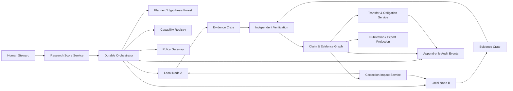

# 01 — System specification

## 1. Normative language

`MUST`, `MUST NOT`, `SHOULD`, `SHOULD NOT`, and `MAY` are normative. Every normative requirement has a stable identifier. A release may not claim conformance while knowingly violating a MUST requirement.

## 2. System boundary

MRR is divided into a control plane and independently governed data-plane nodes.

### 2.1 Control plane

The control plane coordinates work and stores only the information permitted by participating practices. It contains:

1. Research Score Service
2. Workflow Orchestrator
3. Capability Registry
4. Policy Decision Gateway
5. Claim and Evidence Graph
6. Review and Verification Service
7. Transfer and Obligation Service
8. Correction Impact Service
9. Audit/Event Log
10. Export/Projection Service
11. Observability and Cost Ledger

### 2.2 Data plane

Each local node contains:

1. Node Manifest and local identity
2. Local policy engine
3. Task inbox and decision interface
4. Sandboxed executor
5. Local data connectors
6. Local artifact store
7. Evidence Crate builder
8. Signed result outbox
9. Optional offline store-and-forward transport

The control plane MUST NOT assume that local data, prompts, logs, or artifacts are globally readable.

## 3. Reference architecture



## 4. Primary end-to-end workflow

### 4.1 Stage 1 — Research Score

A human or authorized practice creates a `ResearchScore` defining the question, scope, non-goals, data classes, allowed methods, budgets, quality gates, and autonomy limits.

- **MRR-FR-001**: Every research run MUST originate from an approved, versioned `ResearchScore`.
- **MRR-FR-002**: A material change to question, scope, data class, autonomy, budget, or publication policy MUST create a new score revision.
- **MRR-FR-003**: A score revision MUST NOT retroactively alter the policy or meaning of completed runs.
- **MRR-FR-004**: The system MUST reject execution when the referenced score is missing, unapproved, expired, or superseded without explicit continuation permission.

Acceptance:

- Creating a run without an approved score returns a deterministic domain error.
- Every run record resolves to the exact score revision and policy bundle used.

### 4.2 Stage 2 — Hypothesis Forest

The planner generates multiple research branches rather than one linear plan.

- **MRR-FR-010**: The planner MUST support at least the branch roles `confirmatory`, `falsification`, `alternative_explanation`, `replication`, `method_independent`, and `insufficient_evidence`.
- **MRR-FR-011**: A score MAY waive a branch role only with a recorded reason.
- **MRR-FR-012**: Each branch MUST declare falsifiable expectations, required capabilities, estimated budget, stop conditions, and dependencies.
- **MRR-FR-013**: Branch prioritization MUST preserve non-selected branches and the reasons for deferral.
- **MRR-FR-014**: The planner MUST NOT mark its own hypothesis as verified.

Acceptance:

- A branch cannot enter execution without stop conditions and an allocated budget.
- Deferred and rejected branches remain queryable.

### 4.3 Stage 3 — Capability discovery and negotiation

- **MRR-FR-020**: Every executable node MUST publish a signed `NodeManifest` containing capabilities, restrictions, accepted inputs, output types, data residency, and approval requirements.
- **MRR-FR-021**: The orchestrator MUST match tasks to capabilities without assuming permission.
- **MRR-FR-022**: The target node MUST make the authoritative accept, modify, defer, or reject decision.
- **MRR-FR-023**: Modified tasks MUST be returned as a new signed revision and explicitly accepted by the origin before execution.
- **MRR-FR-024**: A refusal MUST be preserved as a research event with a reason category and optional human-readable explanation.

Acceptance:

- A node can reject a syntactically valid task for local policy reasons without causing workflow corruption.
- The control plane cannot set a node task to `accepted` on behalf of that node.

### 4.4 Stage 4 — Signed Task Bundle

- **MRR-FR-030**: Every execution MUST be driven by a schema-valid, content-hashed `TaskBundle`.
- **MRR-FR-031**: A cross-practice `TaskBundle` MUST be signed by the origin practice.
- **MRR-FR-032**: The bundle MUST specify purpose, inputs, data access mode, allowed tools, container digest, resources, network policy, output contract, budget, expiry, and approval rules.
- **MRR-FR-033**: Secrets MUST be referenced by local secret identifiers and MUST NOT be embedded in the task payload.
- **MRR-FR-034**: A task revision MUST receive a new content hash and signature.
- **MRR-FR-035**: Task execution MUST be idempotent with respect to the tuple `(task_id, revision, execution_attempt)`.

Acceptance:

- Signature or hash mismatch rejects the task before any data access.
- An expired task cannot start.
- An identical delivery does not create duplicate authoritative runs.

### 4.5 Stage 5 — Local execution

- **MRR-FR-040**: Tasks MUST execute under the target node's local policy and resource controls.
- **MRR-FR-041**: Sandboxed execution MUST default to non-root, read-only base filesystem, explicit writable mounts, bounded CPU/memory/disk/runtime, and deny-by-default network egress.
- **MRR-FR-042**: The executor MUST record an immutable `RunManifest` before sealing outputs.
- **MRR-FR-043**: Failed, cancelled, timed-out, partially completed, and policy-denied runs MUST produce explicit terminal records.
- **MRR-FR-044**: The system MUST distinguish deterministic transformations from stochastic model-assisted operations.
- **MRR-FR-045**: Model invocations MUST use a provider-neutral adapter and record model profile, prompt/configuration hash, tool calls, token usage, and response hash subject to local redaction policy.
- **MRR-FR-046**: A model response MUST be treated as a proposal until domain validation accepts it.

Acceptance:

- A task cannot write outside approved mounts.
- A timeout produces `timed_out`, not generic `failed`.
- Invalid structured model output cannot enter the claim graph.

### 4.6 Stage 6 — Evidence Crate

- **MRR-FR-050**: Every completed or materially failed run MUST produce an `EvidenceCrate` or a signed failure crate.
- **MRR-FR-051**: Every artifact MUST have a media type, byte size, SHA-256 content hash, producer run, creation time, and disclosure classification.
- **MRR-FR-052**: Every source-based evidence item MUST include a resolvable source record and an exact anchor where technically possible.
- **MRR-FR-053**: Every computational result MUST reference inputs, code or workflow version, environment digest, parameters, and output artifacts.
- **MRR-FR-054**: The crate MUST preserve null results, errors, exclusions, and known unknowns.
- **MRR-FR-055**: Crates MUST be exportable in an RO-Crate-compatible form and mappable to W3C PROV relations.
- **MRR-FR-056**: A sealed crate is immutable; corrections create new objects and links rather than altering sealed bytes.

Acceptance:

- Recomputing a sealed artifact hash yields the stored value.
- A supported source claim cannot cite only a bare URL without an evidence anchor or explicit `anchor_unavailable` reason.

### 4.7 Stage 7 — Claim graph

- **MRR-FR-060**: Claims MUST be atomic enough to be independently supported, contested, contradicted, or withdrawn.
- **MRR-FR-061**: Every claim MUST declare type, scope, status, evidence links, counterevidence links, dependencies, uncertainty, and provenance.
- **MRR-FR-062**: A claim with status `supported` MUST have at least one valid support relation and no unresolved hard verification failure.
- **MRR-FR-063**: A claim MAY exist without support only under `draft`, `unsupported`, `unresolved`, or `speculative` status.
- **MRR-FR-064**: The system MUST distinguish `not_found`, `unknown`, `null_result`, `contradicted`, `underpowered`, `method_invalidated`, and `withdrawn`.
- **MRR-FR-065**: Source count MUST NOT be presented as evidence independence. Source families MUST be represented separately.
- **MRR-FR-066**: Materially different scopes or interpretations MUST remain separate claims linked by typed relations rather than merged into vague consensus.

Acceptance:

- The API rejects `supported` without support evidence.
- Two claims with different population or temporal scope cannot be silently deduplicated.

### 4.8 Stage 8 — Skepticism and independent verification

- **MRR-FR-070**: The proposer and executor MUST NOT issue the final verification decision for their own claim.
- **MRR-FR-071**: A verification record MUST declare its independence dimensions: principal, model family, prompt family, retrieval path, code path, and data access path.
- **MRR-FR-072**: Source verification MUST retrieve or locally inspect the cited source and validate the evidence anchor.
- **MRR-FR-073**: Numeric verification MUST recompute the value or explicitly record why recomputation is impossible.
- **MRR-FR-074**: The skeptic MUST search for counterevidence, alternative explanations, scope leakage, and hidden assumptions.
- **MRR-FR-075**: Failed verification MUST change or block claim status according to a deterministic policy.
- **MRR-FR-076**: Repeated judgments from the same model/configuration MUST NOT count as independent reviews.
- **MRR-FR-077**: The system MUST preserve reviewer disagreement and adjudication rationale.

Acceptance:

- A self-verification attempt is rejected.
- A citation verifier that cannot open the source returns `unverified_source_access`, not `verified`.

### 4.9 Stage 9 — Transfer and obligations

- **MRR-FR-080**: A transfer between practices MUST use a versioned `TransferContract` referencing exact source objects by identifier and hash.
- **MRR-FR-081**: The receiving practice MUST respond with `accepted`, `adapted`, `rejected`, `deferred`, or `unresolved`.
- **MRR-FR-082**: Adaptation MUST create a new local object and preserve the relation to the source object.
- **MRR-FR-083**: Obligations, caveats, disclosure limits, attribution, and correction subscriptions MUST travel with the transfer.
- **MRR-FR-084**: A receiving practice MAY reject a correction, but MUST record that it was notified and why it rejected or deferred it.

Acceptance:

- Transferred caveats are visible in every projection unless a local adaptation explicitly changes them with rationale.
- The recipient cannot silently replace the source hash.

### 4.10 Stage 10 — Correction propagation

- **MRR-FR-090**: A correction MUST identify affected objects, reason, severity, evidence, and requested action.
- **MRR-FR-091**: The impact service MUST traverse dependency, derivation, citation, transfer, and publication edges.
- **MRR-FR-092**: Affected claims MUST receive `review_required` or a stricter status without deleting local decisions.
- **MRR-FR-093**: Impact propagation MUST be idempotent and cycle-safe.
- **MRR-FR-094**: Every affected practice MUST receive a signed notification or a durable pending-delivery record.
- **MRR-FR-095**: Public projections MUST display unresolved critical corrections.
- **MRR-FR-096**: A participant data withdrawal MUST invoke the same impact machinery plus retention and deletion policy.

Acceptance:

- A benchmark graph with cycles produces one notification per affected object and no infinite loop.
- Withdrawing a source dataset marks dependent claims for review.

### 4.11 Stage 11 — Projection and publication

- **MRR-FR-100**: Reports, papers, dashboards, and summaries MUST be generated as projections from versioned claim and evidence objects.
- **MRR-FR-101**: A publication bundle MUST include methods, claim table, evidence map, counterevidence, uncertainty, known unknowns, corrections, and provenance summary.
- **MRR-FR-102**: External publication MUST require an A4 human approval event.
- **MRR-FR-103**: The system MUST support internal, partner-restricted, and public disclosure projections.
- **MRR-FR-104**: A narrative generator MUST NOT invent citations or omit material unresolved corrections.

Acceptance:

- Removing a claim from the graph removes it from regenerated projections without altering historical releases.
- An unapproved bundle cannot be published through any first-party connector.

## 5. Autonomy model

Autonomy is assigned per capability and action.

| Level | Name | Permitted actions | Required control |
|---|---|---|---|
| A0 | Observe | retrieve, parse, classify, compare | automated policy validation |
| A1 | Draft | propose hypotheses, protocols, code, questions | clearly marked proposal |
| A2 | Sandbox Execute | run code in isolated local environment | resource and network policy |
| A3 | Federated Execute | send signed bundles to nodes | target-node acceptance |
| A4 | External Act | publish, contact people, release data, control devices | explicit human or dual approval |

- **MRR-FR-110**: A component MUST NOT infer permission for a higher autonomy level from permission at a lower level.
- **MRR-FR-111**: Every external connector MUST declare its autonomy level and approval requirement.
- **MRR-FR-112**: The default for unclassified actions is deny.

## 6. State machines

### 6.1 Research Score

```text
DRAFT -> IN_REVIEW -> APPROVED -> ACTIVE -> SUPERSEDED -> ARCHIVED
             |            |
             v            v
          REJECTED      SUSPENDED
```

Only `APPROVED` and `ACTIVE` revisions may start work. `SUSPENDED` blocks new work but preserves running-work policy according to the suspension decision.

### 6.2 Task Bundle

```text
CREATED -> OFFERED -> ACCEPTED -> QUEUED -> RUNNING -> COMPLETED -> SEALED
                 |       |          |          |           |
                 |       |          |          +-> FAILED  +-> INVALID_RESULT
                 |       |          +-> CANCELLED
                 |       +-> EXPIRED
                 +-> MODIFICATION_PROPOSED -> OFFERED
                 +-> DEFERRED
                 +-> REJECTED
```

### 6.3 Claim

```text
DRAFT -> UNDER_REVIEW -> SUPPORTED
                    |-> CONTESTED
                    |-> CONTRADICTED
                    |-> UNRESOLVED
                    |-> UNSUPPORTED
Any nonterminal status -> REVIEW_REQUIRED
Any status -> WITHDRAWN
Any status -> SUPERSEDED
```

A withdrawn or superseded claim remains addressable.

### 6.4 Correction

```text
OPEN -> IMPACT_ANALYSIS -> NOTIFYING -> AWAITING_RESPONSES -> RESOLVED
                                         |                  |-> PARTIALLY_RESOLVED
                                         |                  |-> REJECTED_BY_RECIPIENT
                                         +-> DELIVERY_PENDING
```

## 7. Required components and responsibilities

### 7.1 Research Score Service

Validates score contracts, approvals, revisions, and policy references.

### 7.2 Durable Orchestrator

Coordinates long-running workflows, retries only idempotent activities, enforces budgets and stop conditions, and never stores hidden agent state as the sole record.

### 7.3 Capability Registry

Stores signed node manifests and compatibility metadata. It does not grant permission.

### 7.4 Policy Gateway

Combines global hard constraints with local node policy. Local policy may be stricter. Policy decisions are recorded as objects.

### 7.5 Node Runtime

Authenticates task bundles, performs local policy evaluation, executes approved work, seals outputs, and signs result crates.

### 7.6 Claim and Evidence Graph

Stores typed nodes and edges in PostgreSQL. A graph database is not required for v1. Recursive queries and materialized views are sufficient until measured otherwise.

### 7.7 Review and Verification Service

Assigns independent reviewers, validates independence, runs deterministic checks, records adjudication, and prevents self-approval.

### 7.8 Correction Impact Service

Computes transitive impact, creates review obligations, and tracks recipient responses.

### 7.9 Projection Service

Builds reports and portable bundles from a fixed graph revision.

## 8. Deployment modes

### 8.1 Local development

Docker Compose MAY run PostgreSQL, MinIO, Temporal, the control plane, and one node runtime.

### 8.2 Single-practice production

One practice runs both planes but MUST preserve logical role and permission separation.

### 8.3 Federated online

Nodes communicate over mutually authenticated channels and exchange signed task and result objects.

### 8.4 Federated offline

Air-gapped or intermittent nodes use signed inbox/outbox bundles. Import and export MUST verify signatures, expiry, replay protection, and object hashes.

## 9. Non-functional requirements

- **MRR-NFR-001 Provenance completeness**: Every authoritative state transition MUST identify actor, timestamp, policy version, causation, correlation, and object revision.
- **MRR-NFR-002 Auditability**: Domain events MUST be append-only and tamper-evident.
- **MRR-NFR-003 Portability**: Core objects MUST be exportable without a proprietary database dump.
- **MRR-NFR-004 Vendor neutrality**: LLM, storage, workflow, and identity providers MUST be behind interfaces.
- **MRR-NFR-005 Resilience**: Node unavailability MUST not corrupt global state; workflows pause or use explicit alternatives.
- **MRR-NFR-006 Privacy**: Raw restricted data MUST remain local unless a specific approved transfer permits export.
- **MRR-NFR-007 Security**: Cross-practice objects MUST be authenticated, authorized, signed, hashed, and replay-protected.
- **MRR-NFR-008 Observability**: Trace identifiers MUST connect score, branch, task, run, model call, artifact, claim, review, transfer, and correction.
- **MRR-NFR-009 Cost control**: Every run and model call MUST be attributable to a score, branch, budget, and practice.
- **MRR-NFR-010 Maintainability**: Core domain logic MUST be separated from frameworks and external adapters.
- **MRR-NFR-011 Accessibility**: Human review interfaces SHOULD expose provenance, uncertainty, and correction status without requiring database access.
- **MRR-NFR-012 Explicit degradation**: Missing models, connectors, or nodes MUST produce explicit degraded states rather than fabricated substitutes.

## 10. Technology baseline

The initial implementation SHOULD use:

- Python 3.12 or newer;
- FastAPI and Pydantic v2;
- PostgreSQL with JSONB and explicit edge tables;
- S3-compatible content-addressed object storage;
- Temporal for durable workflows;
- OCI images pinned by digest for execution;
- OpenTelemetry for traces and metrics;
- OIDC for users and service identities plus mTLS for node-to-node transport;
- SHA-256 content hashes and Ed25519 signatures;
- Git for code, policies, prompt templates, schemas, and specifications.

Any substitution requires an ADR explaining operational, security, and migration consequences.

## 11. v0.2 integrated research workflow

Between Research Score approval and executable Hypothesis Forest tasks, method-bearing projects MUST pass through:

```text
QuestionModel
→ ConceptMeasurementCharter
→ Estimand and CausalModel
→ EvidenceMatrix and DataAssetProfiles
→ ResearchDesign
→ IdentificationAudit
→ PreAnalysisPlan
```

After execution, primary claims MUST pass through:

```text
FalsificationPlan outcomes
→ ReplicationPlan outcomes
→ GeneralizationMap
→ ResearchDecision
```

The services, contracts, state machines, and claim gates are normative in docs 08–19 and ADR-0003/0004.

- **MRR-FR-120**: A method-bearing analysis task MUST reference an eligible design and, where required, a locked pre-analysis plan.
- **MRR-FR-121**: The Claim Service MUST enforce the claim ceiling issued by the active method profile and Identification Audit.
- **MRR-FR-122**: Method dependency invalidation MUST trigger the same correction-impact machinery as evidence invalidation.
- **MRR-FR-123**: Synthetic test fixtures MUST be technically ineligible to support empirical claims.
