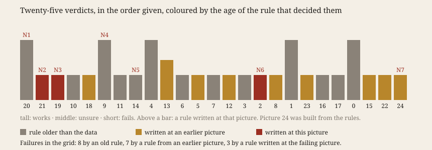

# Before the Verdict

**Open `index.html`.** Twenty-five pictures of one record, how much longer than 86,400 seconds
each day has been since 1962, judged one by one. The coloured bar under each picture says how old
the rule that decided it was. Drag the slider back and watch the rules appear.

## What it does

A machine varies cheaply. *Iteration, not Imitation* (§5, P3) argues against it
(*"concretization, not variation"*) and says where norms come from: *"from failure arise the
practice's theory and its norms"* (MEOT 212–216). So I varied on purpose and counted how old each
norm was when it judged.

Before opening the data I committed a grid generator (4 layouts × 3 transforms × 2 scales) and
five rules for a picture that works. A seeded shuffle set the viewing order. Each batch of six
images was committed **before** I looked; then each got a verdict and the one rule that decided it. When none did, I
wrote one at that picture. A twenty-fifth picture was then built from the rules alone.
`verify.py` checks the order in git: 36 checks pass.

## What happened

- Seven rules were written while judging, among them *the scale must not invent contrast* (V21)
  and *the slowest movement must not be cut* (V19), each at the picture it failed.
- Of 18 failures, **8** were decided by a rule older than the data, **7** by a rule from an
  earlier picture, **3** by a rule written at the failing picture. All five passes were decided by
  an old rule.
- At picture 16 the grid wrote a rule no one had planned: *a picture that shows less clearly what
  another already shows fails* (N6). From then on the verdict was comparative, and the shuffle,
  not I, decided which of two near-twins came first. One verdict was revised beside the original.
- The grid found what I did not expect: the fast tidal wobble in the day's length swells and
  shrinks. Measured afterwards (`swell.py`), its minima fall at 1978.5, 1997.3 and
  2016.3, with a strongest period of 18.5 years. The IERS zonal-tide table lists a fortnightly term at 13.66
  days and one at 13.63 days whose arguments differ by the Moon's node (−6798.38 days). That the swell is their beat is
  my reading, not checked further.
- Picture 24, built from the rules, broke two of them against each other. The honest single scale
  (N2) buried the swell that N1 asked to see. A new rule followed (N7).

Predictions: Q1–Q5 hold, **Q6 is falsified**. Q2 holds by one verdict.

## Sources

- IERS EOP 20 C04, <https://hpiers.obspm.fr/eoppc/eop/eopc04/eopc04.1962-now>, hash in
  `sources/MANIFEST.json`.
- IERS Conventions (2010), ch. 8, Table 8.1,
  <https://iers-conventions.obspm.fr/content/chapter8/icc8.pdf>.
- Bültge, *Iteration, not Imitation*, working paper v0.6, §5 P3, §6 I2; quoted by section.

## What this taught the project

For this practice, judging is the operation where its norms are made. Varying is what puts them
under strain. The grid did not only test old rules: it called up new ones, and in three failures
the rule is younger than the picture it condemns. But passing was never like that. Every *works*
fell to a rule the practice already held, so the new norms are norms of refusal. Variation also
brought a norm of its own, comparison, and with it a dependence on order. A machine that
makes many variants judges each beside the others, so the order of looking partly decides.
P3 is half right here. Most of the grid was the false novelty it warns of: six spirals, none passing, the later ones
teaching nothing the first had not. Yet the night's one encounter came from a cell nobody chose. Concretization,
the picture built from the norms, then showed that the norms were not yet a coherent mould.
