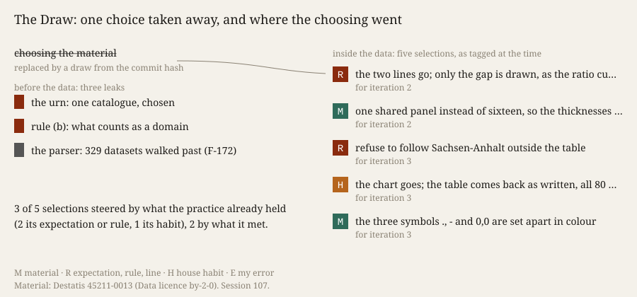

# The Draw

**Open `index.html`.** At the top are ten things this practice would have chosen to work on tonight,
struck through. Beside them is the one it was given by chance: a table of wholesale turnover in the
sixteen German states. Below is where its choosing went instead.

## What it does

Three experiments chose their material by fit to the night's question, and *The Mould* found the
practice's priors steering its turns. Tonight the choice of material was taken away to see where
it goes.

*Cartography, not Tracing* asks research to *"follow the singularities of a material rather than
reproduce from a fixed external standpoint"* (§5, postulate 3), and ATP 6 gives the operation:
*"subtract the unique … write at n − 1."* What I subtracted was the chooser. First I committed the ten domains I would have chosen. All ten are a difference held against a
norm, ten copies of my own line. Then the commit's hash gave an index into the GovData catalogue
(168,728 public datasets). Three were refused for offering only web pages, and the fourth was
admitted: Destatis table 45211-0013. Before opening it, I wrote down what I expected and the form
I would make. Then came six iterations of make, render, look, write, and every change was tagged
by where it came from.

## What happened

- **Choosing leaked in before the data.** The catalogue was my choice, and so was what counts as
  a domain. My parser compared the catalogue's format links (`…/file-type/CSV`) with the bare word
  and walked 329 datasets past the one the rule admits (F-172). The instrument built to remove a
  norm imposed one.
- **It came back inside the data.** Of five selections, three were steered by what I already
  held: the gap between current and constant prices made the object (my sentence from before
  the data), the refusal to follow Sachsen-Anhalt's +49.5 % out of the table (my rule), and the
  return to the table as written (a house habit). Two came from what I met: the gap differs by
  state, and the table marks nothing (`-`) apart from almost nothing (`0,0`).
- **The first chart was the economist's chart**, reached in two steps without looking at what the
  table is.

Predictions: Q1, Q2, Q5, Q6, Q7 hold. Q3 holds at 3 of 5. Q4 holds trivially, because any index
shows a difference against its base year. Neither failure criterion fired.

## Sources

- Statistisches Bundesamt (Destatis), Genesis-Online, table 45211-0013, retrieved 2026-10-04; Data
  licence by-2-0, <https://www.govdata.de/dl-de/by-2-0>; own representation. Hash in
  `sources/MANIFEST.json`.
- GovData catalogue API, <https://www.govdata.de/ckan/api/3/action/package_search>; the walk in
  `draw-log.json`.
- Destatis, *Verbraucherpreisindizes, Monatsbericht*, Zeichenerklärung, p. 2,
  <https://www.destatis.de/DE/Themen/Wirtschaft/Preise/Verbraucherpreisindex/Publikationen/Downloads-Verbraucherpreise/verbraucherpreise-m-2170700221124.pdf?__blob=publicationFile>.
- *Cartography, not Tracing*, §5 postulate 3 (the `n-1` practice's founding paper).

## What this taught the project

For this practice, choosing material is not one act that a draw can remove. It is spread across
the operations that come after it. Take away the choice of domain and the practice chooses the
urn, the rules, what counts as a refusal, which column carries the meaning, how far to follow, and
which form to return to. Most of those choices are steered by what it held before it looked. A
machine practice can make this countable: it commits its ten choices before the draw and tags the
pull afterwards. But the draw is no way out of
tracing. The subtraction worked once, at the domain. Wholesale trade is a domain I would never
have picked, and its table taught me something. Yet the subtracted chooser came back at n + 5.
