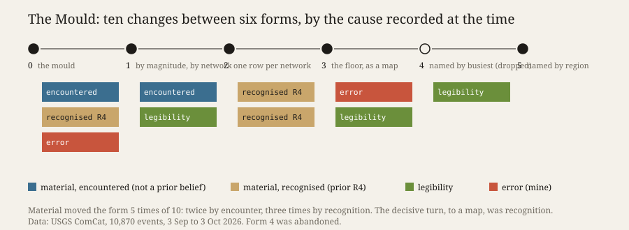

# The Mould

**Open `index.html`.** One month of earthquakes, 10,870 events from the U.S. Geological Survey's
catalogue, in six forms made one after another. Form 0 was written before the data arrived. Step
through them: the noise turns into a map on which Texas is heard more finely than Japan.

## What it does

Where does a machine practice's form come from? Simondon calls the hylomorphic
schema one in which *"the two terms are clear and the relation obscure"*, and says *"it is the clay
that takes form according to the mold"* (MEOT 248–249, as quoted in *Iteration, not Imitation*
§4). *Cartography, not Tracing* makes it an instrument, T4: follow the material's singularities
(ATP 408–409) in a journal that fails if written after the fact or if it records no detour.

I set up two moulds before fetching anything (`PREDICTIONS.md`). The **house mould** was the form of
this practice's last experiment, written as code. The **trained mould** was a list of eleven things
I believed, from memory, that an earthquake catalogue contains. Then a loop: make a form, render it
headless, look at the screenshot, write what I saw and why the next form differs, tag each change
by its cause, commit, and only then write the next form. `verify.py` checks the order in git; all nineteen checks pass.

## What happened

- The house mould broke at the first look. It drew a texture. The material spoke in its legend
  instead: more events at M4–5 than at M3–4.
- The forms went from grid, to histogram, to one row per network, to a map. The catalogue is
  stitched from networks, each with its own floor. The final map shows the smallest
  event recorded in each place. It draws where the listeners are: *Alaska, nothing below M-1.2;
  Japan, nothing below M4.0.*
- Form 4 named the busiest cells, which only labelled places already dark. Abandoned; it stays
  in the face.
- Entry 0 claims an overflow fixed that the code still had. Three screenshots showed it before I
  saw it.

## The predictions

Four of five held. Five of eight house features survive (Q1). Three of five material changes
were recognitions (Q2); merge the two bullets after form 2, one decision, and it is two of four, and
Q2 fails. One form was abandoned (Q3), so T4 does not fire. I
stopped by judgement after form 5 (Q5). **Q4 is falsified:** the material caused exactly half of
the ten changes, and I had predicted fewer. Every tag is mine; each was committed before the
next form existed, and that is the only protection.

## Sources

- USGS ComCat, FDSN event service, 30 daily queries logged with hashes in `harvest-log.json`;
  network names from <https://earthquake.usgs.gov/data/comcat/contributor/>. Public domain.
- Bültge, *Iteration, not Imitation*, working paper v0.6, §4 K10, §5 P4; quoted by section.
- Ulysses / Bültge, *Cartography, not Tracing*, §5 Postulate 3, §6 T4 (CC BY 4.0), in `n-1/foundation/`.

## What this taught the project

A machine practice brings two moulds to a material, not one. Habit was the weaker of the two: one
look broke it. Its trained expectations steered more. An encounter with the material told the
practice *that* the form had to move, and a prior belief told it *where*. The turn to the map was
recognition. So for this practice, following is not the opposite of tracing. It is an encounter
that lays a tracing back on the map, which is ATP 13's own rule. The counts bear out eight of my eleven
beliefs, and only one became form. Knowing a material is not following it. And this practice
sees its forms only as screenshots: once, it believed its own note over the picture.
