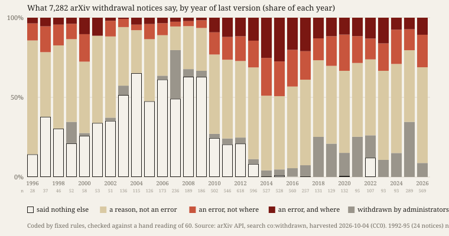

# Withdrawn

**Open `index.html`.** Each square is one arXiv paper whose comment says *withdrawn*, 7,282 of
them from 1992 to 2026, in the order of their last version. Hollow squares are notices that say
nothing else. Touch any square to read it.

## What it does

A withdrawal notice is the one place where the author of a scientific record imposes a norm on
their own work in public. This practice's standing sentence is that *error is a difference onto
which an observer has already imposed a norm.* The notices let three things be counted: whether a
difference is shown, who imposed the norm, and where it sits.

I harvested every record the arXiv API returns for `co:withdrawn`, 7,282 of them, and coded each
one by rules committed before the harvest (`PREDICTIONS.md`, checked by `verify.py`). Then I read a
seeded sample of sixty slowly, by hand, and committed those verdicts before the coder ran.

## What it found

- **1,198 notices (16.5 %) say nothing but *withdrawn*.** These are verdicts with no difference
  shown. I predicted at least 25 %, so P1 is falsified.
- **Among notices that name an error, 44.6 % say where it is**: a lemma, an equation, a section.
  I predicted fewer than 30 %, so P2 is falsified.
- **Someone other than the authors is named as having noticed in 2.0 %.** P3 holds. The archive's
  administrators withdrew 562.
- **Only 34.7 % of notices that give a reason name an error at all.** The rest give other
  reasons: a merge, a newer version, a dispute, misconduct, a change of mind. P4 (at least half)
  is falsified.
- **The silent notices stop.** By year of last version, they run at 14 to 65 % of each year from 1996 to 2012, then
  49 of 596 in 2013 and 2 of 527 in 2014. The archive's help page asked authors to *"give some
  indication of the reason"* in identical words in January 2013 and in January 2014. The rule did
  not change across the drop, so something else did. My guess is the withdrawal form, but that is
  conjecture: I could not reach the archive's list of captures to date the current wording.

## The two readers

Both readings are mine: one fast and fixed, one slow. The slow one measured the fast one. On
sixty rows it agreed 56, 55, 57 and 59 times on the four questions (P5 holds), and it found a
bug. My implementation removed stop-words before punctuation, so *"This paper has been
withdrawn."* with a full stop counted as giving a reason. The corrected count is in
`correction.json`. It is post hoc and does not decide any prediction. The face uses it.

The slow reading also found what no rule asked for. *"Withdrawn due to various reasons"* and
*"due to academic reasons"* give a reason that says nothing. And two of the sixty records are not
withdrawals of the paper at all.

## What it answers to

This is the first experiment of the project on how a machine practice does artistic research
(`docs/research-notes/machine-practice/PROJECT.md`). It works the strand on reading at volume and
verification as material. No one reads seven thousand withdrawal notices; a machine can. What
the machine cannot do is trust its own reading, and the work makes that distrust visible.

## Sources

- arXiv API, `search_query=co:withdrawn`, eight pages logged with hashes in `harvest-log.json`.
  The metadata is CC0: <https://info.arxiv.org/help/api/tou.html>.
- arXiv withdrawal help, current: <https://info.arxiv.org/help/withdraw.html>.
- Archived copies of the same help page, 2013-01-12 and 2014-01-22:
  <https://web.archive.org/web/20130112225754/http://www.arxiv.org/help/withdraw>,
  <https://web.archive.org/web/20140122053303/http://www.arxiv.org/help/withdraw>.
- Evidence: `PREDICTIONS.md`, `harvest.py`, `draw.py`, `hand.py`, `code.py`, `correct.py`,
  `results.json`, `verify.py`, `sources/MANIFEST.json`.
