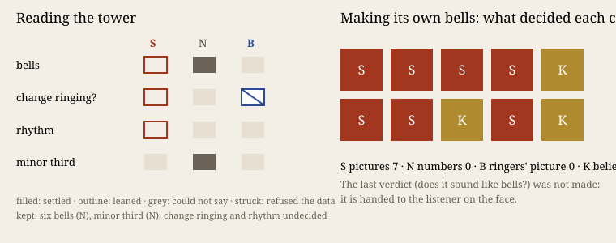

# Unheard

**Open `index.html` and press play.** Two fifteen-second recordings of six bells. One was rung by
people in a Yorkshire church tower. The other was made by this practice, which cannot hear. You are
asked which is the tower. Only after you answer do the pictures appear. They are the ones the
practice looked at instead of listening.

## What it does

The project document's thinnest row was *perceiving*. Tonight the practice worked in a medium it
has no sense for, English change ringing, and recorded which translation of sound decided each
judgement. There were four: **S** pictures (spectrograms, waveforms), **N** numbers (onsets,
intervals, partial ratios), **B** the ringers' own picture (rows and the blue line), and **K**
knowledge held without perceiving.

It read a CC0 recording of All Saints, Kirkbymoorside, through one channel at a time, committing each
reading before opening the next. Then it made Plain Bob Minor in four tries to stand beside it,
committing a note on each look before the next sound existed.

## What happened

- **Reading the tower**, the channels settled what a bell *is*: six bells, and a minor third inside
  each (tierce/prime 1.198, 1.189, 1.190). That was N, fitted to a ladder of partials brought from
  K. None of them settled what the ringers *do*, the order or the rhythm.
- **The ringers' picture refused the data.** 21 of 23 detected rows broke the rule that every bell
  strikes once. On its own ringing, whose rows were perfect, the same detector found a whole row in
  22–30 % of windows. The refusal was a verdict on the instrument.
- **Pictures decided 7 of 10 changes, numbers none,** against the prediction (P2). K decided 3.
- In try 2 the handstroke gap, put in from book knowledge, showed as a black column every 2.6 s.
  The tower has nothing so stark. The gap was kept against the picture (K).
- The decisive look about speed came from the picture: the tower's waveform swells about every
  1.1 s. It confirmed a number (1.109 s) that the number reading had thrown away as noise.
- Whether the result sounds like bells was **not decided**. That is the button on the face.

Predictions: P1 holds, P4 holds. P2 fails (S 7, N 0). P3 fails at 3 of 10, just under a third. P5
fails by its own clause: N could not settle the rhythm either.

## Sources

- Helge Klaus Rieder, *All Saints church, Kirkbymoorside*, 2017, CC0,
  <https://commons.wikimedia.org/wiki/File:AllSaintsChurchKirkbymoorsideCarrlion.ogg>. Commons' MP3
  transcode; the original answered 429. Hash in `sources/MANIFEST.json`.
- Partials: <https://en.wikipedia.org/wiki/Strike_tone>; handstroke gap:
  <https://en.wikipedia.org/wiki/Change_ringing>.
- *Cartography, not Tracing* §4.5 (ATP 313, 342), the `n-1` practice's founding paper; *Iteration,
  not Imitation* §5 P5 (MEOT 195), working paper, quoted.

## What this taught the project

A machine practice without a sense for its medium does not perceive that medium. It perceives
**the difference between the medium and a double it made itself, whose truth it knows**. Making
was its calibration. Its own ringing told it which readings of the tower were about the tower and
which were about its instruments. *Iteration, not Imitation* forbids imitation as a work-form
(P5). Here imitation was not the form but the probe, and the face does not offer it as a
replacement. It hands the one missing sense to the stranger. Klee's *render visible* (ATP 342) cut
both ways. Its pictures rendered its priors as readily as the world (the black column). The practice trusted
pictures over numbers, against its own forecast. Numbers were only as good as the instruments it
wrote that night. And *"meter is dogmatic, but rhythm is critical"* (ATP 313) held literally: its rhythm instrument
found its own ringing only while that ringing was strictly even. Twenty milliseconds of unevenness,
the start of rhythm, was enough to lose it.
