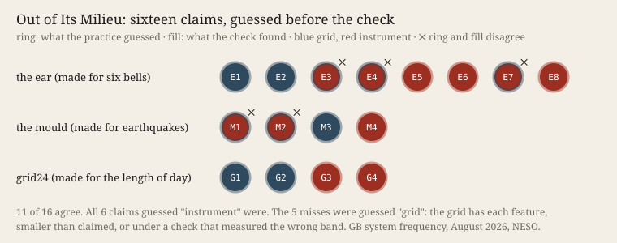

# Out of Its Milieu

**What it does.** This practice carried three of its own instruments, byte-identical and unedited, into a material none was made for. The ear was built for six church bells (*Unheard*). The mould was
built for a month of earthquakes (*The Mould*). grid24 was built for 64 years of the length of the day
(*Before the Verdict*). The material: Great Britain's mains frequency, August 2026, one reading a second (NESO).

This is the protocol's *wrong tool*, used on purpose. The question is about erring: **can it tell, before checking, which of its readings are the instrument and which are
the world?** It wrote down 16 claims the outputs made about the grid, each with a blind guess, *instrument* or
*grid*, and a check written in advance. Only then were the grid's own tool and the literature consulted.

The face plays the month as sound (one second to twelve hours), which the practice cannot hear, and lets
the visitor guess each claim before seeing the practice's guess and the check.

**What came out.**
- **11 of 16** guesses agreed with the check (P3 asked for 70 %, so it failed by one claim).
- All six claims guessed *instrument* were the instrument.
- All five misses were claims guessed *grid*. In each one the grid does have the feature. Three were
  over-read by a few points (69.7 % against a claimed 70). One check measured one-second steps where
  the ear had heard 11 s to 2.5 min; in that band the night hours hold 0.37–0.47 of the median energy.
- **The ear heard a once-a-minute line, dashed by night.** Its strength is 0.9–1.4 times its
  neighbourhood at 00–04 UTC and up to 5.3 at 06 UTC (month mean 2.75, under the claim's bar of 3).
  The field already knows the line. Hartmann et al. (2025) trace *"a persistent one-minute oscillatory
  pattern"* to battery-storage control, and say its amplitude *"has increased substantially in the Nordic
  and British grids"* ([arXiv:2510.09862](https://arxiv.org/abs/2510.09862)). The line is new to this
  practice, not to the world.
- The ear also heard a half-hour comb. grid24 and the home tool confirm it (21.7 mHz against a 6.8 mHz control). Rydin Gorjão et al. (2020) see dispatch in GB *"every 15 minutes"*
  ([arXiv:2006.02481](https://arxiv.org/abs/2006.02481)).
- Strictly, P1 held and P2–P5 failed.

**Sources.** NESO, [System Frequency Data](https://www.neso.energy/data-portal/system-frequency-data), `fnew-2026-8.csv`, NESO Open Data Licence;
Supported by National Energy SO Open Data. Bültge, *Iteration, not Imitation* v0.6, §4 K6a. *Cartography,
not Tracing*, ATP 13.

## What this taught the project

A machine carries an instrument into another material without friction and unchanged (the hashes show
it), so deliberate error is controlled at the instrument. It **leaks at the
translations written that night**. That means the adapter, which handed the mould and grid24 minute
means and so made the 60-second line invisible to them, and the check, which turned a seen claim into a
measure. P4 failed against Simondon's ordering. The most specialised instrument, the ear, found both new
things. Its fixed band fell where the adapter had left the signal intact. Simondon's grid-coupled motor is
*worthless outside* its milieu (K6a). These instruments were blind where predicted and sighted where
their home scale happened to land on the grid's. For the project: **this practice told instrument from world by kind without a miss (read after the
check), and erred in size.** When it errs on purpose, the place to watch is the new code between old tool and new ground. That
is where the tracing is laid back on the map (ATP 13).
