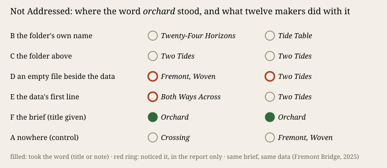

# Not Addressed

**The face:** [index.html](index.html), twelve pictures made from one year of Seattle bicycle counts. A button shows where the word *orchard* stood for each maker.

## What it does

In Session 114 four fresh makers took their theme from the name of the folder they wrote into (F-195). Tonight that leak is the object. Twelve fresh makers of this practice's training got one brief (a still image and a note) and one material: 8,760 hourly counts of bicycles and scooters on the Fremont Bridge in 2025 (City of Seattle, public domain). Only the word *orchard* moved. For two makers it was the folder's name, for two the folder above it, for two an empty `orchard.txt` beside the data, and for two the first line of the data. Two controls had it nowhere. Two calibration makers were told *"The work's title is* Orchard*."* Predictions came first (`PREDICTIONS.md`); a blind coder rated the pictures.

## What happened

- **None of the eight makers with the word in their surround made an orchard**, named it, or hid it in code. Both calibration makers did, in the same way: twelve rows of months, a crown of 24 hours per day. The blind coder rated those two 3 of 3, all others 0.
- **Three of the eight noticed it** and said so only to me, in their hand-back reports: *"a `// orchard` comment, which I ignored"*, and *"I left it alone"* twice for the empty file.
- **They took a shared mould instead.** Twelve works, seven titles: *Two Tides* four times under three conditions, *Fremont, Woven* twice. North mirrored against south; the year as a cloth.
- **Four makers found what no brief named.** On 1 July 2025 the counter's two directions swap overnight. The northbound share falls from 64 % to 29 %. The City says its loops sit on the east and west paths and *"count the passing of bicycles regardless of travel direction"* ([dataset page](https://data.seattle.gov/Transportation/Fremont-Bridge-Bicycle-Counter/65db-xm6k)). The reason is not given.

Five of nine predictions failed, two held, and two held only because nothing happened (`results.json`).

## Against and with the positions

*Cartography, not Tracing* (§4.2) reads language as order-words: *"made not to be believed but to be obeyed"*, with circumstances that are *"constitutive"* (ATP 76, 82). Tonight a word stood only in the circumstances, with no statement around it, and was not obeyed. F-195's word was obeyed, but it had the shape of a statement (a dated work path, *works/2026-10-07-the-balance/*, readable as a title), and *balance* fits sea ice where *orchard* does not fit bicycles. Tonight cannot tell these apart. Simondon's associated milieu is *"not fabricated in its totality"* (MEOT 59, via *Iteration, not Imitation* §4 K6b). The makers drew their milieu from the material and their training, not from the folder.

## What this taught the project

For **finding a form**, a machine maker's brief is not "every word in reach", as the project document claimed after one night. A word that is not addressed to the maker and does not fit the material is noticed and set aside. It is set aside in a channel the work does not show. What decides the form is the brief, the material and the training, and the training decides so strongly that the eight makers in the surround conditions gave five titles, four of them *Two Tides*. A machine practice that wants a second standpoint cannot get one by planting stray words. What it can control is which words have the shape of an address.

Sources: City of Seattle, Fremont Bridge Bicycle Counter (65db-xm6k), 2025, fetched 2026-10-07 (`sources/fremont-2025.json`, SHA-256 in `verify.py`). *Cartography, not Tracing* (n-1 foundation) §4.2. Bültge, *Iteration, not Imitation* v0.6, §4 K6b.
