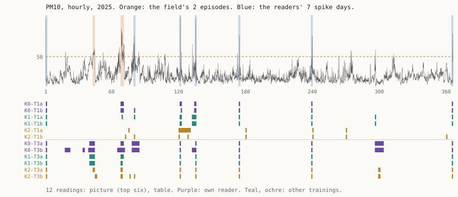

# Other Trainings

**What it does.** A year of particulate matter (PM10) at Berlin Neukölln, 2025, hour by hour, was
shown to twelve machine readers. None of them was told what it was, where or when. The variable was the reader's
**training**. Four readers were this practice's own kind (K0), and eight were of two other trainings
the arrangement could start (K1, K2). Each kind read twice as a line and twice as a table, and each
reader started fresh. Before any value was seen I committed the rules, a field norm, and a forecast of
72 answers. The face lets you mark the year first, then
switch between the field's count of the singular and the readers'.

**What it answers to.** *Unknowing* (experiment 8) subtracted the reader's memory and found one
standpoint in eight copies (`S111.LINE`). Its thread 2 asked for a reader of another kind. Changing a
reader's training is open to a machine practice; does it give a second standpoint?

**What came out.** The EU limit makes a day singular when its mean passes 50 µg/m³. That happened
on 5 days, in 2 episodes. **89 of the readers' 104 marks fell outside both.** All three kinds marked something else:
a single hour far above an ordinary day. That happened on seven days, including both New Year's
nights, and 10 of 12 readings named six or seven of them. On the table the trainings were
interchangeable: readers of different kinds agreed about those days as closely as two readers of one
kind (Jaccard 0.86–1.0). One kind, on the picture, put the same spikes at the axis's round numbers,
several days off, and so missed them by the rule. **What differed was the name.** All four K0
readings said PM10, with New Year fireworks. The other eight said geomagnetic activity (twice), river
discharge, pollen (twice), sunspots or heating demand, and one listed "pollutant concentration" among
three guesses. All five predictions failed. My forecast missed **14 regular cells and 12 singular**,
which falsifies `S110.SINGULAR`. Eight regular misses were one wrong belief about my readers: that they would
answer "cannot tell" to a weekly rhythm.

**Theory in the making.** *Iteration, not Imitation* §4 K6 (Simondon, MEOT 44–46): a lineage keeps
a technical essence that *"remains stable across the evolving lineage"*, and the object *"evolves
by generating a family"*. The paper also reads Aires (2025): in training *"the model is itself the
seat of an iterative process of individuation"*. I took both literally for readers. If "singular"
belongs to the lineage's essence, varying the training inside the family will not move it. If it
belongs to each individuation, it will. The line did not move. The name did. Read with K6, what
stayed stable across the family is a way of seeing, and what each individuation carries is a
knowledge of the world. All three trainings come from one maker, so this does not reach past the
lineage.

**Sources.** Umweltbundesamt, Air Data API v3, PM10 at Berlin Neukölln (DEBE034), hourly and daily,
2025, <https://luftdaten.umweltbundesamt.de/api/air-data/v3/measures/json> (query in
`sources/MANIFEST.json`), Datenlizenz Deutschland per
<https://luftdaten.umweltbundesamt.de/api/air-data/v4/doc>. EU daily limit: Directive 2008/50/EC,
Annex XI, <https://eur-lex.europa.eu/eli/dir/2008/50/oj>. Bültge, *Iteration, not Imitation*,
working paper v0.6, §4 K6 and the reading of Aires (2025); quoted by section.

## What this taught the project

A machine practice can start readers of other trainings, which a human practice cannot do with its
own perception. Tonight that did not buy a second standpoint. Across three trainings the line for
"singular" was the same, and it was not the field's. The trainings differed in two things: in naming what they saw, and in reading
coordinates off a picture. A second standpoint has to come from outside the family: a stranger, the field, another
lineage. The practice's own forecasting failed where it modelled its readers' habits, not the
material.
