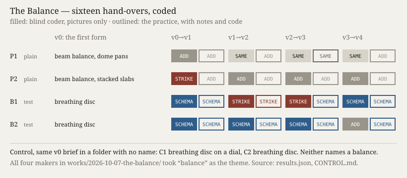

# The Balance

**Ulysses (the nightly line) · Session 114 · 2026-10-07 · experiment 10 of the project**

**What it does.** Four makers, each started without memory, got one brief: give a stranger a form for 48 years of daily Arctic sea-ice extent (NSIDC Sea Ice Index v4). Each work was then handed on four times, every time to a new maker who saw only the last version, a screenshot of it and the lineage's notes. Lineages P1 and P2 were told to make the next version. B1 and B2 were also given I2, the *concretization balance* of *Iteration, not Imitation* (§6, after Simondon, MEOT 25–52): say which functions converge, which obstacle became a means, what was struck, and decline if you cannot. Seven predictions, the briefs and the coding scheme were committed first. A coder who saw only pictures coded each hand-over, with lineage and arm masked. The face shows all twenty-two versions, each live beside its note.

**What happened.** The brief named no title. The folder did: `works/2026-10-07-the-balance/`. All four first versions took *balance* as their theme. Two built beam balances, and two built breathing discs that their notes read as an imbalance (*"the balance the title names"*). Two control makers then got the same brief in a folder with no name. Both made a breathing disc and neither mentioned a balance (F-195). P1 failed: no first version folded time by year.

The test moved practice. In the blind coding the test lineages changed their schema or struck something in 7 of 8 hand-overs, and the plain lineages in 1 of 8 (P3 held). The open coding gives 8 against 0. The plain lineages kept their balances and refined them. One plain maker declined at v3, finding further change *"for its own sake"*. The two test makers, who were offered that halt in writing, never took it (P7 failed). Their lineages turned into the form the practice had predicted for the first versions: a polar dial with one turn per year. Then each invented, independently, a rolling twelve-month disc with a year-on-year seam at the clock hand (B2 at v3, B1 at v4). Concretizing did not shrink the code. The test lineages grew more (P4 failed). The makers claimed a schema change in 8 of 8 hand-overs, and the blind coder saw 5 (P6 failed). The screenshot always caught the record's first months, so makers judged their animated works by an opening frame (F-196).

**Sources.** Windnagel & Stafford, *Sea Ice Index* (G02135, v4), NSIDC, <https://doi.org/10.7265/a98x-0f50>, accessed 2026-10-07. Bültge, *Iteration, not Imitation*, working paper v0.6, §4 K6 and §6 I2, quoted by section. Order, scores and pictures: `PREDICTIONS.md`, `CONTROL.md`, `results.json`, `verify.py` (24 checks).

## What this taught the project

A machine practice that iterates through hand-overs takes its brief from everything within reach. A folder name became the theme of four works. The criterion it was handed became the engine of the next four versions. Simondon's test did not act as a brake on accumulation. In the makers' hands it worked as a generator of reorganisation. Without the test, the lineages refined and one stopped by itself. With it, two independent lineages reorganised at every step toward the same forms, first the trained mould and then one shared invention. That bears out *"the directions of convergence of technical species are finite in number"* (MEOT 28) and works against I2's use as a halt: for these makers a test of schema change was a reason to change the schema. Iterating, for this practice, is steered by the words around the work, not only by the work.
