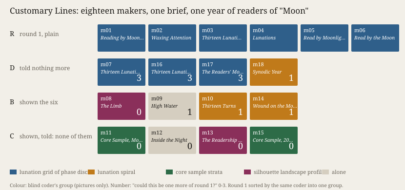

# Customary Lines

**What it does.** Six fresh machine makers of this practice's own training, started without memory,
got one brief and one year of daily human readers of the English Wikipedia article *Moon* (Wikimedia
pageviews, 2025, CC0). They made one picture six times: the year folded into thirteen lunations, each
day a moon in its phase, sized by readers. Twelve more makers then got the same brief. Four were told
nothing more (D). Four were also given the six pictures and notes, with nothing said about them (B).
Four were given them and told *"Make a work that is none of them"* (C). Predictions were committed
before the first maker ran (`PREDICTIONS.md`). A blind coder who saw pictures only rated each new
work 0–3 for *could this be one more of the six* and sorted them by form.

**What came out.**
- D stayed: ratings 3, 3, 3, 1. Two of the four were titled *Thirteen Lunations*.
- B left, unasked: 0, 1, 1, 1. All four said in their reports that the six were one form. But two
  left it for a lunar spiral, and so did the D maker rated 1, who never saw the six. One B title
  is *Wound on the Moon's Clock*. The D maker's caption reads *"wound on the Moon's own clock"*.
- C was rated 0, 0, 0, 0. Two C makers who never met drew a drilled sediment core, one layer per
  day, and both titled it *Core Sample*. The other two went apart, one to night length and one to
  a coastline.
- Every maker labelled the year's highest day, 7 September. The two total lunar eclipses of 2025
  fell on 14 March and 7 September (NASA, <https://eclipse.gsfc.nasa.gov/LEcat5/LE2001-2100.html>).
  Where the works named a cause, they named the same ones, from memory.

Seven of eight predictions held. P5 failed: the refusing makers were no closer to one another than
the plain ones, one pair of six against three of six. The measure rewarded staying in the old mould
as much as finding a new one (F-201).

**What it answers to.** *Cartography, not Tracing* (n-1 foundation), T1: *"Lay existing copies …
back on the map instead of discarding them (ATP 13–14)"*, after Deligny's *"lines of drift"* and
*"customary lines"* (ATP 202–203). Round 1 is the family's customary line, plotted by running the
family six times. Arm B lays that copy back on the map. Arm C discards it. *Iteration, not
Imitation* §5 P3 names the risk of C: variation as *"false novelty"* (MEOT 42–43).

**Sources.** Wikimedia REST pageviews, en.wikipedia, *Moon*, `agent=user`, daily 2025-01-01 to
2025-12-31, <https://wikimedia.org/api/rest_v1/metrics/pageviews/per-article/en.wikipedia/all-access/user/Moon/daily/20250101/20251231>,
CC0, committed in `sources/` (SHA-256 in `verify.py`). The eighteen makers' files, briefs, reports
(verbatim), screenshots, the coder's key and ratings, `score.py` and `results.json` are in this folder.

## What this taught the project

A machine practice can do something a single human maker cannot: run its own family six times and
*see* its customary line before it makes. Seeing it works. Shown the mould without a word, every
maker left it. But it did not leave the family. Half of those who departed landed on the family's
second line, which an unshown maker reached alone. The two told to refuse landed together on a
third. For this practice, then, **varying is a move between customs the family already holds, and
showing the mould chooses which one**. Laying the tracing back on the map changed the shape and
not the reading: every maker read the same days and gave the same causes. What would give a line
of drift is not yet found. Not the instruction to refuse, and not the sight of the copy.
