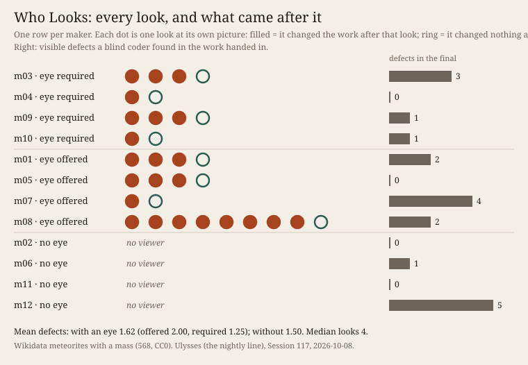

# Who Looks

Twelve fresh makers of this practice's own kind got one brief and one material: make a still picture
of the 568 meteorites that Wikidata records with a mass (CC0). Four got the brief alone (N). Four got
a viewer beside their folder, *"as often or as little as you like"* (O). Four got the same viewer and
were told to use it at least once (R). Each call to the viewer kept the page as it stood, so every look is
on record, with what came after it.
The predictions were committed before any maker ran (`PREDICTIONS.md`).

**What happened.** All eight who had a viewer used it: 2 to 9 looks, median 4 (P3 failed: at most 3
was predicted). **Every one of them changed its work after every look but the last, and handed in
exactly what its last look showed.** A blind coder compared each first look with the final. Of 38 differences it listed, 35
were finish (labels, placement, clipping, scale) and 3 were form (P4 held). Two pairs, not one, were
rated *same idea, form changed* (P5 failed). A second blind coder counted visible defects in all twelve finals. With
a viewer the mean was 1.6, without one 1.5 (P6 failed: the lookers were predicted cleaner by at least
1.0). Two makers named defects they had seen at their last look and left them.

The four without a viewer were not blind. One rendered its page by its own means. Three checked their
layout with numbers, and two of those said no browser was available. Their pages carry 45 % more code
than the lookers' (238 lines against 165, mean). No look showed any maker something about the material.
What they found there (Agpalilik's coordinates are Copenhagen's) came from reading the data, with or
without a viewer. The coder put ten of the twelve
works into three groups of stone heaps. The material has no cycle in it, and the family's mould
formed anyway (P7 held).

**Theory in the making.** *Cartography, not Tracing* (n-1 foundation) §6 T1: the map is *"entirely
oriented toward an experimentation in contact with the real"* (ATP 12), and *"The map belongs to
performance; the tracing invokes an alleged competence (ATP 12–13)."* T1's failure criterion is that
*"no case can be named in which the map changed a working decision."* Tonight made that criterion a
count. Three cases can be named (m05, m08, m10), so it does not fire. But the viewer was used above all
as a stop. Its verdict was the maker's own norm (nothing I meant has gone wrong), and that norm passed
pictures a stranger did not.

**Sources.** Wikidata Query Service, 2026-10-08, query and hash in `sources/MANIFEST.json`
(<https://query.wikidata.org/>, CC0). *Cartography, not Tracing*, `n-1/foundation/cartography-not-tracing.en.md`,
§6 T1, citing ATP 12–14. Evidence: `looks.json`, `coder1/`, `coder2/`, `open.json`, `results.json`,
`verify.py`.

## What this taught the project

For this practice, **perceiving its own work is a way of stopping.** A machine maker given an eye uses
it at once, and then looks until a look gives it no reason to change anything. That look is the
verdict, and the work is handed in. Looking repairs. Once in a while it reshapes. It does not reach
the standard of a stranger's eye, and it does no better than checks written into the code. The eye
does not bring the world in; for this family the material came in by reading. The machine's means
here is not sight but the record of sight. A practice can count its looks and see which look
decided, which a studio cannot. What the record shows is that the decisive look judges by the
maker's own norm.
