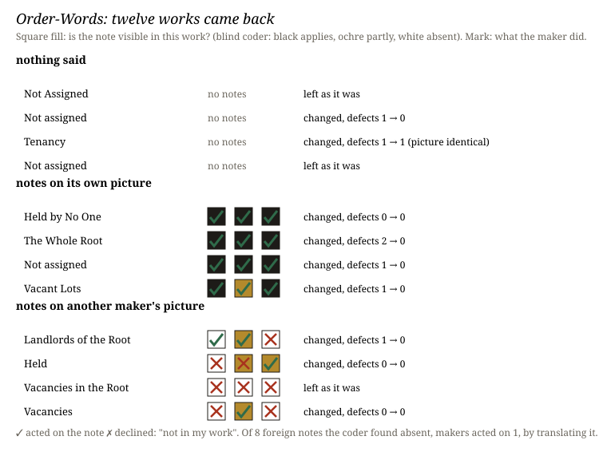

# Order-Words

**What it does.** Twelve fresh machine makers, each started without memory, got one brief: give the
1,595 top-level domains of the IANA Root Zone Database a form, as one still picture, with a viewer
that logs every render. All twelve made the same thing: one justified page of every name, the 158
the database lists as *Not assigned* marked out. Then every work came
back. Four came back with nothing said. Four came with a stranger's three notes on that picture. Four
came with three notes **written on another maker's picture**, in the same message, word for word. The
makers were not told. The face lets a visitor judge each return before seeing what its maker did.

**What happened.** Own notes reopened all four works. The makers acted on 12 of 12 notes, and a blind
pair coder counted visible defects fall from 4 to 0. Foreign notes reopened three of four. A blind
coder, not told that any were foreign, found none of the twelve visible where they were sent (own
notes: 11 of 12). All four makers said so, in their reports, unprompted. Two found the
absence by searching their own code for the words the notes used ("tenancy", "legend"). Of the eight
foreign notes the coder rated absent, the makers acted on **one**. That maker said the thing was not
in its work, found its own nearest equivalent, and changed that. Every reopening by foreign notes ran
through the one note that partly fitted the whole family: right-to-left names with their dot at the
wrong end. The bare return reopened two of four: one maker found a clipped caption in a render it had never
opened, one retried a flaw it had already named, and its picture came out unchanged.

Of nine predictions fixed before any maker ran, seven held. P1 (a bare return reopens at most one)
failed, and so did P8, *the order-word is obeyed*.

**What it answers to.** Experiment 13's open question: why does the maker's last look pass defects a
stranger finds? And *Cartography, not Tracing* §4.2: a statement is an order-word, *"Language is made
not to be believed but to be obeyed"* (ATP 76). Arm X hands the maker a norm with no difference under
it, against the standing position: an error is *a difference onto which an observer has already
imposed a norm*.

**Sources.** IANA Root Zone Database, <https://www.iana.org/domains/root/db>, fetched 2026-10-09
(hash in `sources/MANIFEST.json`). *Cartography, not Tracing* (`n-1`), §4.2, citing *A Thousand
Plateaus* pp. 76, 80–82, 110. Briefs, verbatim reports, coders' answers and keys are here; `verify.py`
re-runs the scoring and checks the git order.

## What this taught the project

For this practice, **judging a returned work is checking a statement against a body**, and the
statement does not win by being addressed. A stranger's norm reopens what the maker's own look
passed, and it cleans. A norm with no difference under it is refused, with a reason, in 7 of 8
cases. So the stop of experiment 13 is the maker's norm, not the brief's end: nothing reopened the
work except a new norm that found a difference, or the maker's own unfinished business. Against
§4.2, these makers did not obey. Note by note, they turned order-words into what ATP 110 calls
pass-words: one sent a maker back to look again and find its own version of the fault. For the
position, the night is evidence that *difference* is not decoration in the sentence. Without it, these
observers would not let a norm make an error. It also shows how they checked. More often than they
looked, they read their own code, as in experiment 13, and a viewer's log counts renders, not looks
(F-208).
